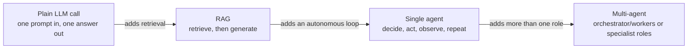

# Evaluation Criteria Across LLM, RAG, Agent, and Multi-Agent Systems

Evaluation criteria across four system shapes, plain LLM, RAG, single agent, and multi-agent: what actually matters for each, and how to use that to decide something. Synthesized from this repo's own experiments and current research, then tested empirically in [Evaluation Criteria in Practice](experiments/evaluation-criteria-experiment/README.md).

## The four system shapes

Four shapes, each adding one capability the shape before it didn't have: retrieval, then an autonomous loop deciding whether to use that retrieval again, then a second role checking the first role's work.

- **Plain LLM call.** One prompt, one response, no lookup, no tools, answered entirely from what the model already knows. See [Intent Classification](experiments/intent-classification-prompting/README.md).
- **RAG.** A retrieval step feeds the generation step: look something up first, then answer using what was found. See [RAG Architectures](experiments/rag-architectures/README.md).
- **Single agent.** The model repeatedly decides what to do next, search again or answer, based on what has happened so far, instead of following a fixed script. See [Agentic Architectures](experiments/agentic-architectures/README.md)'s Single-Agent ReAct.
- **Multi-agent.** More than one role, each with its own scope, handing control and state back and forth rather than one model doing everything itself. See the same experiment's Orchestrator and Supervisor architectures.

## Critical metrics

The metrics this framework tracks, what each one actually measures, and which of the four shapes it applies to. Read this table as a reference; the decision framework below is what explains when each one actually matters, not just that it exists.

| Criterion | Definition | Plain LLM | RAG | Single agent | Multi-agent | What it actually answers |
|---|---|:---:|:---:|:---:|:---:|---|
| Task/quality metric (accuracy, EM, F1, macro F1) | How often (Exact Match, accuracy) or how closely (F1, token-overlap partial credit) the predicted output matches the correct answer. | Yes | Yes | Yes | Yes | Was the final output right. The one metric every shape needs, and the one least likely to be enough on its own past plain LLM calls. |
| Retrieval quality (Recall@k, Precision@k, MRR) | Recall@k: did a relevant item appear anywhere in the top k retrieved. Precision@k: what fraction of the top k retrieved were actually relevant. MRR: the reciprocal rank of the first relevant item, rewarding it appearing earlier. | No | Yes | Only if the agent's tool is itself a retriever | Only if a role's tool is itself a retriever | Did the system have a chance to be right, independent of whether it used that chance well. |
| Faithfulness / groundedness / abstention rate | Whether an answer's claims are actually supported by the retrieved or found evidence, as opposed to correct by coincidence; abstention rate is how often the system says "I don't know" instead of guessing, split into correct (on a genuinely unanswerable case) and incorrect (giving up on one it could have answered). | No | Yes | Only for tool-using agents that must stay grounded in tool output | Same | Is the answer actually supported by what was retrieved or found, or just plausible. |
| Operational metrics (tokens, latency, TTFT, context payload, error rate) | Tokens: prompt/completion size sent to and returned from the model. Latency: total time for a call to finish. TTFT (time to first token): time until the response starts. Context payload: bytes sent in one call. Error rate: how often a call failed outright. | Yes | Yes | Yes | Yes | What the system costs, and whether it's breaking outright. Explains cost; rarely decides a winner by itself. |
| Semantic cache hit rate | How often a query was answered from a cached, near-duplicate prior result instead of a fresh model call. | Sometimes (if the technique caches) | Sometimes | Sometimes | Sometimes | Is repeated, near-duplicate work being avoided. Reads as 0% and says nothing when nothing in the system caches, which is true of every architecture in this repo's three experiments so far. |
| Empty retrieval rate | How often a retrieval call came back with nothing useful, no gold or relevant result, even if it technically returned something. | No | Yes | Yes, for tool calls that search | Yes | How often a lookup came back with nothing (or nothing useful) to work with. |
| Step / loop count | How many model or tool calls one run actually took, start to finish. | No (always 1) | Only for multi-call architectures (HyDE, Decomposition, CRAG) | Yes | Yes | How many decision points the system actually exercised. |
| Early termination rate | The fraction of runs that hit a step cap without the system itself ever deciding it was done, as opposed to stopping because it chose to. | No | Rarely tracked (see gap below) | Yes | Yes | Did the system stop because it decided it was done, or because an external cap forced it to. |
| Inter-agent handoff count | How many times control, and whatever state was written into the handoff, passed from one role to another within a run. | No | No | Always 0, by construction | Yes | How many times control (and whatever state was written into the handoff) passed between roles. |
| State overhead | The size, in bytes, of whatever context or structured summary has to be carried forward, built, and kept consistent between steps or role handoffs. | No | No | Yes (its running transcript) | Yes (each handoff's payload) | How much context has to be carried, built, and kept consistent as the system runs. |
| Tool error / retry rate | How often a tool call (not a model call, e.g. a failed retrieval or a timed-out lookup) failed outright. | No | Rarely (a failed retrieval call) | Yes | Yes | Is the system's environment interaction actually reliable, separate from whether its reasoning is. |

## The decision framework

Six questions, roughly in the order you'd actually ask them. Each one starts with which of the four shapes it applies to, since a question that doesn't apply to a shape isn't scored low there, it's simply inapplicable, then how it's measured for the shapes it does apply to, and only then a number, where a specific result actually backs up the point.

**1. Is the output good?**
*Applies to:* all four shapes, always. Every shape produces something to score against a gold answer, regardless of how it got there.
*Measured and interpreted:* the task/quality metric family (Exact Match, accuracy, F1, macro F1), scored identically across shapes since it only ever looks at the final answer, not the process. For a plain LLM call this is often the *whole* story, since a single call has no other layer to check (see question 2). For the other three shapes it's necessary but frequently not sufficient on its own, because two shapes (or two techniques within one shape) can land on the same score through very different, and very differently trustworthy, processes, which is the rest of this framework's reason to exist.
*Numbers:* [Intent Classification](experiments/intent-classification-prompting/README.md#results) found its retrieval technique beat every other technique by 23 points of fine accuracy (90.5% vs. the next best 67.1%), a gap wide enough on its own that no other metric was needed to call that winner. That's the case where this question's answer really was the whole story.

**2. If quality is tied or the gap looks small, why?**
*Applies to:* RAG, single agent, and multi-agent. Does **not** apply to a plain LLM call: a plain call has exactly one decision point (question 1), so once you've asked whether the output was good, there is no further layer left to check. A tied or close plain-LLM score is just a tied or close score, not a puzzle this framework has another metric for.
*Measured and interpreted:* for RAG, check retrieval quality (Recall@k, Precision@k, MRR) against the generation-quality metric, since a RAG system can retrieve badly and still generate a right answer by accident, or retrieve well and still generate a wrong one, and those are separate claims. For a single agent or multi-agent system, the next layer is agentic metrics instead (questions 3 and 6 below), since the extra decision points there are about control flow, search again or finish, accept a draft or refine, not about what got retrieved.
*Numbers:* [RAG Architectures](experiments/rag-architectures/README.md#results) found Hybrid RAG had the best Recall@k (0.650) and MRR (0.468) of any architecture there, and still lost on F1 (0.619) to Query Decomposition RAG (0.675), which had *worse* Recall@k (0.517) and the worst MRR (0.268) in the whole comparison. Reading either metric alone would have named a different winner; reading both together is what shows good retrieval and a good final answer aren't the same claim.

**3. Is the system's autonomy trustworthy, or is an external cap doing the work?**
*In plain terms:* when a looping shape stops, is that because it judged it had enough information, or because it was simply told "stop after N tries" and ran out of tries? If the cap is doing the work, whatever accuracy the shape gets is partly an accident of whichever limit was chosen, not evidence it can be trusted to know when it's actually done.
*Applies to:* single agent and multi-agent only. Does **not** apply to plain LLM (no loop at all) or single-shot RAG (one search, one generation, no decision to make about whether to continue): both always complete in one pass, so there's no "did it decide to stop, or was it forced to" question to ask. [Evaluation Criteria in Practice](experiments/evaluation-criteria-experiment/README.md#results) confirms this isn't just a definitional shrug: both shapes' measured early termination rate came back exactly 0%, not because they're reliably deciding to stop, but because neither one ever has a stopping decision to make in the first place.
*Measured and interpreted:* early termination rate, the fraction of runs that hit a step cap without the shape itself ever signaling it was done. The same rate can mean different things depending on what a shape does *when* it hits that cap, worth checking before trusting the rate alone: a shape that submits nothing when it times out (an automatic miss) is not equivalent to a shape that still submits a best-effort guess (which might still be right), even at an identical early termination rate.
*Numbers:* in [Agentic Architectures](experiments/agentic-architectures/README.md#results), Orchestrator (sequential dispatch) tied for worst accuracy (47.5% EM) with three other architectures, reading as "unremarkable" on its own. But its early termination rate is 100%: in all 40 runs, the planner never once decided it had enough information, the step cap did all the stopping. [Evaluation Criteria in Practice](experiments/evaluation-criteria-experiment/README.md#what-we-learned) later found the interpretation nuance above playing out concretely: Single-Agent ReAct's early termination rate (35.0%) is numerically *lower* than the multi-agent shape's (47.5%), which reads as "more reliable," but every one of the single agent's early-terminated runs submitted no answer at all (guaranteed wrong), while every one of the multi-agent shape's still submitted a best-effort draft (often still right) — the numerically better rate belonged to the less accurate shape.

**4. Where does the cost come from, and is it buying anything?**
*Applies to:* all four shapes. Every shape makes at least one model call, so token cost, latency, time to first token, and context payload are always measurable, even for a plain LLM call's single pass.
*Measured and interpreted:* operational metrics always answer "what did this cost," but they only *decide* a comparison when a cost buys literally nothing extra; otherwise they explain a gap some other metric already found rather than settling it on their own.
*Numbers:* in [Intent Classification](experiments/intent-classification-prompting/README.md#results), self-consistency spent 3x the tokens of plain chain-of-thought (2,183 vs. 728) and scored *lower* (62.3% vs. 63.2%), a clean case of cost with no return. Compare that to Query Decomposition RAG and HyDE in [RAG Architectures](experiments/rag-architectures/README.md#results), which also cost roughly double a single-call architecture's wall-clock time (20.6 to 21.8s vs. 9.2 to 13.2s), but Decomposition's extra call bought the best F1 in that experiment. The same "costs more" fact was a bad trade in one experiment and a good one in another; cost alone never tells you which.

**5. Is the system reliable, or just accurate on average?**
*Applies to, with a real caveat:* model-call error rate applies to all four shapes, every model call can fail outright regardless of shape. Tool error rate and empty retrieval rate apply only to RAG, single agent, and multi-agent, only a shape that calls a tool can have a tool fail; both are undefined, not meaningfully 0%, for a plain LLM call, which makes no tool calls at all. Abstention rate is narrower still: it only means something for a shape whose prompt actually gives it the option to decline, which so far in this repo has only been true of the RAG architectures experiment (explicitly told to say "Insufficient information."). The plain LLM, single-agent, and multi-agent shapes tested in this repo were instead told to always give their best guess, so an abstention rate isn't tracked for them, not because it wouldn't apply in principle to those shapes, but because none of this repo's prompts for them gave the model that option. That's a gap in this repo's prompts, not a property of the shapes themselves.
*Measured and interpreted:* these metrics matter most as a floor that rules things out, not usually as a decider, since in every experiment this repo has run so far they've sat at or near their best possible value.
*Numbers:* 0% model-call error rate in every architecture across all four experiments this repo has run ([Intent Classification](experiments/intent-classification-prompting/README.md#results), [RAG Architectures](experiments/rag-architectures/README.md#results), [Agentic Architectures](experiments/agentic-architectures/README.md#results), [Evaluation Criteria in Practice](experiments/evaluation-criteria-experiment/README.md#results)), 0% tool error rate everywhere a tool was used, and label validity at 98.7% or higher throughout Intent Classification. That's not a wasted metric: it's what lets every other finding in this framework be read as a genuine behavioral difference rather than one system just breaking more often than another. It also means none of these four experiments has yet stress-tested reliability under conditions where it would actually vary (see [Open gaps](#open-gaps-this-framework-doesnt-resolve-yet)).

**6. Is coordination between roles adding value, or just adding cost and failure surface?**
*Applies to:* multi-agent only. Plain LLM, RAG, and single-agent shapes all have exactly one role by construction, so handoff count is 0 for all three, not a low score on this question, an inapplicable one: there's no coordination to evaluate in a system with nothing to coordinate between.
*Measured and interpreted:* handoff count read against accuracy is the direct test. The number alone says nothing; what the coordination is actually *for* is what separates a productive handoff from an expensive one.
*Numbers:* in [Agentic Architectures](experiments/agentic-architectures/README.md#results), Orchestrator (sequential dispatch) and Supervisor + Verification Loop both average 7 handoffs, the joint-highest in that experiment, for the worst and the best accuracy respectively (the Supervisor's handoffs feed a verification step that rejects bad drafts; the Orchestrator's feed a planner that never learns to stop).

Handoff count and accuracy only tell you *whether* coordination paid off, not *how* it tends to fail when it doesn't, and that second question is backed by external research, not this repo's own data. [Cemri et al.'s MAST taxonomy](https://arxiv.org/abs/2503.13657) analyzed real multi-agent LLM system failures across seven popular frameworks and over 200 tasks, and grouped what it found into three categories: specification issues (weak role definitions, unclear task boundaries), inter-agent misalignment (roles working against or past each other), and task verification (nothing checks the final output is actually right). Within those, the single most common failure mode is **step repetition** at 17.14% of failures, agents (or an agent and its earlier self) redoing work already done, followed by **reasoning-action mismatch** at 13.98% (an agent reasons its way to the right conclusion, then does something else) and **failure to ask for clarification** at 11.65%. This repo's own data has a concrete instance of the top failure mode, from external research now confirmed internally too: Orchestrator (sequential dispatch)'s planner, on the "are both Bioy Casares and Hall Argentinian authors" question, asked for each author's nationality, got both answers, and then invented a third sub-question anyway ([finding 1](experiments/agentic-architectures/README.md#what-we-learned)), step repetition in miniature. [Evaluation Criteria in Practice](experiments/evaluation-criteria-experiment/README.md#what-we-learned) later measured this directly rather than just spotting one instance: every one of the multi-agent shape's runs that exhausted its round budget (19 of 40) had at least one literal repeated retrieval, versus zero among the runs that stayed within budget.

## Open gaps this framework doesn't resolve yet

- **No experiment here has stress-tested reliability metrics under conditions where they'd actually vary.** Error rate, tool error rate, and empty retrieval rate all sat near a perfect floor across all three experiments. That's informative (see question 5 above) but it also means this framework's claim that reliability metrics matter "when things are actually breaking" is argued from research, not yet demonstrated with this repo's own numbers.
- **Resolved:** the redundant-step rate gap flagged in an earlier version of this document is now measured. [Evaluation Criteria in Practice](experiments/evaluation-criteria-experiment/README.md) added the metric and found it decisive: every one of the multi-agent shape's runs that exhausted its round budget (19 of 40) also had at least one redundant retrieval, versus zero among the runs that stayed within budget, and 33% of the single-agent shape's tool calls (40 of 120) were redundant overall. MAST's top documented failure mode, step repetition, is real and common enough in this repo's own architectures to justify tracking it as standard practice going forward, not just a taxonomy borrowed from someone else's frameworks.
- **MAST itself has documented limits worth knowing before leaning on it as ground truth.** It's a [post-hoc, design-time taxonomy](https://arxiv.org/abs/2503.13657): failures are identified by having a human or an LLM judge review a *finished* trace, not by any live, in-the-moment signal, so it doesn't by itself say what a system should watch for *while running*. Its own LLM-judge automated classifier, built to apply the taxonomy at scale, agrees with human annotation on whether a run failed at all about 94% of the time, but only about 72% on *which one* of its 14 specific failure modes applies, meaning even the paper's own tool for using MAST at scale isn't fully reliable. And several of its categories (conversation reset, information withholding, ignoring another agent's output) don't apply to a single-agent system at all, by MAST's own scoping. This repo's redundant-step rate is a small, concrete instance of closing the first gap for one failure mode specifically: a signal computable directly from a run's own trace, no LLM judge or after-the-fact human review required, at the cost of only catching a literal repeated retrieval rather than every way a system can redo its own work (see the caveat in Future work below and in Evaluation Criteria in Practice's own README).
- **Faithfulness and LLM-as-judge scoring are used inconsistently across this repo's experiments**, and that inconsistency is itself worth naming. RAG Architectures uses a cheap lexical-overlap proxy for faithfulness (see that experiment's caveats). The alignment-comparison experiment (SFT vs RLHF vs DPO) uses a full LLM-judge win rate instead. [Zheng et al.'s MT-Bench and Chatbot Arena work](https://arxiv.org/abs/2306.05685) is the standard grounding for using a strong LLM as a judge at all, and RAG Architectures' own "Future work" section already flags an LLM-judged, RAGAS-style faithfulness score as the natural next step for that experiment specifically. This framework treats that as a general principle, not a RAG-only one: a lexical or rule-based proxy is cheap and fine for ruling out gross failures, but a claim this framework leans on heavily deserves the more expensive, more accurate judge call, and right now, whether that call happened is inconsistent from one experiment in this repo to the next.
- **This framework only speaks for the shapes and scale this repo has actually tested.** All three experiments run one local 8B model (`llama3.1:8b`), a handful of architectures per experiment, and 40 to 231 examples, all English-language, extractive or classification-style tasks. Nothing here has tested a genuinely open-ended generation task, a much larger or hosted model, or a multi-agent system with more than 3 specialist roles.

## Future work

**Done:** [Evaluation Criteria in Practice](experiments/evaluation-criteria-experiment/README.md) was the empirical follow-on this framework was written to set up: the same task run through a plain LLM call, a RAG pipeline, a single agent, and a multi-agent system, with one shared metric set (including a new redundant-step rate metric, testing whether MAST's most common real-world multi-agent failure mode shows up in this repo's own architectures) logged for every run. Its results are referenced throughout the decision framework and Open gaps sections above.

**Next up:** a task or corpus difficult enough to move reliability metrics off their current floor. Error rate, tool error rate, and empty retrieval rate have sat near 0% (or their best possible value) across every technique and shape compared so far, which is informative on its own (see the decision framework above) but means none of these metrics has been evaluated as an actual decision-maker yet, only as a metric that was merely present. A noisier, larger, or adversarial dataset would test that directly.

Further out, scoped as their own experiments when their time comes (see "Starting a new experiment" in this repo's `CLAUDE.md`):

- **A consistent faithfulness/groundedness standard across every experiment in this repo that makes a groundedness-adjacent claim**, replacing ad hoc lexical proxies with the same LLM-judge methodology used in alignment-comparison, so faithfulness scores become comparable across experiments, not just internally consistent within one.

## Grounding research

* [Chang et al., 2023, A Survey on Evaluation of Large Language Models](https://arxiv.org/abs/2307.03109)
* [Liang et al., 2022, Holistic Evaluation of Language Models (HELM)](https://arxiv.org/abs/2211.09110)
* [Zheng et al., 2023, Judging LLM-as-a-Judge with MT-Bench and Chatbot Arena](https://arxiv.org/abs/2306.05685)
* [Es et al., 2023, RAGAS: Automated Evaluation of Retrieval Augmented Generation](https://arxiv.org/abs/2309.15217)
* [Gao et al., 2023, Retrieval-Augmented Generation for Large Language Models: A Survey](https://arxiv.org/abs/2312.10997)
* [Yao et al., 2022, ReAct: Synergizing Reasoning and Acting in Language Models](https://arxiv.org/abs/2210.03629)
* [Anthropic, 2024, Building effective agents](https://www.anthropic.com/engineering/building-effective-agents)
* [A Survey on Evaluation of LLM-based Agents, 2025](https://arxiv.org/abs/2503.16416)
* [Evaluation and Benchmarking of LLM Agents: A Survey, 2025](https://arxiv.org/abs/2507.21504)
* [Cemri et al., 2025, Why Do Multi-Agent LLM Systems Fail? (MAST)](https://arxiv.org/abs/2503.13657)

## Reproducing this

There is nothing to run. Every number cited above lives in the results already committed under [experiments/intent-classification-prompting/results/](experiments/intent-classification-prompting/README.md), [experiments/rag-architectures/results/](experiments/rag-architectures/README.md), [experiments/agentic-architectures/results/](experiments/agentic-architectures/README.md), and [experiments/evaluation-criteria-experiment/results/](experiments/evaluation-criteria-experiment/README.md). This document only reads and synthesizes them.
