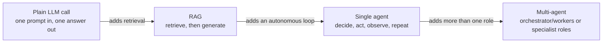

# Evaluation Criteria Across LLM, RAG, Agent, and Multi-Agent Systems

This is not a single experiment. It is a reference framework, synthesized from the three experiments this repo has already run ([Intent Classification](experiments/intent-classification-prompting/README.md), [RAG Architectures](experiments/rag-architectures/README.md), [Agentic Architectures](experiments/agentic-architectures/README.md)) plus current research on evaluating each system type. The question it answers is not "what metrics exist" (every experiment README already lists those for its own system), but "which of them actually matter, for which kind of system, and how do you use that to decide something."

No new model runs happened to write this. Every number below is pulled from results this repo already produced and cited in the experiments above. See [Future work](#future-work) for the empirical experiment this framework points to next.

## The four system shapes

Four increasingly capable shapes, each adding one thing the shape before it didn't have:

- **Plain LLM call.** One prompt, one response, no lookup, no tools. This repo's [Intent Classification](experiments/intent-classification-prompting/README.md) experiment lives almost entirely here (its retrieval technique is the one exception, see below).
- **RAG.** A retrieval step feeds the generation step. Some RAG architectures also loop, HyDE and Query Decomposition each make a second call, and Corrective RAG (CRAG) can re-retrieve, but the loop is short and scripted, not an open-ended decision the model makes about what to do next. See [RAG Architectures](experiments/rag-architectures/README.md).
- **Single agent.** The model itself repeatedly decides what to do next (search again, or answer) based on what has happened so far, instead of following a fixed script. See [Agentic Architectures](experiments/agentic-architectures/README.md)'s Single-Agent ReAct.
- **Multi-agent.** More than one role, each with its own scope, handing control (and state) back and forth. See the same experiment's Orchestrator and Supervisor architectures.

These boundaries blur in practice. CRAG's grading-and-re-retrieve step is a small agent wearing a RAG architecture's clothes, and Intent Classification's retrieval technique (embed the query, pull 5 similar training examples, no generation-time decision about whether to search again) is RAG's retrieval half without RAG's generation-time complexity. Treat the four shapes as a spectrum of "how many decision points can go wrong," not a strict taxonomy.

## Criteria catalog

| Criterion | Definition | Plain LLM | RAG | Single agent | Multi-agent | What it actually answers |
|---|---|:---:|:---:|:---:|:---:|---|
| Task/quality metric (accuracy, EM, F1, macro F1) | How often (Exact Match, accuracy) or how closely (F1, token-overlap partial credit) the predicted output matches the correct answer. | Yes | Yes | Yes | Yes | Was the final output right. The one metric every shape needs, and the one least likely to be enough on its own past plain LLM calls. |
| Retrieval quality (Recall@k, Precision@k, MRR) | Recall@k: did a relevant item appear anywhere in the top k retrieved. Precision@k: what fraction of the top k retrieved were actually relevant. MRR: the reciprocal rank of the first relevant item, rewarding it appearing earlier. | No | Yes | Only if the agent's tool is itself a retriever | Only if a role's tool is itself a retriever | Did the system have a chance to be right, independent of whether it used that chance well. |
| Faithfulness / groundedness / abstention rate | Whether an answer's claims are actually supported by the retrieved or found evidence, as opposed to correct by coincidence; abstention rate is how often the system says "I don't know" instead of guessing, split into correct (on a genuinely unanswerable case) and incorrect (giving up on one it could have answered). | No | Yes | Only for tool-using agents that must stay grounded in tool output | Same | Is the answer actually supported by what was retrieved or found, or just plausible. |
| Operational metrics (tokens, latency, TTFT, context payload, error rate) | Tokens: prompt/completion size sent to and returned from the model. Latency: total time for a call to finish. TTFT (time to first token): time until the response starts. Context payload: bytes sent in one call. Error rate: how often a call failed outright. | Yes | Yes | Yes | Yes | What the system costs, and whether it's breaking outright. Explains cost; rarely decides a winner by itself. |
| Semantic cache hit rate | How often a query was answered from a cached, near-duplicate prior result instead of a fresh model call. | Sometimes (if the technique caches) | Sometimes | Sometimes | Sometimes | Is repeated, near-duplicate work being avoided. Reads as 0% and says nothing when nothing in the system caches, which is true of every architecture in this repo's three experiments so far. |
| Empty retrieval rate | How often a retrieval call came back with nothing useful, no gold or relevant result, even if it technically returned something. | No | Yes | Yes, for tool calls that search | Yes | How often a lookup came back with nothing (or nothing useful) to work with. |
| Step / loop count | How many model or tool calls one run actually took, start to finish. | No (always 1) | Only for multi-call architectures (HyDE, Decomposition, CRAG) | Yes | Yes | How many decision points the system actually exercised. |
| Early termination rate | The fraction of runs that hit a step cap without the system itself ever deciding it was done, as opposed to stopping because it chose to. | No | Rarely tracked (see gap below) | Yes | Yes | Did the system stop because it decided it was done, or because an external cap forced it to. |
| Inter-agent handoff count | How many times control, and whatever state was written into the handoff, passed from one role to another within a run. | No | No | Always 0, by construction | Yes | How many times control (and whatever state was written into the handoff) passed between roles. |
| State overhead | The size, in bytes, of whatever context or structured summary has to be carried forward, built, and kept consistent between steps or role handoffs. | No | No | Yes (its running transcript) | Yes (each handoff's payload) | How much context has to be carried, built, and kept consistent as the system runs. |
| Tool error / retry rate | How often a tool call (not a model call, e.g. a failed retrieval or a timed-out lookup) failed outright. | No | Rarely (a failed retrieval call) | Yes | Yes | Is the system's environment interaction actually reliable, separate from whether its reasoning is. |

## The decision framework

Six questions, each answered by a different layer of criteria, roughly in the order you'd actually ask them:

**1. Is the output good?** Start with the task/quality metric. This is necessary everywhere and, for a plain LLM call, often sufficient on its own: Intent Classification's retrieval technique beat every other technique by 23 points of fine accuracy (90.5% vs the next best 67.1%), a gap wide enough that no other metric was needed to call the winner.

**2. If quality is tied or the gap looks small, why?** Move to the next layer down for that shape. For RAG, that's retrieval quality: this repo's own RAG experiment found Hybrid RAG had the best Recall@k (0.650) and MRR (0.468) of any architecture, and still lost on F1 (0.619) to Query Decomposition RAG (0.675), which had *worse* Recall@k (0.517) and the worst MRR (0.268) in the whole comparison. Reading either metric alone would have named a different winner; only reading both together shows that good retrieval and a good final answer are not the same claim. For an agent or multi-agent system, that next layer is agentic metrics, not retrieval ones (see question 3).

**3. Is the system's autonomy trustworthy, or is an external cap doing the work?** This question only has an answer for single-agent and multi-agent systems, since it's specifically about a system deciding, on its own, that it has done enough. Early termination rate is the metric built for exactly this, and it's the single most decisive metric in this repo's agentic-architectures experiment: Orchestrator (sequential dispatch) tied for worst accuracy (47.5% EM) with three other architectures, a result that reads as "unremarkable." But its early termination rate is 100%, in all 40 runs, the planner never once decided it had enough information; the step cap did all the stopping. Its accuracy right now is partly a property of the cap chosen (3 rounds), not of the architecture's own judgment, a fact invisible to any quality metric. Single-Agent ReAct had a related but distinct version of the same problem: it committed to an answer on only 65% of runs (26 of 40), but was right 73% of the time it did commit, meaning the bottleneck was deciding to answer, not the reasoning behind the answer.

**4. Where does the cost come from, and is it buying anything?** Operational metrics answer the first half of this everywhere, but they only *decide* something when a cost buys literally nothing. In Intent Classification, self-consistency spent 3x the tokens of plain chain-of-thought (2,183 vs 728) and scored *lower* (62.3% vs 63.2%), a clean case of cost with no return. Compare that to Query Decomposition RAG and HyDE, which also cost roughly double a single-call architecture's wall-clock time (20.6 to 21.8s vs 9.2 to 13.2s), but Decomposition's extra call bought the best F1 in the RAG experiment, so the same "costs more" fact reads as a bad trade in one experiment and a good one in another. Cost alone never tells you which; it has to be read against what the extra cost changed.

**5. Is the system reliable, or just accurate on average?** Error rate, abstention rate, and tool error/retry rate answer this, but in all three of this repo's experiments so far, these sat at or near a perfect floor: 0% model-call error rate in every architecture across all three experiments, 0% tool error rate in the agentic experiment, and label validity at 98.7% or higher throughout Intent Classification. That's not a wasted metric, it's what lets every other finding above be read as a genuine behavioral difference rather than one system just breaking more often than another, but it also means none of these three experiments has yet stress-tested reliability under conditions where it would actually vary (see [Open gaps](#open-gaps-this-framework-doesnt-resolve-yet)).

**6. Is coordination between roles adding value, or just adding cost and failure surface?** This question only applies once there's more than one role. Handoff count read against accuracy is the direct test: in the agentic-architectures experiment, Orchestrator (sequential dispatch) and Supervisor + Verification Loop both average 7 handoffs, the joint-highest in the experiment, for the worst and the best accuracy respectively. The number alone says nothing; what the coordination is actually *for* (the Supervisor's handoffs feed a verification step that rejects bad drafts, the Orchestrator's feed a planner that never learns to stop) is what separates a productive handoff from an expensive one.

Handoff count and accuracy only tell you *whether* coordination paid off, not *how* it tends to fail when it doesn't. [Cemri et al.'s MAST taxonomy](https://arxiv.org/abs/2503.13657) analyzed real multi-agent LLM system failures across seven popular frameworks and over 200 tasks, and grouped what it found into three categories: specification issues (weak role definitions, unclear task boundaries), inter-agent misalignment (roles working against or past each other), and task verification (nothing checks the final output is actually right). Within those, the single most common failure mode is **step repetition** at 17.14% of failures, agents (or an agent and its earlier self) redoing work already done, followed by **reasoning-action mismatch** at 13.98% (an agent reasons its way to the right conclusion, then does something else) and **failure to ask for clarification** at 11.65%. This repo's own data already has a concrete instance of the top failure mode: Orchestrator (sequential dispatch)'s planner, on the "are both Bioy Casares and Hall Argentinian authors" question, asked for each author's nationality, got both answers, and then invented a third sub-question anyway ([finding 1](experiments/agentic-architectures/README.md#what-we-learned)), step repetition in miniature. Neither handoff count nor early termination rate was built to name that specifically; see [Open gaps](#open-gaps-this-framework-doesnt-resolve-yet) for the metric this points to.

## Cross-experiment evidence

The same criterion type played a different role in each experiment already run here, which is itself the clearest evidence for "it depends on the shape":

| Criterion type | Intent Classification (plain LLM) | RAG Architectures | Agentic Architectures |
|---|---|---|---|
| Task/quality metric alone | **Decisive.** 90.5% vs 44 to 67% is a large enough gap to call the winner unassisted. | **Misleading alone.** The best-F1 architecture had mediocre-to-worst retrieval metrics; reading retrieval or generation metrics alone names a different winner. | **Misleading alone.** 4 of 5 architectures tied at 47.5% EM, hiding a real, large behavioral gap underneath. |
| Reliability-floor metric (error rate, label/tool validity) | Did no differentiating work: 0% error rate, ≥98.7% label validity everywhere. | Did no differentiating work: 0% model-call error rate everywhere. | Did no differentiating work: 0% tool and model-call error rate everywhere. |
| Shape-specific mechanism metric | Not needed; the quality gap was already self-explanatory. | Retrieval metrics (Recall@k, MRR) explained the mechanism for Hybrid RAG's win on retrieval, but not for the overall F1 winner. | Agentic metrics (early termination rate) revealed a failure mode completely invisible to the accuracy numbers. |
| Operational/cost metric | **Decisive in one case**: self-consistency's 3x token cost bought a *lower* score than plain CoT. | Explained cost, didn't decide a winner (mean LLM calls, wall-clock time tracked with call count, not accuracy). | Explained cost, didn't decide a winner (mean handoffs, state overhead), except where a design choice (single-agent's whole transcript as state) was clearly the more expensive path for no accuracy gain. |

Three experiments is a small sample to generalize from, but the pattern is consistent enough to state as the framework's core claim: **reliability-floor metrics are there to rule things out, task/quality metrics are necessary everywhere and sufficient only for the simplest shape, and the metric that actually decides a close call is whichever one is specific to what that shape can uniquely get wrong** (retrieval metrics for RAG, agentic metrics for agents and multi-agent systems).

## Open gaps this framework doesn't resolve yet

- **No experiment here has stress-tested reliability metrics under conditions where they'd actually vary.** Error rate, tool error rate, and empty retrieval rate all sat near a perfect floor across all three experiments. That's informative (see question 5 above) but it also means this framework's claim that reliability metrics matter "when things are actually breaking" is argued from research, not yet demonstrated with this repo's own numbers.
- **Resolved:** the redundant-step rate gap flagged in an earlier version of this document is now measured. [Evaluation Criteria in Practice](experiments/evaluation-criteria-experiment/README.md) added the metric and found it decisive: every one of the multi-agent shape's runs that exhausted its round budget (19 of 40) also had at least one redundant retrieval, versus zero among the runs that stayed within budget, and 33% of the single-agent shape's tool calls (40 of 120) were redundant overall. MAST's top documented failure mode, step repetition, is real and common enough in this repo's own architectures to justify tracking it as standard practice going forward, not just a taxonomy borrowed from someone else's frameworks.
- **MAST itself has documented limits worth knowing before leaning on it as ground truth.** It's a [post-hoc, design-time taxonomy](https://arxiv.org/abs/2503.13657): failures are identified by having a human or an LLM judge review a *finished* trace, not by any live, in-the-moment signal, so it doesn't by itself say what a system should watch for *while running*. Its own LLM-judge automated classifier, built to apply the taxonomy at scale, agrees with human annotation on whether a run failed at all about 94% of the time, but only about 72% on *which one* of its 14 specific failure modes applies, meaning even the paper's own tool for using MAST at scale isn't fully reliable. And several of its categories (conversation reset, information withholding, ignoring another agent's output) don't apply to a single-agent system at all, by MAST's own scoping. This repo's redundant-step rate is a small, concrete instance of closing the first gap for one failure mode specifically: a signal computable directly from a run's own trace, no LLM judge or after-the-fact human review required, at the cost of only catching a literal repeated retrieval rather than every way a system can redo its own work (see the caveat in Future work below and in Evaluation Criteria in Practice's own README).
- **Faithfulness and LLM-as-judge scoring are used inconsistently across this repo's experiments**, and that inconsistency is itself worth naming. RAG Architectures uses a cheap lexical-overlap proxy for faithfulness (see that experiment's caveats). The alignment-comparison experiment (SFT vs RLHF vs DPO) uses a full LLM-judge win rate instead. [Zheng et al.'s MT-Bench and Chatbot Arena work](https://arxiv.org/abs/2306.05685) is the standard grounding for using a strong LLM as a judge at all, and RAG Architectures' own "Future work" section already flags an LLM-judged, RAGAS-style faithfulness score as the natural next step for that experiment specifically. This framework treats that as a general principle, not a RAG-only one: a lexical or rule-based proxy is cheap and fine for ruling out gross failures, but a claim this framework leans on heavily deserves the more expensive, more accurate judge call, and right now, whether that call happened is inconsistent from one experiment in this repo to the next.
- **This framework only speaks for the shapes and scale this repo has actually tested.** All three experiments run one local 8B model (`llama3.1:8b`), a handful of architectures per experiment, and 40 to 231 examples, all English-language, extractive or classification-style tasks. Nothing here has tested a genuinely open-ended generation task, a much larger or hosted model, or a multi-agent system with more than 3 specialist roles.

## Future work

**In progress:** [Evaluation Criteria in Practice](experiments/evaluation-criteria-experiment/README.md) is the empirical follow-on this framework was written to set up: the same task run through a plain LLM call, a RAG pipeline, a single agent, and a multi-agent system, with one shared metric set (including a new redundant-step rate metric, testing whether MAST's most common real-world multi-agent failure mode shows up in this repo's own architectures) logged for every run.

**Next up, once that experiment is done:** a task or corpus difficult enough to move reliability metrics off their current floor. Error rate, tool error rate, and empty retrieval rate have sat near 0% (or their best possible value) across every technique and shape compared so far, which is informative on its own (see the decision framework above) but means none of these metrics has been evaluated as an actual decision-maker yet, only as a metric that was merely present. A noisier, larger, or adversarial dataset would test that directly.

Further out, scoped as their own experiments when their time comes (see "Starting a new experiment" in this repo's `CLAUDE.md`):

- **A consistent faithfulness/groundedness standard across every experiment in this repo that makes a groundedness-adjacent claim**, replacing ad hoc lexical proxies with the same LLM-judge methodology used in alignment-comparison, so faithfulness scores become comparable across experiments, not just internally consistent within one.

## Terminology

This document leans on vocabulary already defined, at length and with examples, in the experiments it draws from. Rather than duplicate those definitions, here are the cross-cutting terms specific to this framework, plus pointers to the fuller glossaries:

**Decision point.** A place in a system's execution where its next action isn't fully determined in advance, either what to retrieve, what to generate, or what to do next in a loop. A plain LLM call has one, RAG has two, and agents and multi-agent systems have as many as they take steps or handoffs.

**Reliability-floor metric.** A metric (error rate, tool error rate, label validity, empty retrieval rate) that measures whether a system is breaking outright, as opposed to succeeding but producing a mediocre or wrong result. Called a "floor" because in every experiment this repo has run so far, these metrics sat near their best possible value across every technique or architecture compared, doing no differentiating work between them, while still being necessary to confirm that every other finding is a genuine behavioral difference and not one system simply failing more often.

**Shape-specific mechanism metric.** Whichever metric category is unique to what a given system shape can unusually get wrong: retrieval metrics for RAG (it can retrieve badly even while generating well), agentic metrics for agents and multi-agent systems (they can stop for the wrong reason, or coordinate expensively without benefit, even while their final answer looks fine).

For the deeper, example-grounded definitions of Recall@k, MRR, faithfulness, F1, early termination rate, handoff count, state overhead, TTFT, and every other individual metric named above, see [RAG Architectures' Terminology section](experiments/rag-architectures/README.md#terminology) and [Agentic Architectures' Terminology section](experiments/agentic-architectures/README.md#terminology).

## Grounding research

* [Chang et al., 2023, A Survey on Evaluation of Large Language Models](https://arxiv.org/abs/2307.03109)
* [Liang et al., 2022, Holistic Evaluation of Language Models (HELM)](https://arxiv.org/abs/2211.09110)
* [Zheng et al., 2023, Judging LLM-as-a-Judge with MT-Bench and Chatbot Arena](https://arxiv.org/abs/2306.05685)
* [Es et al., 2023, RAGAS: Automated Evaluation of Retrieval Augmented Generation](https://arxiv.org/abs/2309.15217)
* [Gao et al., 2023, Retrieval-Augmented Generation for Large Language Models: A Survey](https://arxiv.org/abs/2312.10997)
* [Yao et al., 2022, ReAct: Synergizing Reasoning and Acting in Language Models](https://arxiv.org/abs/2210.03629)
* [Anthropic, 2024, Building effective agents](https://www.anthropic.com/engineering/building-effective-agents)
* [A Survey on Evaluation of LLM-based Agents, 2025](https://arxiv.org/abs/2503.16416)
* [Evaluation and Benchmarking of LLM Agents: A Survey, 2025](https://arxiv.org/abs/2507.21504)
* [Cemri et al., 2025, Why Do Multi-Agent LLM Systems Fail? (MAST)](https://arxiv.org/abs/2503.13657)

## Reproducing this

There is nothing to run. Every number cited above lives in the results already committed under [experiments/rag-architectures/results/](experiments/rag-architectures/README.md), [experiments/agentic-architectures/results/](experiments/agentic-architectures/README.md), and [experiments/intent-classification-prompting/results/](experiments/intent-classification-prompting/README.md). This document only reads and synthesizes them.
