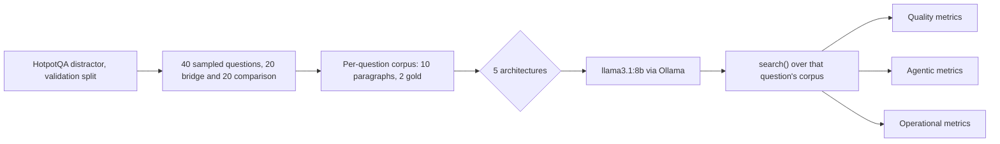

# Agentic Architectures: Sequential vs. Orchestrator Styles

This experiment compares five ways to structure a multi-step agent that answers a question requiring two separate lookups. It also measures what each structure costs to run: how many steps it takes, how often it hands control between roles, and how often it runs out of budget without a clean answer.

**In short:** the Supervisor + Verification Loop won on accuracy (60% exact match, versus 47.5% for the other four, which all tied). But the two "smarter" adaptive designs each had a specific failure mode worth knowing before you reach for them: the adaptive orchestrator's planner never once decided it had enough information on its own, in all 40 runs, so its step cap did 100% of the "when to stop" work. The single agent had the same problem in a different costume: it answered correctly 73% of the time it actually committed to an answer, but committed only 65% of the time, burning its whole budget re-searching instead. And running two lookups in parallel instead of one after another produced byte-for-byte identical answers and barely any wall-clock speedup, because the local model server serializes requests internally regardless of how many threads call it.

## Setup

**The problem.** [HotpotQA](https://huggingface.co/datasets/hotpotqa/hotpot_qa) (distractor config) is a multi-hop question answering dataset: every question needs facts from two different Wikipedia paragraphs to answer, and every question ships with 10 candidate paragraphs, 2 that actually support the answer and 8 unrelated distractors. That fixed paragraph set becomes the corpus a `search()` tool retrieves over for that question. There is no live web search here: keeping the corpus fixed and small means every architecture is judged against exactly the same evidence, so any difference in accuracy comes from how an architecture plans and uses the tool, not from differences in what the tool can find.

The `search()` tool always returns only its single best-matching paragraph. With 2 gold paragraphs needed per question, one search can never fully answer a question. That's deliberate: it forces every architecture to actually decide whether, when, and how to search again, which is the real design question this experiment is about.

HotpotQA questions come in two types, and they stress an architecture differently:
- **Bridge** questions: hop 2 needs an entity or fact hop 1 finds. Example: "What position did the leader of party X hold in the year they became leader?" You need to know *who* the leader is before you can look up their position.
- **Comparison** questions: two independent lookups, compared against each other. Example: "Who was born earlier, person A or person B?" Hop 2 doesn't need anything from hop 1.

40 questions were sampled, split evenly between the two types, so no architecture is judged on an easier slice.

**Model.** Every architecture runs on the same local model, `llama3.1:8b` (Q4_K_M) via [Ollama](https://ollama.com), through one shared [`llm_client.py`](llm_client.py). Any accuracy or cost difference between architectures comes from architecture, not from different models answering.

**Retrieval.** Paragraphs are embedded with a small local sentence-transformer (`all-MiniLM-L6-v2`) and ranked by cosine similarity against the query. See [`retrieval.py`](retrieval.py).



## Architectures compared

| Architecture | Control flow |
|---|---|
| Single-Agent ReAct | One agent loops Thought → Action → Observation, deciding turn by turn whether to search again or finish. No decomposition, no other agents. |
| Sequential Pipeline (fixed) | A Decomposer writes both sub-questions upfront. Hop 1 and Hop 2 each retrieve and answer in fixed order. A Synthesizer combines them. No stage revisits an earlier one's output. |
| Orchestrator (sequential dispatch) | A Planner dispatches one Worker lookup at a time and sees the result before deciding the next sub-question, so later queries can reuse facts earlier ones found. Stops adaptively. |
| Orchestrator (parallel dispatch) | Same upfront decomposition as the fixed pipeline, but both Worker lookups run concurrently. A Synthesizer combines them at the end. |
| Supervisor + Verification Loop | A Supervisor routes between a Retriever, a Reasoner (drafts an answer), and a Verifier (checks the draft is actually supported by evidence). A rejected draft sends the Supervisor back to refine the search query. |

Every architecture's exact prompts are in its module under [`techniques/`](techniques/) and are shown verbatim in the dashboard's Architecture Deep-Dive tab.

## Evaluation methodology

**Quality metrics:** Exact Match and token-overlap F1 (SQuAD-style) against the gold answer, reported overall and split by question type (bridge vs. comparison), since that split is where architectures are expected to diverge most.

**Agentic metrics:**
- **Step / loop count**: how many model or tool calls one question took
- **Tool execution latency**: wall-clock time inside `search()` itself
- **Tool error / retry rate**: fraction of runs with at least one failed tool call
- **Inter-agent handoff count**: how many times control passed between roles. It's 0 for the single-agent baseline by construction, since there's only one role
- **Early termination rate**: fraction of runs that hit their step cap without a clean finish or verdict, instead of stopping because the architecture decided it was done
- **State overhead**: size in bytes of the shared state passed at the final handoff (or, for the single agent, its whole running transcript)

**Operational metrics:** tokens used, latency, time to first token, and context payload size for every model call, plus:
- **Empty retrieval rate**, redefined for this task: `search()` always returns a top-1 match, so "empty" here means the retrieved paragraph wasn't one of the 2 gold paragraphs. That's a wasted or misleading lookup, functionally the same failure a truly empty result would cause downstream.

Semantic cache hit rate isn't tracked: nothing in this experiment caches across questions, so the metric wouldn't mean anything here.

## Results

| Architecture | Exact Match | F1 | Bridge F1 | Comparison F1 | Mean Steps | Mean Handoffs | Early Termination | Mean Wall-Clock | Mean Prompt Tokens |
|---|---|---|---|---|---|---|---|---|---|
| Single-Agent ReAct | 47.5% | 0.481 | 0.400 | 0.561 | 6.7 | 0 | 35.0% | 10.9s | 1,317 |
| Sequential Pipeline (fixed) | 47.5% | 0.527 | 0.435 | 0.619 | 6.0 | 3 | 0.0% | 5.7s | 643 |
| Orchestrator (sequential dispatch) | 47.5% | 0.533 | 0.389 | 0.676 | 10.0 | 7 | 100.0% | 8.9s | 1,196 |
| Orchestrator (parallel dispatch) | 47.5% | 0.527 | 0.435 | 0.619 | 6.0 | 4 | 0.0% | 5.1s | 643 |
| **Supervisor + Verification Loop** | **60.0%** | **0.623** | 0.410 | **0.836** | 7.0 | 7 | 47.5% | 8.5s | 788 |

Every architecture had a 0% model-call error rate across all calls, so none of the gap above comes from outright failures, only from what each architecture chose to do.

See the full results, every prompt, and a step-by-step trace of any question through any architecture in the dashboard: `streamlit run app.py`.

## Why these metrics, and which ones actually mattered

Listing what a metric means isn't the same as knowing whether it did any work. Here's what each category actually bought us, checked against the real numbers above rather than the plan we had before running anything.

**Quality metrics alone would have said almost nothing.** Four of the five architectures tie at 47.5% exact match. Read only the Exact Match column and the honest conclusion is "architecture barely matters here." That conclusion is wrong, and the only reason we know it's wrong is that the other two metric categories were tracked at all.

**Early termination rate was the single most decisive metric in this experiment, because it answers a different question than accuracy does.** Exact match asks whether the final answer was right. Early termination rate asks whether the architecture stopped because it chose to, or because we forced it to. For Orchestrator (sequential dispatch), those two questions have very different answers: its accuracy looks unremarkable, tied with three other architectures at 47.5%, but in all 40 runs the Planner never once decided on its own that it had enough information. It didn't run out of things to search because the question needed more rounds; it ran out of rounds, every single time, because we capped it at 3 and it never said "DONE" before hitting that cap. An architecture can land on the right answer without ever demonstrating it knew it had enough to stop, and accuracy alone can't tell those two things apart. This is exactly what an agentic metric exists to catch: a process that looks fine from its output and isn't, because what's keeping it bounded is an external cap, not the architecture's own judgment. Practically, that means this architecture's correctness right now is partly a property of *us* choosing 3 rounds, not of the architecture reliably knowing when to quit; a different cap would very likely change its behavior.

**Empty retrieval rate was what explained *why* Supervisor won, not just *that* it won.** Its 9.6% miss rate against 17.5-19.8% everywhere else is a mechanical explanation: better evidence, found through query refinement, not some vaguer claim about better reasoning. Without this metric, "Supervisor scores highest" would be a result with no mechanism behind it.

**Mean handoffs and mean prompt tokens were only informative read against accuracy, never alone.** Orchestrator (sequential dispatch) and Supervisor both average 7 handoffs, the joint-highest in the experiment, for the worst and the best accuracy respectively. Orchestrator (sequential dispatch) also spends the second-most tokens (1,196) for tied-worst accuracy. Neither number means anything by itself; both are the direct evidence that more coordination and more spend don't automatically buy more quality; what that coordination and spend are actually *for* does.

**Tool error rate and model-call error rate did no differentiating work in this run, and that's worth stating plainly rather than omitting.** Both sat at 0% for every architecture. That's not a wasted metric: it's what lets every other finding above be read as a genuine behavioral difference rather than a difference in how often something just broke. A metric that shows no variance is still doing its job if its job was to rule something out.

**Mean state overhead bytes explained a cost mechanism, not a quality outcome.** It's why Single-Agent ReAct is expensive (its whole transcript, carried forward every turn) without being why it's inaccurate. Useful for understanding *where* the cost comes from, not for predicting which architecture wins.

## What we learned

**1. The adaptive planner never once decided it had enough information, in all 40 runs.** Orchestrator (sequential dispatch)'s early termination rate is 100%: every single run used its full 3-round budget rather than the Planner emitting `Next: DONE`. Looking at the actual planner output makes this concrete. For "Are both Adolfo Bioy Casares and James Norman Hall Argentinian authors?", a clean comparison question, the planner asked for Bioy Casares' nationality, then Hall's nationality (both questions answered after 2 rounds), then invented a third question anyway: "What is the nationality of the co-author of James Norman Hall's novel 'Mutiny on the Bounty'?" It never once judged that it was done; the step cap was the only thing that ever stopped it. This is the direct operational cost of adaptive planning: the architecture is only as bounded as the cap you put on it, not as bounded as the model's own judgment, so budget it like a hard limit you will always hit, not a ceiling you might. This isn't a new discovery: it's the same problem ReAct-style agents were already known to have when a stopping condition depends on the model itself recognizing it has enough ([Yao et al., 2022](https://arxiv.org/abs/2210.03629)); this experiment confirms it shows up in an orchestrator's planner role too, not just a single agent's own loop.

**2. The same failure showed up in the single-agent baseline, just wearing a different costume.** Single-Agent ReAct never emitted `Action: finish[...]` on 35% of runs (14 of 40), instead looping on `search[...]` until it hit its 4-turn cap. But on the 26 runs where it did commit to an answer, it was right 73% of the time (19 of 26). The model's reasoning wasn't the bottleneck; deciding it had looked hard enough was. Put next to finding 1, this is the same root cause appearing in two structurally different architectures: a single agent freely deciding whether to act again, and an orchestrator's dedicated planner role deciding whether to delegate again. Both defaulted to "look for more" over "commit to an answer," which suggests this is a property of the model's disposition toward the search/finish decision itself, not of either control-flow structure.

**3. The verification loop won on accuracy, but by rescuing bad retrievals, not by out-reasoning bridge questions.** Supervisor + Verification Loop reached 60% exact match, 12.5 points above every other architecture, and its F1 lead is almost entirely on comparison questions (0.836, versus 0.561-0.676 elsewhere). Its lead evaporates on bridge questions, where its 0.410 F1 is statistically indistinguishable from the rest (0.389-0.435 on 20 questions). The mechanism is visible in the round-count distribution: 19 of 40 runs had their first draft accepted immediately, 19 of 40 exhausted all 3 rounds without ever getting the Verifier's approval, and only 2 landed in between. That bimodal split says the query refinement step works when the *first* retrieval was merely mediocre, giving the Supervisor room to phrase a better query against the same fixed corpus, but doesn't help when the corpus genuinely lacks better evidence for that phrasing, or when the missing piece is a second hop the loop was never designed to chase. This matches a broader finding that self-correction without new external information tends to plateau or thrash rather than converge ([Huang et al., 2023](https://arxiv.org/abs/2310.01798)): the Verifier can reject a bad draft, but "try a different search query" isn't new information when the same 10 paragraphs are all that exist. Its lower empty-retrieval rate (9.6%, versus 17.5-19.8% elsewhere) shows the refinement step is genuinely finding better paragraphs sometimes, just not reliably enough to escape a truly hard case within 3 rounds.

**4. Parallel dispatch bought almost nothing here, and the reason is the serving backend, not the architecture.** Orchestrator (parallel dispatch) and Sequential Pipeline (fixed) share the exact same upfront decomposition and produced byte-for-byte identical predicted answers on every one of the 40 questions (both 47.5% exact match, both 0.527 F1, identical bridge and comparison splits). That's expected at temperature 0: dispatch order doesn't change what either hop retrieves or what the model outputs, only when it happens. What's more informative is the wall-clock gap: 5.1s parallel versus 5.7s sequential, about 10%, far short of the roughly 2x a truly concurrent backend should give two independent lookups. Ollama was running with a single parallel processing slot, so concurrent requests from the two worker threads were still served one at a time by the model. The lesson generalizes past this experiment: parallel dispatch is a property of your architecture's *intent*, but the latency win only shows up if your serving layer (batching, multiple GPUs, multiple hosted replicas) actually honors that intent. Measuring "parallel" architectures against a single-slot local server will always understate their real-world benefit.

**5. Fixed decomposition guessed at bridge hops it couldn't have known; adaptive planning didn't clearly fix it, at this sample size.** The original hypothesis was that Sequential Pipeline's blind, upfront decomposition would specifically hurt bridge questions, where hop 2 needs an entity hop 1 hasn't found yet, and that Orchestrator (sequential dispatch)'s adaptive re-planning would recover that gap. The data doesn't support a clean win: bridge F1 was 0.435 for the fixed pipeline versus 0.389 for the adaptive orchestrator, a difference well inside the noise of a 20-question sample, not the clear recovery the hypothesis predicted. Spot-checking individual traces shows why the adaptive version doesn't cleanly help even when it could: per finding 1, its planner keeps generating additional sub-questions past the point where it already had the bridge entity, and that extra, sometimes off-target searching dilutes the evidence handed to the Synthesizer as often as it sharpens it. Adaptive planning only pays for itself if the planner also knows when to stop adapting.

**6. State overhead was the single-agent's real cost, hidden inside "just one agent."** Single-Agent ReAct carried a mean state overhead of 2,855 bytes (its entire running transcript), 4 to 10 times every multi-agent architecture (292-762 bytes), because a multi-agent handoff only carries forward a small structured summary (a sub-question and its answer), while a single agent's context is its whole history, verbatim. That's also why it had the highest mean prompt tokens (1,317) and highest latency (10.9s) despite doing the least explicit coordination (0 handoffs, by construction): "no coordination overhead" doesn't mean "no overhead", it means the overhead moved into the transcript instead of into handoff messages.

## Caveats

- 40 questions is enough to see clear directional differences between architectures, not enough for tight statistical confidence on the exact percentage-point gaps.
- A local 8B model run at temperature 0 with strict output-format instructions is a noisier narrator than a larger hosted model would be: some of the differences between architectures are really differences in how reliably `llama3.1:8b` follows a given prompt's format, not purely architectural. This is itself a real operational finding, not just noise to ignore (see "Model backend" below).
- Ollama serves one model to one caller at a time on a single local GPU/CPU, so "parallel" dispatch in this experiment measures the architecture's *coordination pattern*, not the latency win a truly parallel hosted backend (with batching or multiple GPUs) would deliver.

## Terminology

**Agent.** A loop where a language model repeatedly decides what to do next (call a tool, ask another agent, or answer) based on what's happened so far, rather than following a fixed script. The "decides" part is what makes it an agent instead of a plain function call: the same code can take a different path on every run depending on the model's output.

**Tool / tool call.** A non-model function an agent can invoke to get information it doesn't already have, here a single `search(query)` function that looks up the most relevant paragraph in that question's fixed corpus. A tool call is not a model call: it costs no tokens, but it does cost wall-clock time and can fail (a bad query, a timeout), which is why it gets its own error-rate metric.

**Orchestrator / worker.** A pattern where one agent (the orchestrator) decides *what* work needs doing and delegates each piece to a separate worker agent, then combines the results. The orchestrator itself usually doesn't touch the raw evidence; it manages a plan. See Anthropic's [building effective agents](https://www.anthropic.com/engineering/building-effective-agents) for the reference version of this pattern.

**Supervisor.** Similar to an orchestrator, but the supervisor's workers are specialists with distinct jobs (here: Retriever, Reasoner, Verifier) rather than interchangeable copies of the same worker, and the supervisor can route back to an earlier specialist based on a later one's judgment, rather than only moving forward.

**Handoff.** One transfer of control (and the state that's been built up so far) from one role to another, e.g. an orchestrator passing a sub-question to a worker, or a worker passing its answer back. Counting handoffs matters because each one is a place a multi-agent system can lose information: whatever isn't explicitly written into the handoff message doesn't reach the next role, even if an earlier role "knew" it.

**State / state overhead.** The information an agent (or a whole multi-agent system) is carrying forward between steps: for a single agent, its running transcript; for a multi-agent system, whatever gets serialized into each handoff. State overhead is the size of that payload. It's a real operational cost distinct from token count, because it's what has to be built, serialized, and kept consistent as a system gets more agents and more steps.

**Multi-hop question answering.** A question that can't be answered from one fact or one document; answering it correctly requires finding one fact, then using it to find a second, related fact. HotpotQA's "bridge" questions are the clearest example: you can't even form a sensible second search query until the first search tells you who or what you're now looking up.

**Semantic search / embedding.** Instead of matching exact keywords, a semantic search tool converts text into a vector (a list of numbers, called an embedding) that captures its meaning, and finds the closest vectors to a query's vector. Text with similar meaning ends up with similar vectors even if it doesn't share any of the same words, which is why "who leads the company" can match a passage that says "chief executive officer" without either phrase appearing in the other.

**Exact Match / F1.** Two ways of scoring a predicted answer against the correct one. Exact Match is strict: 1 if the (normalized) strings match exactly, 0 otherwise. F1 gives partial credit based on word overlap, so a predicted answer that's mostly right but missing or adding a word still scores above zero. Both are standard for extractive QA datasets like HotpotQA and SQuAD.

**Time to first token (TTFT).** How long a model takes to start responding, as opposed to total latency, which includes the time to finish the whole response. It's the metric closest to how responsive a system *feels*, since a user (or the next step in a pipeline) is waiting on the first token, not the last one.

## Grounding research

* [Yao et al., 2022, ReAct: Synergizing Reasoning and Acting in Language Models](https://arxiv.org/abs/2210.03629)
* [Wang et al., 2023, Plan-and-Solve Prompting](https://arxiv.org/abs/2305.04091)
* [Prasad et al., 2023, ADaPT: As-Needed Decomposition and Planning with Language Models](https://arxiv.org/abs/2311.05772)
* [Anthropic, 2024, Building effective agents](https://www.anthropic.com/engineering/building-effective-agents)
* [Shinn et al., 2023, Reflexion: Language Agents with Verbal Reinforcement Learning](https://arxiv.org/abs/2303.11366)
* [Madaan et al., 2023, Self-Refine: Iterative Refinement with Self-Feedback](https://arxiv.org/abs/2303.17651)
* [Huang et al., 2023, Large Language Models Cannot Self-Correct Reasoning Yet](https://arxiv.org/abs/2310.01798)
* [Yang et al., 2018, HotpotQA: A Dataset for Diverse, Explainable Multi-hop Question Answering](https://arxiv.org/abs/1809.09600)

## Reproducing this

`requirements.txt` only covers the dashboard (`app.py`), which just reads the results already saved in `results/records.json`. Running the experiment itself needs a few heavier packages, listed separately in `requirements-experiment.txt`, so the dashboard stays light to deploy.

To just view the dashboard:

```bash
pip install -r requirements.txt
streamlit run app.py
```

To rerun the whole experiment from scratch:

```bash
ollama pull llama3.1:8b        # one time setup
pip install -r requirements-experiment.txt
python3 -u run_experiment.py   # about 27 minutes on an M4 MacBook Air
streamlit run app.py
```
