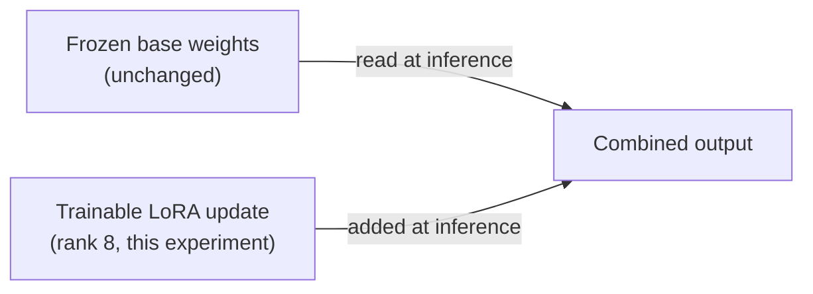
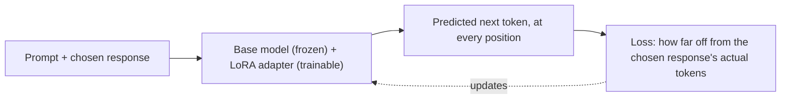
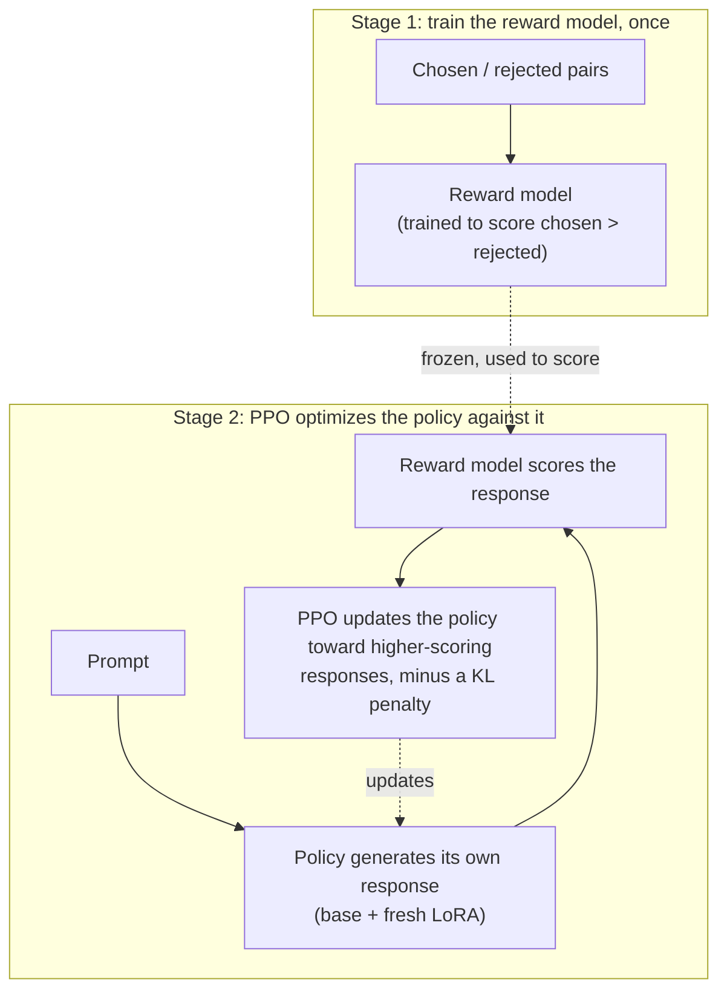
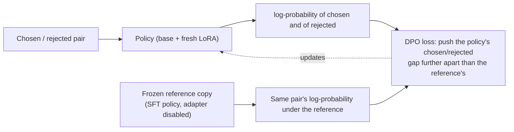

# SFT vs RLHF vs DPO

This experiment trains the same small model three different ways, SFT, RLHF (with PPO), and DPO, on the same preference data, and compares what each one actually produces. Unlike most of the experiments in this repo, this one doesn't just call a model: it runs real gradient training, locally, on a laptop.

**[Live dashboard](https://swati-alignment-comparison.streamlit.app/)**

**In short:** DPO won decisively, a 75% overall win rate against RLHF's 41% and SFT's 34%, and the reason is visible in the training numbers, not just the outcome: RLHF's reward model scored only 48.1% accuracy on held-out preference pairs, worse than random guessing, while DPO's implicit preference signal hit 71.2% on the same kind of check. At this small scale, RLHF's reward model didn't learn a preference signal reliable enough for PPO to productively optimize against, and it cost roughly 1.5x DPO's training time to get there.

## Goal

Does skipping the reward model and the step-by-step RL loop (DPO) lose quality compared to the full RLHF recipe, or does it get there cheaper and more reliably? And how much do either of them actually buy you over just training on demonstrations directly (SFT)?

## A framing note before anything else

"SFT, RLHF, PPO, and DPO" is sometimes talked about as four competing techniques. It isn't quite that. RLHF is a training *pipeline* (train a reward model, then optimize a policy against it), and PPO is the specific reinforcement-learning algorithm used to do that optimization step. Listing "RLHF" and "PPO" as two separate, competing arms double-counts the same thing. The real three-way comparison is:

1. **SFT**: train directly on demonstrations, no preference signal at all
2. **RLHF (PPO)**: train a reward model on preference pairs, then use PPO to optimize a policy against it
3. **DPO**: skip the reward model and the RL loop, and optimize directly on the same preference pairs in one training step

All three start from the same SFT checkpoint. Per the standard RLHF recipe, PPO and DPO both assume a model that already follows instructions reasonably well before preference tuning begins; starting from the raw base model would confound "does this technique work" with "can this model follow instructions at all."

## Setup

**Base model:** [`HuggingFaceTB/SmolLM2-135M-Instruct`](https://huggingface.co/HuggingFaceTB/SmolLM2-135M-Instruct), 135 million parameters. This experiment trains real weights three separate times (four, counting the reward model), on a laptop with no dedicated GPU, so the model had to be small enough that a full pipeline of SFT, reward model training, PPO, and DPO all finish in reasonable time. SmolLM2 is built by Hugging Face specifically for this kind of cheap, local experimentation, and is still coherent enough that differences between the three techniques' outputs are legible.

**Compute:** Apple M4, 16GB unified memory, no CUDA. Training runs on PyTorch's MPS (Metal) backend. Every technique trains through [LoRA](#lora-the-training-method-all-three-techniques-share) rather than full fine-tuning, both to keep memory and step time down, and to keep the comparison controlled: every technique trains the same size and shape of update, so a difference in results comes from the training objective, not from one technique getting a bigger trainable budget than another.

**A real memory leak, found and fixed here.** An early full-scale run degraded from roughly 1.5 steps/second to over 10 seconds/step within the first 20 SFT steps, and system memory swap climbed to within a few hundred MB of exhausted. The cause: PyTorch's MPS allocator caches freed memory blocks for reuse rather than returning them to the OS, and this experiment's batches are padded to whatever the longest sequence in that specific batch happens to be, so batch shapes vary step to step. Differently-sized blocks can't be reused from the cache, so the cache kept growing rather than staying flat. The fix, in [`common.py`](common.py)'s `MPSCacheClearingCallback`, calls `torch.mps.empty_cache()` every 5 steps; peak memory usage across the real run stayed bounded after that. Mentioned here rather than silently fixed, because it's a genuine property of local single-GPU (well, single-unified-memory) training with variable-length batches, not something specific to this experiment's code.

## Dataset: Anthropic/hh-rlhf

[Anthropic/hh-rlhf](https://huggingface.co/datasets/Anthropic/hh-rlhf) is a dataset of AI assistant conversations where crowdworkers were shown two possible responses to the same message and picked which one they preferred, along two axes: helpfulness and harmlessness (the "hh" in the name). It comes from Anthropic's own paper on building RLHF-trained assistants, [Bai et al., 2022](https://arxiv.org/abs/2204.05862), and was built specifically to train reward models, which is exactly the role it plays here too.

Each row has a `chosen` and a `rejected` transcript: identical conversation up to the final turn, then two different possible assistant replies, one marked as preferred. The full dataset has four parts: `helpful-base`, `helpful-online`, `helpful-rejection-sampled`, and `harmless-base`. This experiment uses only `helpful-base`, for two reasons. First, `harmless-base` is built from adversarial red-teaming prompts meant to provoke unsafe responses, which isn't appropriate content for a public dashboard's example outputs. Second, this experiment is about comparing *how* SFT, RLHF, and DPO learn from preference data, not about safety tuning specifically, so one clean, on-topic subset is enough.

Within `helpful-base`, this experiment further restricts to single-turn conversations (one human message, one assistant reply), to keep prompts short and training tractable on a laptop. That still leaves tens of thousands of eligible pairs. See [Results](#results) for exact training and evaluation counts. Evaluation prompts come from hh-rlhf's separate test split, never seen during training.

**How each technique uses this data, differently:**
- **SFT** only ever looks at the `chosen` half of each pair, and never sees `rejected` at all.
- **RLHF** uses the full pairs, but indirectly: its reward model trains on them once, and from that point on, PPO never looks at the original pairs again, only at the reward model's opinion of whatever the policy generates on its own.
- **DPO** uses the full pairs directly, every training step, with no reward model in between.

## Terminology

This experiment leans on a few training and RL concepts throughout. Skip this section if they're already familiar.

**Fine-tuning.** Taking a model that already knows how to talk, and training it a bit more on new examples so it picks up a specific style or behavior. Like a new hire who already knows how to do the job in general, going through a short course on how *this specific company* wants things done.

**LoRA (Low-Rank Adaptation).** A cheap way to fine-tune a model without touching almost any of its original numbers. Picture the model's original weights as a locked book: instead of rewriting pages, LoRA writes a small set of sticky notes next to a few specific pages, and only those notes get trained. The book itself never changes. See [LoRA, the training method all three techniques share](#lora-the-training-method-all-three-techniques-share) below for the full picture, and [peft-comparison](../peft-comparison/README.md) for exactly how much cheaper this makes training and what it costs.

**Preference pair.** Two different responses to the same question, where a human said one was better than the other. Not a right-or-wrong answer key, just "this one over that one." This is the raw material both RLHF and DPO learn from.

**Reward model.** A model whose only job is to read a response and output a single number saying how good it is. Trained on preference pairs first; RLHF then uses its scores to guide training, the way a teacher's grade tells a student how they're doing without the student re-reading the whole textbook every time.

**Policy.** The model actually being trained to respond better. In RLHF, it's the one being steered by the reward model's scores. "Policy" is just the standard term for "the thing making decisions" in this kind of training.

**PPO (Proximal Policy Optimization), [Schulman et al., 2017](https://arxiv.org/abs/1707.06347).** The specific method RLHF uses to update the policy based on the reward model's scores. "Proximal" means it deliberately takes small, careful steps instead of big ones, so the model doesn't suddenly swing into strange behavior chasing a high score.

**KL divergence / KL penalty.** A number measuring how far the model has drifted from where it started. RLHF adds a penalty for drifting too far, so the model doesn't get so focused on pleasing the reward model that it starts producing things the reward model happens to score highly but that aren't actually good responses (see "reward hacking" below).

**Reward hacking.** When a model learns to score well on a reward model's scale without actually getting better at the underlying task, the training equivalent of teaching to the test. The KL penalty above is RLHF's main defense against it.

**DPO (Direct Preference Optimization), [Rafailov et al., 2023](https://arxiv.org/abs/2305.18290).** A way to learn from the same preference pairs as RLHF, but without training a separate reward model or running PPO's step-by-step loop. It goes straight from "here's a pair humans compared" to "nudge the model to prefer the better one," in one training step.

**Win rate.** Out of every head-to-head comparison between two techniques' responses, the share one technique was picked as better. A 60% win rate means that technique's response was judged better 6 times out of 10.

**Held-out prompts.** Questions none of the three techniques ever saw during training, used to test them fairly, the same way a final exam covers material the class studied but uses questions the students never saw the answers to.

## LoRA: the training method all three techniques share

Before getting into what makes SFT, RLHF, and DPO different, it helps to cover what they all have in common: none of them change the model's original numbers directly. This model has 135 million individual numbers (parameters) that control everything it does. Training all 135 million of them, every time, for every technique, would be slower and need more memory than necessary.

LoRA is a shortcut. Picture the model's original numbers as a locked book: instead of rewriting pages in that book, LoRA writes a small set of sticky notes that sit next to a few specific pages, and only those sticky notes get written on during training. When the model runs, it reads the original page *and* the sticky note next to it, and combines the two. The book itself never changes, and once training is done, the sticky notes can be folded directly back into the book, so the trained model runs exactly as fast as the original.

Every technique in this experiment, SFT, RLHF's reward model and PPO policy, and DPO, trains its own fresh set of sticky notes on top of the same starting book (the SFT checkpoint, for RLHF and DPO). That's deliberate: it means any difference in this experiment's results comes from *what each technique is trying to teach the sticky notes to do*, not from one technique quietly getting more room to write than another. See [peft-comparison](../peft-comparison/README.md) for exactly how many parameters LoRA touches and what it costs compared to training the whole model.



## Architecture deep dive

### SFT: copy the good example

SFT (supervised fine-tuning) is the simplest of the three. For every training example, the model is shown a question and a good answer to it, and trained to get better at predicting that answer, one word at a time. It never sees a bad answer, and it's never asked to judge anything, only to imitate.

This is the same basic idea as a student copying out a worked example from a textbook until they can reproduce the method on their own. It works well when the good answer is genuinely representative of what's wanted, and it's the fastest and simplest of the three to train, but it has a ceiling: the model can only get as good as the examples it was shown, and it never learns anything about what makes an answer *better*, only what one acceptable answer looks like.



### RLHF (PPO): train a scorer, then train against it

RLHF starts from the SFT model, then adds two more stages. First, it trains a **reward model**: a separate model shown pairs of responses and taught to give the better one a higher score, the way a teacher grades essays. Once that's trained, the second stage, **PPO**, has the policy (the model being trained) write its own new responses, has the reward model score them, and nudges the policy's numbers toward whatever tended to score higher.

This is closer to learning by practicing and getting feedback than to copying an example: the model isn't shown a correct answer, it writes something itself and finds out how good it was. The risk is reward hacking (see Terminology); RLHF guards against it with a KL penalty that punishes the policy for drifting too far from where it started.



### DPO: skip the scorer, learn from the pairs directly

DPO also starts from the SFT model, and uses the exact same chosen/rejected pairs RLHF's reward model is trained on. But instead of training a separate scorer and running a whole practice-and-feedback loop, DPO does something more direct: for each pair, it nudges the model to make the chosen response more likely and the rejected one less likely, compared to how a frozen, untouched copy of the SFT model would have scored that same pair. One training pass over the pairs, no scorer, no generation step, no separate practice loop.

The appeal is obvious: simpler to implement, less infrastructure (no second model to train and hold in memory), and generally more stable to train than PPO's loop. The trade-off is that DPO never generalizes beyond the exact pairs it's shown the way a reward model can, since it has no separate scoring function of its own, only ever a direct comparison against pairs it's seen.



## Metrics

Chosen deliberately for what this comparison actually needs, not the repo's full standard metric list:

- **Win rate (pairwise, judged)**: the metric that answers this experiment's goal question. Each technique's held-out responses are judged head-to-head by a local Ollama model, blind to which technique produced which response, with response order randomized per call to control for position bias.
- **Wall-clock training time and peak memory**: RLHF's whole pitch against DPO is "worth the extra infrastructure cost"; this is what makes that cost concrete instead of assumed.
- **Reward model accuracy (held out)**: checks that RLHF's reward model actually learned the preference signal before trusting PPO's results built on top of it.
- **DPO's implicit reward margin and accuracy (held out)**: DPO has no separate reward model to check, but its loss function implies one; these two numbers are the closest equivalent check for DPO.
- **KL divergence from the reference policy (RLHF)**: the standard signal for whether PPO drifted sensibly or started reward-hacking.

## Results

Trained on 600 preference pairs, evaluated on 60 held-out prompts, 180 pairwise judgments total (3 technique pairs × 60 prompts), zero ties.

**Win rates:**

| Technique | Overall win rate |
|---|---|
| DPO | 75.0% |
| RLHF (PPO) | 40.8% |
| SFT | 34.2% |

**Head-to-head:**

| Matchup | Result |
|---|---|
| SFT vs RLHF (PPO) | RLHF wins, 56.7% to 43.3% |
| SFT vs DPO | DPO wins, 75.0% to 25.0% |
| RLHF (PPO) vs DPO | DPO wins, 75.0% to 25.0% |

**Training metrics:**

| Technique | Wall-clock | Peak memory | Train loss | Held-out accuracy |
|---|---|---|---|---|
| SFT | 157s | 4.72GB | 1.97 | — |
| Reward model (for RLHF) | 108s | 3.30GB | 0.74 | 48.1% |
| RLHF (PPO stage) | 473s | 4.83GB | — (mean reward 0.69 → 2.22) | — |
| DPO | 399s | 4.27GB | 0.65 | 71.2% (implicit reward accuracy) |

RLHF's total cost is the reward model plus the PPO stage: about 581 seconds combined, against DPO's 399 seconds alone.

## Which metrics actually mattered

**Win rate was the metric that actually explained the result, and it wasn't close.** DPO won 75% of its head-to-head judgments overall, against RLHF's 41% and SFT's 34%, and beat each of the other two directly 75% to 25%, with zero ties across all 180 judged comparisons. That's a decisive, not marginal, gap.

**The reward model's held-out accuracy was the single most explanatory secondary metric.** RLHF's reward model scored 48.1% accuracy on held-out preference pairs, worse than random guessing (50%). PPO spent its entire training budget optimizing against a scorer that had not reliably learned which response was actually better. That single number does more to explain RLHF's weak win rate than anything else measured here: PPO's own training-time reward went up (mean reward 0.69 → 2.22), but that's the reward model's opinion improving, not evidence the policy actually got better, since the scorer it was climbing wasn't shown to track quality. DPO's equivalent number, held-out reward accuracy of 71.2%, tells the same kind of story in the opposite direction: its implicit preference signal generalized far better than the reward model's explicit one, at the exact same data scale.

**Wall-clock time and memory differentiated cost, not quality, and did so unevenly.** RLHF's total cost (reward model training plus PPO) was about 581 seconds, roughly 3.7x SFT's 157 seconds and about 1.5x DPO's 399 seconds, while producing the worst win rate of the three. Peak memory, by contrast, barely differentiated anything: every technique here landed in a narrow 3.3-4.8GB band, because LoRA keeps every technique's trainable footprint small regardless of what it's optimizing. Memory was the metric that mattered least in this run, worth saying plainly rather than implying it was decisive just because it was measured.

**PPO's mean KL from the reference policy came out slightly negative (-0.13), which is noise, not a real signal at this scale.** KL divergence can't be negative in theory; a small negative reading is a known property of the low-variance k1 estimator TRL uses, under a small batch size and few PPO steps. This metric needed more training steps than this run's laptop-scale budget gave it to be read with any confidence, and shouldn't be over-interpreted here.

## What we learned

**1. DPO's implicit reward generalized far better than RLHF's explicit reward model, at identical data scale, and this is a confirmation of DPO's own stated rationale, not a new finding.** [Rafailov et al., 2023](https://arxiv.org/abs/2305.18290) argue that a language model is "secretly" already a reward model: DPO's objective reuses the policy's own pretrained distributional competence directly, rather than learning a scoring function from scratch. RLHF's reward model here had to learn that scoring function from a randomly-initialized head, on only 600 examples and a small LoRA budget (rank 8, query/value projections only), which is a much harder learning problem than reweighting probabilities a competent language model already assigns to fluent text. The 71.2% vs 48.1% gap in held-out accuracy is exactly the outcome that argument predicts. This experiment doesn't discover anything new here; it makes the mechanism concretely visible at a scale small enough to watch happen.

**2. A reward model's training-time reward curve going up is not, by itself, evidence that PPO made the policy better.** RLHF's mean reward rose from 0.69 to 2.22 over training, which would look like clear progress read on its own. But a reward signal is only informative if the reward model tracks real quality, and this one didn't reliably (48.1% held-out accuracy). This is the exact failure mode described in [Gao et al., 2023](https://arxiv.org/abs/2210.10760), on reward model overoptimization: a policy can climb a reward model's score while making no real progress, or getting worse, once the reward model itself is unreliable. This experiment's reward model is far smaller and more data-starved than the ones that paper studies, but the underlying mechanism is the same one it names.

**3. RLHF still narrowly beat SFT despite a near-chance reward model, which suggests even a noisy preference signal carries some value over pure imitation, just far less than a clean one.** Head-to-head, RLHF beat SFT 56.7% to 43.3%. A reward model at 48.1% held-out accuracy failed to generalize, but that doesn't mean it carried zero signal on the specific training examples PPO actually optimized against; it means that signal didn't reliably transfer to prompts it hadn't seen. The gap between RLHF's modest win over SFT and DPO's large one over both is consistent with "some real signal, poorly generalized" rather than "no signal at all."

**4. Small autoregressive models degenerate into repetition regardless of which technique trained them, and DPO's overall win doesn't make it immune.** The clearest individual counter-example (see the dashboard's Query Explorer) is DPO producing "It is a way to pay for the car with cash." three times in a row on a car-leasing question, losing that specific comparison to SFT's plainer but more coherent answer. Repetition loops in likelihood-trained language models are a well-documented property of the decoding and training setup itself, not a defect specific to one preference-tuning technique ([Holtzman et al., 2020](https://arxiv.org/abs/1904.09751)), and 135M parameters is small enough that any of the three techniques here can fall into one.

**5. RLHF's extra infrastructure cost did not pay for itself at this scale.** RLHF took roughly 1.5x DPO's wall-clock time (581s vs 399s, reward model included) and produced a lower win rate than DPO, while peak memory barely differed between any of the three techniques, since LoRA keeps every technique's trainable footprint small regardless of the objective behind it. At this scale, "worth the extra infrastructure cost" comes out no for RLHF against DPO, matching the practical rationale teams like the Zephyr project gave for choosing DPO ([Tunstall et al., 2023](https://arxiv.org/abs/2310.16944)). See "What this task does, and doesn't, test" below for why this shouldn't be read as a verdict on RLHF at the scale the literature's own claims are about.

## When to use which technique

**Narrow task, demonstration data already captures it → SFT.** Imagine wanting a model that only writes polite replies to customer complaints. If there are already thousands of examples of a human writing exactly that kind of reply, showing the model those examples directly teaches it to imitate the pattern. There's no judgment call being asked of the model, every example it sees is already a correct answer, so there's nothing to weigh between "better" and "worse." In practice, teams building a tool scoped to one specific, well-bounded job have found plain SFT sufficient for exactly this reason, because the full range of desired behavior can realistically be demonstrated ([Taori et al., 2023](https://crfm.stanford.edu/2023/03/13/alpaca.html)).

**Huge, unpredictable variety of queries → RLHF.** Now imagine a general assistant fielding millions of completely different requests: coding help, medical questions, creative writing, disagreements about politics. No fixed set of "here's the one right answer" examples can cover territory that wide. What helps instead is teaching the model a general sense of what a good answer looks like, one it can apply to situations it's never specifically seen, which is exactly what a reward model provides: not a memorized set of good answers, but a general scoring sense that can judge a brand-new response. Teams building open-ended assistants at large scale have leaned on RLHF for this reason ([Ouyang et al., 2022](https://arxiv.org/abs/2203.02155), [Touvron et al., 2023](https://arxiv.org/abs/2307.09288)).

**Real compute constraints, want stability and simplicity → DPO.** Teams working under tighter compute budgets, or that want a simpler and more stable training pipeline, have found DPO captures most of the benefit of preference tuning without the instability and infrastructure cost of a full reward-model-plus-RL loop ([Rafailov et al., 2023](https://arxiv.org/abs/2305.18290), [Tunstall et al., 2023](https://arxiv.org/abs/2310.16944)).

**This isn't a strict ranking, though.** At least one team that started with DPO later found a well-tuned RL approach outperformed it on certain tasks, a real-world echo of the finding that DPO's simplicity can come at some cost to the ceiling RLHF reaches when tuned well ([Xu et al., 2024](https://arxiv.org/abs/2404.10719)).

## What this task does, and doesn't, test

**What it fairly tests:** how SFT, RLHF, and DPO each turn the same preference data into a trained policy, and what that costs in wall-clock time and memory, on identical starting weights and an identical LoRA budget. The win-rate comparison is a fair, apples-to-apples read of *this data, at this scale*.

**What it can't fairly test:** RLHF's real advantage, per [When to use which technique](#when-to-use-which-technique) above, is supposed to show up at large scale, with a huge, diverse pool of queries a fixed set of examples can't cover, and with a reward model that's had enough data to generalize well. This run's own numbers show exactly what happens when that precondition isn't met: RLHF's reward model, trained on only 600 pairs, scored 48.1% held-out accuracy, worse than chance, so PPO never got the reliable reward signal RLHF's whole case depends on. A 135M-parameter model trained on a few hundred single-turn, English-language, helpfulness-only prompts doesn't exercise RLHF's real advantage at all. This result should be read as "what happens when RLHF's reward model doesn't have enough data to generalize," not as a verdict on RLHF versus DPO at the scale the literature's own claims are about. Likewise, this task can't say anything about safety-relevant preference tuning (the `harmless-base` subset was deliberately excluded, see Dataset above), multi-turn conversation quality, or how any of these techniques hold up on a model large enough to have real reasoning capability to begin with.

## Future work

- **Scale up the base model and dataset**, as its own follow-up experiment once GPU compute is available, to see whether RLHF's win-rate gap over DPO (if any, see Results) grows, shrinks, or reverses at a scale closer to where the literature's own claims were made.
- **Add `harmless-base` as a second, separate comparison**, specifically to see whether RLHF's reward-model generalization matters more for harmlessness (where a fixed rule can be gamed) than for helpfulness (where "chosen" responses are often just more complete).
- **Try a modern RL-without-a-value-model alternative to PPO** (RLOO or GRPO, both available in the `trl` library used here), since PPO's separate value model is exactly the piece that makes RLHF the most memory- and complexity-heavy technique in this comparison; a lighter RL method could change the "is RLHF worth the infrastructure cost" trade-off measured here.

## Caveats

- Trained locally on a 135M-parameter model with LoRA, not full fine-tuning, and on a few hundred single-turn examples. See "What this task does, and doesn't, test" above.
- Win rates are judged by a single local LLM judge (`llama3.1:8b` via Ollama), not human raters. LLM-as-judge has known biases (verbosity, position, style) that this experiment mitigates with randomized response order but can't eliminate.
- PPO trained for fewer epochs than SFT and DPO in this run (see Results), specifically because PPO's generation-heavy rollout step dominates wall-clock time; this keeps the full pipeline tractable on a laptop but means PPO's numbers reflect less training than the other two techniques got.
- The judge never returned a tie across all 180 comparisons. That could mean genuine ties were rare at this quality level, or it could mean the judge (prompted to pick A, B, or TIE) leans toward picking a side by default; this run can't fully distinguish the two, and a reader should treat the exact win-rate numbers as directionally reliable rather than precise to the percentage point.
- RLHF's reward model held-out accuracy (48.1%) is itself a noisy estimate from only 80 held-out pairs; a materially larger held-out set could move that number, though it would need to move a long way to change this run's basic conclusion.

## Grounding research

* [Ouyang et al., 2022, Training language models to follow instructions with human feedback (InstructGPT)](https://arxiv.org/abs/2203.02155)
* [Schulman et al., 2017, Proximal Policy Optimization Algorithms](https://arxiv.org/abs/1707.06347)
* [Rafailov et al., 2023, Direct Preference Optimization: Your Language Model is Secretly a Reward Model](https://arxiv.org/abs/2305.18290)
* [Xu et al., 2024, Is DPO Superior to PPO for LLM Alignment? A Comprehensive Study](https://arxiv.org/abs/2404.10719)
* [Gao et al., 2023, Scaling Laws for Reward Model Overoptimization](https://arxiv.org/abs/2210.10760)
* [Holtzman et al., 2020, The Curious Case of Neural Text Degeneration](https://arxiv.org/abs/1904.09751)
* [Bai et al., 2022, Training a Helpful and Harmless Assistant with Reinforcement Learning from Human Feedback](https://arxiv.org/abs/2204.05862)
* [Hu et al., 2021, LoRA: Low-Rank Adaptation of Large Language Models](https://arxiv.org/abs/2106.09685)
* [Touvron et al., 2023, Llama 2: Open Foundation and Fine-Tuned Chat Models](https://arxiv.org/abs/2307.09288)
* [Taori et al., 2023, Alpaca: A Strong, Replicable Instruction-Following Model](https://crfm.stanford.edu/2023/03/13/alpaca.html)
* [Tunstall et al., 2023, Zephyr: Direct Distillation of LM Alignment](https://arxiv.org/abs/2310.16944)

## Reproducing this

```bash
pip install -r requirements-experiment.txt
python run_experiment.py       # trains SFT, the reward model, PPO, and DPO; ~25 min on an M4 Mac
streamlit run app.py
```

Needs a local [Ollama](https://ollama.com) server running (`ollama serve`) with `llama3.1:8b` pulled, used only for judging, not for training.

To just view the dashboard without re-running training:

```bash
pip install -r requirements.txt
streamlit run app.py
```
