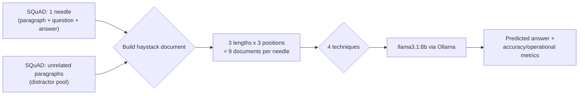

# Context Window Management Compared

This experiment compares 4 ways to decide what actually goes into a model's context window when there is more content than comfortably fits: Full Context (keep everything), Sliding Window (keep only what's recent), Retrieval Selection (keep only what's relevant), and Hierarchical Summarization (compress older content instead of dropping it). It asks a narrower question than the separate [rag-architectures](../rag-architectures) experiment: not which retrieval design wins, but whether the choice of *what to keep in context at all* changes accuracy, and specifically whether the well known "lost in the middle" effect shows up on a model we can actually measure ourselves.

Run the dashboard locally with `streamlit run app.py` (not yet deployed).

**In short:** Full Context won overall (0.795 F1) with Retrieval Selection close behind (0.764 F1) at roughly a sixth of the prompt tokens (596 vs 3,947) and about 9x lower latency (3.5s vs 32.7s), and at the longest documents Retrieval Selection actually beat Full Context outright (0.777 vs 0.756 F1). Sliding Window and Hierarchical Summarization both scored far lower overall (0.526 and 0.502 F1), but for structurally different reasons. Sliding Window fails as a hard, deterministic cutoff: exactly 0.0 F1 in every length/position combination where the needle falls outside its 1,500-word window, and a flat 0.732 wherever it falls inside, a step function, not a gradual decline. Hierarchical Summarization fails softly almost everywhere, but catastrophically (0.0 F1, 16 out of 16 documents) whenever the needle lands in the middle of a document long enough to get summarized, at both medium and long lengths.

## What is a context window, and why compare management strategies at all

A language model only sees what fits inside its context window on a given call. Every call is stateless: nothing from an earlier call carries forward unless it gets resent. Modern context windows are large (Claude's current models run at 1,000,000 tokens), but two problems don't go away just because the window got bigger. First, cost and latency still scale with however many tokens actually get sent, a window "fitting" something doesn't make sending it free. Second, a model's *effective* use of a long context isn't uniform: [Liu et al., 2023](https://arxiv.org/abs/2307.03172) found that accuracy at using a fact drops when that fact sits in the middle of a long context, even though it's technically still inside the window the whole time, a pattern called "lost in the middle."

So in practice, most real systems that deal with more content than fits comfortably don't just widen the window and stop thinking about it. They decide *what* goes in: everything, only what's recent, only what's relevant, or a compressed summary of what came before. This experiment builds all 4 of those decisions side by side, against the same controlled documents, so the comparison is measured rather than assumed.

## Setup

**Dataset.** [SQuAD](https://huggingface.co/datasets/rajpurkar/squad) ships short Wikipedia paragraphs, each with a question and a short extractive answer. This experiment doesn't use those paragraphs as-is, they're too short to stress a context window on their own. Instead, 8 paragraph+question+answer triples are sampled as "needles": the one piece of text that actually contains the answer. Every needle is buried inside a pile of other, unrelated SQuAD paragraphs (the "haystack") built purely for this experiment, at a controlled total length and a controlled position, the same synthetic construction the "Lost in the Middle" paper itself uses.

Every needle is tested at:
- **3 lengths** — short (~500 words), medium (~2,000 words), long (~6,000 words)
- **3 positions** — the needle paragraph placed at the start, middle, or end of the haystack

That's a 3 x 3 grid per needle, 72 documents total, each run through all 4 techniques, 288 runs in total.

**Model.** Every technique runs on the same local model, `llama3.1:8b` (Q4_K_M), through Ollama, using the shared [`llm_client.py`](llm_client.py). Any accuracy difference between techniques comes from what each technique put in context, not from different models answering. Retrieval Selection's embeddings use `sentence-transformers/all-MiniLM-L6-v2`, run locally, no API cost.

**A real gotcha this experiment ran into:** Ollama's `/api/tags` reports `llama3.1:8b`'s maximum supported context as 131,072 tokens, but the server process Ollama actually launches to serve a request defaults to a runtime context window of only 4,096 tokens unless told otherwise. This experiment's "long" documents run to roughly 8,000+ tokens once the prompt and question are included, so the first attempt at this run silently overflowed that default and hung after a laptop sleep/wake cycle compounded it. `llm_client.py` now explicitly requests `num_ctx: 16384` on every call, comfortably above the longest document used here. This is exactly the "don't silently truncate" failure mode worth watching for with any locally-served model: the model card's rated context length and the server's actual runtime context are two different numbers.

**Time to first token caveat, same as the [rag-architectures](../rag-architectures) experiment's own note:** Ollama reuses its KV cache across calls that share a long prefix, so a call's reported prefill time (used here as TTFT) can look artificially small once the cache is warm. That's a property of local single-user serving, not of any technique, but it's worth keeping in mind when comparing the TTFT column above across techniques that share a lot of prompt structure.

## The 4 techniques

| Technique | What it does differently |
|---|---|
| **Full Context** | Every word of the document goes into the prompt, unmodified. The baseline. |
| **Sliding Window** | Keeps only the last 1,500 words of the document; everything older is dropped outright. |
| **Retrieval Selection** | Embeds every paragraph, keeps only the top-3 most similar to the question. |
| **Hierarchical Summarization** | Folds the document into a running summary chunk by chunk (~1,200 words per chunk), keeps the last chunk verbatim. |

Every technique shares the exact same final-answer prompt (see each technique's Deep Dive tab in the dashboard for the verbatim text), told to answer only from the text it's given. That's what makes the comparison fair: any difference in accuracy comes from what a technique chose to keep, not from one technique being told to try harder.

## Evaluation metrics

**Accuracy**, broken out three ways, since an aggregate number can't show *where* a technique starts failing:
- **F1** — word-overlap score between the predicted and gold answer. Gives partial credit, unlike exact match.
- **Exact Match** — strict normalized-string equality.
- **By length** and **by position**, separately, plus the full length x position grid — this breakdown is the entire point of the experiment, not an afterthought.

**Operational metrics**, for every document: LLM calls, prompt/completion tokens, latency, time to first token, context payload size, wall-clock time, error rate. LLM call count is tracked as its own metric here specifically because Hierarchical Summarization's call count scales with document length while the other 3 techniques' doesn't, that's the direct, mechanical cost of choosing to compress rather than truncate or retrieve.

## Results

| Technique | F1 | Exact Match | Mean LLM Calls | Mean Prompt Tokens | Mean Latency | Median TTFT | Error Rate |
|---|---|---|---|---|---|---|---|
| **Full Context** | **0.795** | **0.694** | 1.0 | 3,947 | 32.7s | 20.6s | 0% |
| Retrieval Selection | 0.764 | 0.639 | 1.0 | **596** | **3.5s** | **3.0s** | 0% |
| Sliding Window | 0.526 | 0.431 | 1.0 | 1,676 | 12.5s | 14.2s | 0% |
| Hierarchical Summarization | 0.502 | 0.403 | 3.0 | 4,628 | 74.1s | 11.4s | 2.8% |

F1 by document length (mean across all 3 needle positions):

| Technique | Short (~500w) | Medium (~2,000w) | Long (~6,000w) |
|---|---|---|---|
| Full Context | 0.779 | 0.851 | 0.756 |
| Retrieval Selection | 0.756 | 0.759 | **0.777** |
| Sliding Window | 0.803 | 0.530 | 0.244 |
| Hierarchical Summarization | 0.803 | 0.418 | 0.286 |

F1 by needle position (mean across all 3 lengths):

| Technique | Start | Middle | End |
|---|---|---|---|
| Full Context | 0.803 | 0.898 | 0.685 |
| Retrieval Selection | 0.785 | 0.789 | 0.718 |
| Sliding Window | 0.262 | 0.583 | 0.732 |
| Hierarchical Summarization | 0.574 | 0.297 | 0.635 |

The full length x position grid, where the two failure modes actually show themselves, is in the dashboard's Comparison tab. The two extremes worth calling out directly: Sliding Window scores exactly **0.000 F1** at (medium, start), (long, start), and (long, middle), every combination where the needle falls fully outside its 1,500-word window, and a constant **0.732** at every "end" position regardless of length, since the end is always inside the window. Hierarchical Summarization scores exactly **0.000 F1** at (medium, middle) and (long, middle), 16 out of 16 documents, every single needle, both lengths, whenever the needle falls in the middle of a chunk that gets folded into the running summary rather than kept as the verbatim last chunk.

Full Context's own position breakdown (middle best at 0.898, end worst at 0.685) does not reproduce the classic lost-in-the-middle U-shape, but this comes with a real caveat: each (length, position) cell here averages only 8 needles, and inspecting the actual answers shows the pattern is driven by 2-3 specific hard questions failing at start and end but not middle, not a uniform degradation across all 8. This run neither confirms nor refutes lost-in-the-middle for Full Context; it just isn't a large enough sample to say either way on this technique specifically. Sliding Window's and Hierarchical Summarization's failure patterns, by contrast, are exactly reproducible across every needle, because they follow directly from each technique's mechanics rather than from the model's moment-to-moment attention behavior.

## Why these metrics, and which ones actually mattered

**Breaking F1 out by length and position, instead of reporting one overall number, was the single most decisive choice in this experiment.** The overall numbers alone (0.526 for Sliding Window, 0.502 for Hierarchical Summarization) read as "these two techniques are just worse." The breakdown shows they're not uniformly worse, they win or tie at short documents (Sliding Window 0.803, Hierarchical Summarization 0.803, both above Full Context's 0.779) and then fail specifically and completely in the exact structural blind spot their own design predicts. Averaging across lengths and positions the way the overall F1 column does erases that story entirely.

**The full length x position grid was necessary, not just a nice-to-have, because the by-length and by-position tables individually hide the interaction that actually explains the numbers.** Sliding Window's by-position row alone (start 0.262, middle 0.583, end 0.732) reads like a graded position effect, similar in shape to a lost-in-the-middle curve. The grid shows it isn't graded at all: it's a hard 0.0-or-0.732 cutoff at every individual (length, position) cell, and the by-position average only looks graded because it's blending "inside the window" and "outside the window" cells together across the 3 lengths.

**Mean LLM calls explained *why* Hierarchical Summarization costs what it does, not just that it does.** Its call count is mechanically 1 plus the number of chunk boundaries a document crosses, so its mean of exactly 3.0 calls is just (1 + 2 + 6) / 3 across the short/medium/long documents. That's also directly why it was the only technique with any errors at all (2 of 72 documents, both long, 6-call runs, both plain 180-second timeouts): more sequential calls on local serving is strictly more chances for one of them to be slow.

**Prompt tokens and latency were the clearest, cleanest cost signal, and track technique design almost perfectly, independent of accuracy.** Retrieval Selection's 596 mean prompt tokens is a direct, mechanical consequence of keeping only 3 paragraphs; its 3.5s mean latency and 3.0s median time-to-first-token follow from that token count, not from anything about how well it happened to answer. This is what makes Retrieval Selection's near-parity with Full Context on accuracy (0.764 vs 0.795 overall, and an outright win at long length) the most practically useful result in this experiment: comparable answer quality at roughly a sixth of the tokens and a ninth of the latency.

**Exact Match added essentially nothing beyond F1 here.** Every technique's ranking is identical under either metric (Full Context best, then Retrieval Selection, then Sliding Window and Hierarchical Summarization roughly tied), so it's reported for completeness as the standard companion metric for extractive QA, not because it changed a single conclusion.

## Terminology

**Context window.** The total number of tokens (roughly, word-pieces, not whole words) a model can attend to in one request, input and output combined. Every call to the model is stateless: it has no memory of a previous call unless the content of that call is resent as part of the new one. If a conversation runs long enough that its full history plus the new question no longer fits, something has to give, that's the entire problem this experiment is about.

**Needle-in-a-haystack test.** A way to test long-context handling without needing a naturally long document. Take one small, specific fact (the "needle"), bury it inside a much larger pile of unrelated filler text (the "haystack"), and ask a question that can only be answered using the needle. Because the haystack is built rather than found, its size and the needle's position inside it can be controlled precisely, which is what lets this experiment isolate "does length matter" and "does position matter" as two separate questions.

**Lost in the middle.** The empirical finding, from [Liu et al., 2023](https://arxiv.org/abs/2307.03172), that a model's accuracy at using a piece of information depends on *where* that information sits in a long context, highest near the start or the end, lower in the middle, even when every token is technically within the model's window. It's not that the middle tokens are invisible to the model; it's that the model's attention doesn't weight them as reliably.

**Sliding window (recency truncation).** Keeping only the most recent portion of a growing input and discarding the rest, with no judgment about whether the discarded part was actually unimportant. The same idea behind a chat app that only resends the last few turns of a conversation, or a log viewer that shows only the tail of a file.

**Retrieval (as context management).** Instead of deciding what to keep by recency, decide by relevance: embed each candidate piece of text and the question into vectors, and keep only the pieces whose vector is closest to the question's. This experiment uses the leanest possible version of this idea (see [rag-architectures](../rag-architectures) for a much deeper comparison of retrieval-system designs); here it's applied to a single document's own paragraphs, not an external corpus.

**Hierarchical summarization / compaction.** Instead of dropping older content outright, compress it into a shorter summary that keeps the gist while discarding detail, then keep compressing further as more content arrives. This is conceptually the same thing Claude's own API compaction feature does automatically once a long conversation approaches a token threshold: the alternative to "forget it" is "remember a smaller version of it."

**Embedding.** A list of numbers (a vector) a model produces to represent the meaning of a piece of text, such that text with similar meaning ends up with similar-looking vectors, even sharing no exact words. This is what lets Retrieval Selection judge "is this paragraph relevant to this question" without either one containing the other's exact wording.

## What this task does, and doesn't, test

**What it does test fairly:** whether a technique's *decision rule* about what to keep in context helps or hurts accuracy, and specifically whether position and length interact with that decision rule in the ways each technique's own design would predict (sliding window should fail once the needle falls outside the window; retrieval should be largely position-insensitive since it never truncates by recency in the first place).

**What it doesn't test:** this is a single-document, single-question task built from short, self-contained SQuAD paragraphs. It doesn't test multi-hop reasoning across several separated facts (an area where retrieval's top-k-by-similarity-to-the-question design is a weaker fit, since a multi-part question doesn't produce one clean similarity signal), and it doesn't test a real multi-turn conversation, where content actually does arrive incrementally and a technique like Hierarchical Summarization has to decide what to fold in *before* knowing what question will eventually be asked, which this experiment's document construction sidesteps by building the whole document upfront. It also doesn't test cost or accuracy at the kind of scale where quadratic attention cost or KV-cache memory pressure actually bind: this run served the model at a 16,384-token runtime context (see the gotcha noted in Setup), and even the "long" documents at ~8,000 tokens sit comfortably under half of that, let alone this model's rated 131,072-token maximum.

## Future work

- **A real streaming/conversational setting**, where content genuinely arrives turn by turn and a technique like Hierarchical Summarization has to compress without knowing in advance what will later be asked, closer to how an actual long-running agent's context management behaves.
- **Multi-hop needles**, where the answer requires combining two or more facts planted at different positions, to test whether Retrieval Selection's single top-k-by-question-similarity design breaks down the way it's expected to.
- **A length sweep well past this model's comfortable range**, to find where accuracy (not just cost) actually starts to degrade for each technique, rather than the moderate 500 to 6,000 word range used here.
- **A hosted long-context model's built-in compaction** (see the Claude API's server-side compaction feature) compared directly against this experiment's hand-rolled Hierarchical Summarization, to see whether a production-grade implementation of the same idea does meaningfully better.
- **Why Hierarchical Summarization's failure concentrates so completely at mid-chunk position** (0.0 F1, every needle, both medium and long lengths) rather than degrading gradually: this result is clean enough (16 out of 16) to be worth a dedicated follow-up isolating whether it's specifically about being surrounded on both sides within one chunk (as opposed to sitting at a chunk's edge), independent of anything about document length itself.

## References

- [Liu et al., 2023 — Lost in the Middle: How Language Models Use Long Contexts](https://arxiv.org/abs/2307.03172)
- [Xiao et al., 2023 — Efficient Streaming Language Models with Attention Sinks (StreamingLLM)](https://arxiv.org/abs/2309.17453)
- [Rae et al., 2019 — Compressive Transformers for Long-Range Sequence Modelling](https://arxiv.org/abs/1911.05507)
- [Bulatov et al., 2022 — Recurrent Memory Transformer](https://arxiv.org/abs/2207.06881)
- [Lewis et al., 2020 — Retrieval-Augmented Generation for Knowledge-Intensive NLP Tasks](https://arxiv.org/abs/2005.11401)
- [Rajpurkar et al., 2016 — SQuAD: 100,000+ Questions for Machine Comprehension of Text](https://arxiv.org/abs/1606.05250)
