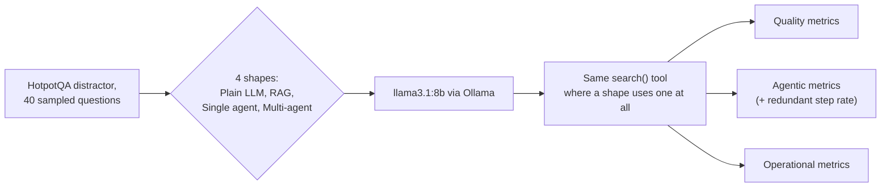

# Evaluation Criteria in Practice: Plain LLM vs. RAG vs. Single Agent vs. Multi-Agent

This experiment holds one task and one dataset fixed and varies only the system shape, plain LLM call, RAG, single agent, multi-agent, to test [EVALUATION_CRITERIA.md](../../EVALUATION_CRITERIA.md)'s central claim: that a task or quality metric alone under-determines outcomes more as a system gains decision points, and the metric layer that actually explains a close call is whichever one is specific to what that shape can uniquely get wrong.

**[Live dashboard](https://swati-evaluation-criteria-experiment.streamlit.app/)**

**In short:** single-shot RAG tied the winning multi-agent shape on accuracy (60.0% exact match each) and clearly beat the looping single-agent shape (47.5%), despite doing far less work, one search and one generation call, no loop, no verification. The mechanism traces to retrieval, not reasoning: RAG's one search, using the raw question as the query, found a gold paragraph 92.5% of the time, better than the single agent's own first, self-generated search query (82.5%). And early termination rate, read alone, would call the single agent the more reliable shape (35% vs. multi-agent's 47.5%), but the two failure modes aren't the same thing: every one of the single agent's early terminations means it submitted no answer at all (14 of 40 runs, guaranteed wrong), while every one of the multi-agent's early terminations still submits its best draft (19 of 40 runs, often still right), which is most of why the shape with the numerically worse early-termination rate has the better accuracy.

## What this experiment tests

Every LLM application starts somewhere on a spectrum of how many decision points it has. A plain call has one: what to output. Add retrieval and there are two: what to retrieve, and what to generate from it. Add a loop that decides whether to search again, and there are as many decision points as steps taken. Add a second role checking the first role's work, and there are that many again, times however many roles hand off to each other.

[EVALUATION_CRITERIA.md](../../EVALUATION_CRITERIA.md), the framework document this experiment tests, argues that the more decision points a system has, the less a single quality number tells you about what actually happened. This experiment tests that directly: one task, one dataset, one model, four shapes, everything else held constant.



## Setup

**Dataset.** [HotpotQA](https://huggingface.co/datasets/hotpotqa/hotpot_qa) (distractor config): 40 questions, 20 bridge and 20 comparison, each shipping 10 candidate paragraphs (2 gold, 8 distractors).

**Model.** Every shape runs on the same local model, `llama3.1:8b` (Q4_K_M), through [Ollama](https://ollama.com), using the same shared [`llm_client.py`](llm_client.py). Any accuracy or cost difference between shapes comes from shape, not from different models answering.

**Retrieval.** Where a shape uses retrieval at all, it uses the exact same `search()` tool (k=1, a small local sentence-transformer, `all-MiniLM-L6-v2`) as every other retrieving shape here. That's deliberate: the RAG, single-agent, and multi-agent shapes differ in what they can *decide to do* with that tool (search once versus search again versus route through a verification loop), not in what the tool itself can find.

## The four shapes

| Shape | What it can do | What it can't |
|---|---|---|
| **Plain LLM (no retrieval)** | Answer from training knowledge in one call. | Look anything up at all. |
| **RAG (single-shot retrieval)** | Retrieve once, generate once from what came back. | Notice a first search wasn't enough and search again. |
| **Single-Agent ReAct** | Loop, deciding turn by turn whether to search again or finish, up to a step cap. | Get a second, independent opinion on its own reasoning. |
| **Multi-Agent (Supervisor + Verification Loop)** | Route between a Retriever, a Reasoner, and a Verifier; a rejected draft sends the Supervisor back to refine the query. | Escape a genuinely missing second hop no query rewording can find. |

One representative technique per shape. RAG's representative is single-shot retrieval, the simplest, most common non-adaptive form. The multi-agent representative is a Supervisor + Verification Loop: a Retriever fetches evidence, a Reasoner drafts an answer from it, and a Verifier, with no stake in the draft being right, checks whether the evidence actually supports it; a rejected draft sends the Supervisor back to refine the query.

## Evaluation metrics

**Quality metrics:** Exact Match and token-overlap F1 (SQuAD-style) against the gold answer, reported overall and split by question type (bridge vs. comparison).

**Agentic metrics:**
- **Step / loop count**, **tool calls**, **tool error rate**
- **Inter-agent handoff count**: 0 by construction for plain LLM, RAG, and single-agent (one role each); non-zero only for multi-agent
- **Early termination rate**: fraction of runs that hit a step cap without a clean finish or verdict, rather than stopping because the shape decided it was done. Undefined (always `False`) for plain LLM and RAG, which have no loop to hit a cap on
- **Redundant step rate** *(new in this experiment)*: a later tool call retrieving a paragraph title an earlier tool call in the *same run* already retrieved, divided by total tool calls. This operationalizes [MAST](https://arxiv.org/abs/2503.13657)'s most common documented multi-agent failure mode, step repetition (17.14% of failures in that paper's study), concretely enough to compute from a run's own trace, no LLM judge or after-the-fact review required. It's a narrower version of "redoing work already done": it only catches a literal duplicate retrieval, not every way a system can repeat itself (see [EVALUATION_CRITERIA.md](../../EVALUATION_CRITERIA.md) for what it doesn't catch)
- **State overhead**: bytes of shared state at the final handoff, or the whole running transcript for shapes with no handoffs

**Operational metrics:** tokens, latency, time to first token, context payload size, error rate for every model call, plus **empty retrieval rate**: `search()` always returns a top-1 match, so "empty" means the retrieved paragraph wasn't gold, a wasted or misleading lookup. Semantic cache hit rate isn't tracked: nothing here caches across questions.

## Results

| Shape | EM | F1 | Bridge F1 | Comparison F1 | Mean Tool Calls | Early Termination | Redundant Step Rate | Mean Handoffs | Mean Wall-Clock |
|---|---|---|---|---|---|---|---|---|---|
| Plain LLM (no retrieval) | 35.0% | 0.371 | 0.131 | 0.611 | 0.0 | 0.0% | n/a (0 tool calls) | 0 | 0.4s |
| RAG (single-shot retrieval) | **60.0%** | **0.626** | 0.417 | **0.836** | 1.0 | 0.0% | 0.0% | 0 | 1.1s |
| Single-Agent ReAct | 47.5% | 0.481 | 0.400 | 0.561 | 3.0 | 35.0% | 28.3% | 0 | 11.5s |
| Multi-Agent (Supervisor + Verification Loop) | **60.0%** | 0.623 | 0.410 | **0.836** | 2.0 | 47.5% | 26.7% | 7.0 | 9.5s |

Every shape had a 0% model-call and tool-call error rate, so none of the gap above comes from outright failures. Full per-question traces, all four prompts verbatim, and every operational metric are in the [dashboard](#reproducing-this).

## Why these metrics, and which ones actually mattered

**Quality metrics alone would have said RAG and multi-agent tied, and left it there.** Both land at 60.0% exact match, both 0.836 F1 on comparison questions. Reading only that column, the honest conclusion is "shape doesn't matter above single-shot retrieval." That's not wrong, exactly, but it's incomplete: it can't say *why* two shapes with such different amounts of machinery (0 handoffs, 1 tool call, 1.1s versus 7 handoffs, 2 tool calls, 9.5s) land in the same place, or whether that tie is a coincidence or a real ceiling. The next few metrics answer that.

**Retrieval quality on the very first search explained the RAG-versus-single-agent gap directly.** RAG's one search, using the raw question verbatim, hit a gold paragraph 92.5% of the time (37 of 40). Single-Agent ReAct's own first search, phrased by the model itself from its own reasoning, hit gold only 82.5% of the time (33 of 40), a worse start despite the agent getting to try again afterward. The raw question turned out to be a better retrieval query than the model's own rephrasing of it, at least on this corpus. Without this metric, "the single agent looped and searched more, so it should retrieve at least as well" would be the reasonable-sounding but wrong assumption.

**Early termination rate needed a second metric right next to it to mean anything, because the same number means two different things in two different shapes.** Single-Agent ReAct's early termination rate (35.0%) is *lower* than the multi-agent shape's (47.5%), which read alone says the single agent is the more reliable of the two loopers. But cross-referencing predicted answers shows the opposite: every one of the single agent's 14 early-terminated runs submitted no answer at all (`predicted_answer` is null, an automatic miss), while every one of the multi-agent shape's 19 early-terminated runs still submitted its last Reasoner draft, unverified but often still correct (52.6% exact match on exactly those 19 runs, well above chance). Early termination rate answers *how often* a shape failed to conclude on its own; it takes reading the actual predicted answers, not just this rate, to know *what happens next* when it doesn't, and that second question turned out to matter more here.

**Redundant step rate, the metric this experiment adds, was the single most mechanistically clean result in this run.** Split the multi-agent shape's runs by whether they exhausted their 3-round budget: every one of the 19 that did (100%) had at least one redundant retrieval, a later round's "improved" query landing back on a paragraph an earlier round already tried. Every one of the 21 that didn't had zero. That's not a correlation buried in noise, it's a clean binary split on this sample: when the verification loop's query refinement genuinely finds something new, it finishes within budget; when it runs out of new things to try, it starts repeating itself, every time.

**Operational metrics explained cost, and here they also flagged a trade with no return.** Multi-agent's 9.5s mean wall-clock, 7 handoffs, and 788 prompt tokens bought a tied accuracy with RAG's 1.1s, 0 handoffs, and 195 tokens, on this task, at this sample size. That's not proof multi-agent coordination is never worth it (see "What this task does, and doesn't, test" below), but on a task capped around 2 hops, its extra machinery paid for redundancy, not for accuracy RAG didn't already have.

**Error rate and tool error rate did no differentiating work.** Both sat at 0% for every shape. That's still informative: it means every gap above is a genuine behavioral difference, not one shape breaking more often than another, and it's also exactly the gap [EVALUATION_CRITERIA.md](../../EVALUATION_CRITERIA.md) names as still untested: reliability metrics that have never yet been observed to move.

## What we learned

**1. More decision points didn't buy more accuracy here, and the reason is retrieval quality, not reasoning depth.** RAG's single search outperformed the single agent's own first search (92.5% vs. 82.5% gold-paragraph rate), so the extra decision points single-agent and multi-agent shapes add (whether to search again, whether to accept a draft) spent part of their budget compensating for a worse starting point, not improving on a better one. On this task and this sample, that compensation got single-agent back to competitive-but-not-better (47.5% EM, below RAG's 60.0%) and got multi-agent back to exactly tied (60.0%).

**2. Even on bridge questions, the type this experiment expects a one-shot shape to structurally fail, RAG did not underperform the shapes built to handle multiple hops.** RAG's bridge F1 (0.417) is marginally *ahead* of the multi-agent shape's (0.410) and close to Single-Agent ReAct's (0.400). This isn't a new discovery about this experiment's architectures: it's a confirmation of an effect already documented for HotpotQA specifically. [Min et al. (2019)](https://arxiv.org/abs/1906.02900) showed that a large share of HotpotQA's "multi-hop" questions can be answered by a single-paragraph reading model without genuine multi-hop reasoning, because the target entity or fact is often recoverable from just one of the two supporting paragraphs, or because redundant phrasing gives away the answer without needing the bridge. This experiment's own numbers are a small, concrete instance of that known shortcut, not evidence that multi-hop retrieval structure doesn't matter in general.

**3. Redundant step rate cleanly separated the multi-agent shape's successful rounds from its failed ones, something round-count alone couldn't do.** 100% of its budget-exhausting runs (19 of 40) had at least one redundant retrieval; 0% of its successful runs did. Round-count distribution alone can only suggest that query refinement plateaus once the corpus has nothing new to offer a rephrased query; redundant step rate shows that plateau directly, as a literal repeated retrieval, in every single case where the loop failed.

**4. Single-Agent ReAct repeated a search on more than a quarter of its runs, not just the ones that ultimately failed.** 27 of its 40 runs (67.5%) had at least one redundant retrieval, and 40 of its 120 total tool calls (33.3%) were redundant, well above the multi-agent shape's 32 of 80 (40.0%, though concentrated entirely in its failing runs, see finding 3). A freely-looping single agent, with no separate role checking whether a new search is actually needed, repeats itself more broadly and less predictably than a structured verification loop does.

**5. Plain LLM's bridge/comparison gap is the cleanest demonstration in this experiment of retrieval closing a specific, measurable hole.** Its comparison F1 (0.611) is respectable, many comparison questions ask something like "did both X and Y do Z" or "who was born earlier," answerable in part from general knowledge about well-known entities, or just favorable to a binary guess. Its bridge F1 (0.131) is not: a bridge question's answer depends on an intermediate fact that has to be looked up, not recalled, and a model with no lookup at all has no way to get it. Every other shape's bridge F1 (0.400-0.417) clears plain LLM's by 3x or more, the direct, measured cost of skipping retrieval on a task built to need it.

**6. RAG and multi-agent's tied accuracy came from substantially overlapping behavior, not coincidentally equal scores on different answers.** On the 20 comparison questions, the two shapes gave the identical predicted answer on 16 of them. Their tied 0.836 comparison F1 is mostly the same answers, not two different sets of successes and failures that happened to average out the same.

## Caveats

- 40 questions is enough to see clear directional differences between shapes, not enough for tight statistical confidence on exact percentage-point gaps, especially once broken down further by question type.
- A local 8B model at temperature 0 with strict output-format instructions is a noisier narrator than a larger hosted model would be; some of the gap between shapes may partly reflect how reliably `llama3.1:8b` follows a given prompt's format, not purely shape.
- Redundant step rate, this experiment's new metric, only catches a literal duplicate paragraph retrieval. A shape that asks a differently-worded but substantively redundant question, without ever retrieving the same title twice, would not be caught by it (see [EVALUATION_CRITERIA.md](../../EVALUATION_CRITERIA.md) for the motivating example).
- State overhead isn't measured consistently enough across shapes to compare directly. Plain LLM's figure includes its full system prompt (it serializes the whole `messages` list); RAG's includes only the bare question (a minimal dict). That's why plain LLM's raw number (459 bytes) looks larger than RAG's (107 bytes) despite RAG's shape objectively carrying more state (a retrieved passage) forward into its second call: the two numbers aren't measuring the same thing, so this metric is reported in the dashboard but not used in any finding above.

## What this task does, and doesn't, test

The plan going in was that HotpotQA's multi-hop structure would be a generous test for this experiment's question: a shape that can't retrieve more than one fact (plain LLM, single-shot RAG) should be structurally capped in a way the task is built to expose. That held for plain LLM (finding 5), but not for single-shot RAG (finding 2): it matched or slightly beat the looping shapes even on bridge questions specifically, because a real share of HotpotQA's "multi-hop" questions don't actually need both supporting paragraphs to answer, a shortcut [Min et al. (2019)](https://arxiv.org/abs/1906.02900) already documented for this exact dataset. That means this task is a weaker test of "does a shape need more than one retrieval" than it looks on paper, and a fairer test of that specific question would need a dataset where the shortcut isn't available, every question genuinely requiring both retrieved facts, not just labeled as requiring them.

It's also a poor fit for testing shape differences that aren't about *how many facts* a task needs: a task requiring long-horizon planning with no clear stopping condition, or genuinely conflicting evidence a Verifier role would need to adjudicate rather than just reject, would stress the single-agent and multi-agent shapes in ways this task's fixed, mostly-shortcut-able ~2-hop structure doesn't.

## Future work

A natural follow-up, scoped as its own experiment (see "Starting a new experiment" in this repo's `CLAUDE.md`):

- **A dataset without HotpotQA's single-hop shortcut** (see "What this task does, and doesn't, test" above), where a question genuinely cannot be answered from either supporting fact alone, to test whether single-shot RAG's tie with the multi-agent shape holds up once the task can no longer be solved by accident with one lucky retrieval.
- **A task with a wider, unknown range of required steps**, relevant to whether RAG's single-shot ceiling and the plain LLM's total lack of grounding scale the same way as step count grows.
- **A hosted or batching-capable backend**, to separate what's a property of shape from what's a property of `llama3.1:8b` specifically following these prompts.
- **A redundant-step rate that catches semantic, not just literal, repetition**, using an LLM-judge or embedding-similarity check on sub-question wording, to close the gap this experiment's own metric definition leaves open (see Caveats above).
- **The next experiment already queued in [EVALUATION_CRITERIA.md](../../EVALUATION_CRITERIA.md):** a task or corpus difficult enough to move reliability metrics (error rate, tool error rate, empty retrieval rate) off the 0%-ish floor they've sat at throughout this experiment.

## Terminology

**Shape.** How many decision points a system has and what kind: a plain LLM call has one (what to output), RAG has two (what to retrieve, what to generate), a single agent has as many as it takes steps, a multi-agent system has that many again, times however many roles hand off to each other.

**Agent.** A loop where a model repeatedly decides what to do next (call a tool, hand off to another role, or answer) based on what's happened so far, rather than following a fixed script.

**Tool call.** A non-model function call, here a single `search(query)` lookup. Distinct from a model call: it costs no tokens, but it does cost wall-clock time and can fail.

**Handoff.** One transfer of control, and whatever state was written into it, from one role to another. Always 0 for a single-role shape (plain LLM, RAG, single agent), not a low score, an inapplicable one: there's no second role to hand off to.

**State overhead.** The size, in bytes, of whatever context or structured summary has to be carried forward between steps or handoffs. See the Caveats section above for why this isn't comparable across shapes in this experiment as measured.

**Early termination.** A run that hit its step cap without the shape itself signaling it was done. Only meaningful for a shape with a loop to hit a cap on (single agent, multi-agent); undefined for a shape that always completes in one pass.

**Redundant step rate.** How often a tool call in a run retrieves a paragraph title an earlier tool call in that same run already retrieved, as a fraction of that run's total tool calls. See "Evaluation metrics" above for what it's built to test.

**Exact Match / F1.** Two ways of scoring a predicted answer against the correct one. Exact Match is strict: 1 if the (normalized) strings match exactly, 0 otherwise. F1 gives partial credit based on word overlap, so a predicted answer that's mostly right but missing or adding a word still scores above zero.

**Time to first token (TTFT).** How long a model takes to start responding, as opposed to total latency, which includes the time to finish the whole response.

## Grounding research

* [Yao et al., 2022, ReAct: Synergizing Reasoning and Acting in Language Models](https://arxiv.org/abs/2210.03629)
* [Lewis et al., 2020, Retrieval-Augmented Generation for Knowledge-Intensive NLP Tasks](https://arxiv.org/abs/2005.11401)
* [Reflexion: Language Agents with Verbal Reinforcement Learning](https://arxiv.org/abs/2303.11366)
* [Self-Refine: Iterative Refinement with Self-Feedback](https://arxiv.org/abs/2303.17651)
* [Cemri et al., 2025, Why Do Multi-Agent LLM Systems Fail? (MAST)](https://arxiv.org/abs/2503.13657)
* [Yang et al., 2018, HotpotQA: A Dataset for Diverse, Explainable Multi-hop Question Answering](https://arxiv.org/abs/1809.09600)
* [Min et al., 2019, Compositional Questions Do Not Necessitate Multi-hop Reasoning](https://arxiv.org/abs/1906.02900)
* This repo's own [EVALUATION_CRITERIA.md](../../EVALUATION_CRITERIA.md), the framework document this experiment tests

## Reproducing this

`requirements.txt` only covers the dashboard (`app.py`), which just reads the results already saved in `results/records.json`. Running the experiment itself needs a few heavier packages, listed separately in `requirements-experiment.txt`, so the dashboard stays light to deploy.

To just view the dashboard:

```bash
pip install -r requirements.txt
streamlit run app.py
```

To rerun the whole experiment from scratch:

```bash
ollama pull llama3.1:8b        # one time setup
pip install -r requirements-experiment.txt
python3 -u run_experiment.py   # about 15 minutes on an M4 MacBook Air
streamlit run app.py
```
