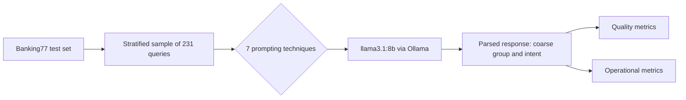
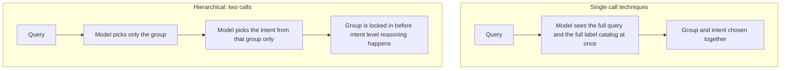

# Intent Classification: Comparing Prompting Techniques

This experiment compares seven ways to ask a small open model to classify a customer support message into one of 77 fine grained banking intents. It also measures what each way costs to run.

**[Live dashboard](https://llm-agentic-architectures-learning-8nn36axsm2lvbifxk8w4tt.streamlit.app/)**

**In short:** retrieving relevant examples for each query worked far better than every other technique (90.5% accuracy, compared to 44% to 67% for the rest). A fixed set of static examples barely beat having no examples at all. Splitting the decision into two steps, first the group then the intent, made accuracy worse, not better. Self consistency's extra voting cost three times the tokens and did not pay for itself.

## Setup

**Dataset.** [Banking77](https://huggingface.co/datasets/PolyAI/banking77) is a set of 13,083 customer support queries across 77 banking intents, all in one domain. We picked it because many of its classes are close in meaning. For example, `card_not_working` and `virtual_card_not_working`. Telling them apart takes more than spotting a topic. It takes real understanding of the query.

Every technique ran on the same sample of 231 test queries. The sample is stratified: each intent gets a share proportional to its size in the test set. All seven techniques saw the exact same queries, so no technique had an easier set to work with.

**Model.** The model is `llama3.1:8b` (Q4_K_M quantization), run locally through [Ollama](https://ollama.com). This was not the original plan. The experiment started on Hugging Face Inference Providers, but its free monthly credits ran out partway through. Claude was considered next, but a Claude Pro subscription does not include API credits, and paying per token for a bulk classification run did not make sense. A free, local 8B model turned out to be a good choice anyway. It removes cost as a variable and makes the whole pipeline reproducible on any machine that has Ollama installed.

**Output schema.** Banking77 does not ship official coarse categories, so this project defines its own. [taxonomy.py](taxonomy.py) groups the 77 intents into 10 coarse groups, written by hand against the dataset's real labels. Every technique returns both a coarse group and a fine intent, as strict JSON:

```json
{"coarse_group": "Transfers", "intent": "failed_transfer"}
```

This two field schema is what makes several metrics below possible. Coarse Accuracy, Fine Accuracy, and Hierarchy Consistency (does the model's own intent actually belong to its own group?) can all be read off one response.



## Techniques compared

| Technique | Idea |
|---|---|
| Zero-shot | Label catalog only, no examples |
| Zero-shot, schema-guided | Same, but every label carries a one line definition |
| Few-shot, fixed | A static set of 10 examples (one per coarse group) in every prompt |
| Few-shot, semantic retrieval | 5 nearest training examples per query, chosen by embedding similarity |
| Chain-of-thought | The model reasons step by step, then answers |
| Self-consistency | Chain of thought is sampled 3 times at temperature 0.7, then the answers vote |
| Hierarchical (coarse-to-fine) | Two calls. First pick the group. Then pick the intent from only that group's candidates |

## Evaluation methodology

**Quality metrics:**
* Fine Accuracy: exact match on the specific intent.
* Macro F1: the unweighted mean F1 across all 77 intents, so a handful of rare classes are not drowned out by common ones.
* Coarse Accuracy: exact match on the 10 group label.
* Label Validity Rate: did the response parse into a real label at all, regardless of whether it was correct.
* Hierarchy Consistency Rate: does the model's stated intent actually belong to its stated group.

**Operational metrics:** tokens used (prompt and completion), latency, time to first token, context payload size, and error rate, for every call. Two more apply only to the retrieval technique: Semantic Cache Hit Rate (queries answered from a cached, near duplicate prediction, with no fresh model call) and Empty Retrieval Rate (queries where nothing in the training pool was close enough to use as an example).

## Results

| Technique | Fine Acc. | Macro F1 | Coarse Acc. | Hierarchy Consistency | Mean Prompt Tokens | Mean Latency |
|---|---|---|---|---|---|---|
| Zero-shot | 59.7% | 57.7% | 81.8% | 95.7% | 697 | 1.37s |
| Zero-shot, schema-guided | 67.1% | 65.9% | 81.8% | 94.8% | 1,515 | 1.59s |
| Few-shot, fixed | 64.5% | 61.5% | 80.5% | 94.4% | 1,080 | 1.65s |
| **Few-shot, retrieval** | **90.5%** | **90.2%** | **97.8%** | **100.0%** | 875 | 3.22s |
| Chain-of-thought | 63.2% | 60.1% | 81.8% | 95.7% | 728 | 3.18s |
| Self-consistency (n=3) | 62.3% | 60.5% | 83.1% | 93.9% | 2,183 | 9.69s |
| Hierarchical | 44.2% | 40.8% | 56.7% | 99.1% | 263 | 2.04s |

Every technique had a 0% error rate across all 1,617 calls. Label validity stayed at or above 98.7% throughout. Llama 3.1 8B followed the strict JSON instruction reliably no matter the technique.

See the full results, exact prompts, and confusion matrices in the [live dashboard](https://llm-agentic-architectures-learning-8nn36axsm2lvbifxk8w4tt.streamlit.app/), or run it locally with `streamlit run app.py`.

## What we learned

**1. Retrieval beat everything else, by a wide margin.** Few-shot with per query semantic retrieval reached 90.5% fine accuracy. That is 23 points above the next best technique, and close to double most of the others. It is also the only technique that reached 100% hierarchy consistency and a near perfect 97.8% coarse accuracy. On a 77 class problem, this matches what the many label in-context-learning research argues in [Milios, Reddy and Bahdanau (2023)](https://arxiv.org/abs/2309.10954): no single fixed prompt can demonstrate 77 classes, so which examples you show the model matters more than almost anything else you can do to the prompt.

**2. Fixed few-shot barely helped, and it cost more than zero-shot.** Ten static examples, one per coarse group, moved fine accuracy from 59.7% to only 64.5%, while spending more tokens than schema guided zero-shot. With 77 classes and only 10 examples shown, the model has nothing to lean on for the other 67 intents most of the time. The fixed set mostly teaches output format, not classification. This is the clearest evidence here that examples only help when they are relevant to the query, not just present in the prompt.

**3. Splitting the decision into group first, then intent, made things worse.** This was the most surprising result. The hierarchical technique scored lowest on every quality metric, including Coarse Accuracy at 56.7%. That is the worst coarse score of all seven techniques, well below the roughly 82% every other technique gets for the same judgment made together with the intent. Forcing the model to commit to a group before it has thought about the specific intent removes information instead of adding structure. The fine grained cues in a query that would help tell "Card Payments" apart from "ATM & Cash Withdrawals" are the same cues that intent level reasoning would use. Once the wrong group is locked in, the second call is solving the wrong sub problem. Decomposing a decision is not automatically a simplification.



**4. Chain of thought did not clearly help, and self-consistency did not fix that.** Plain chain of thought, from [Wei et al. (2022)](https://arxiv.org/abs/2201.11903), reached 63.2%, in the same range as schema guided zero-shot and fixed few-shot. Reasoning text before the answer did not reliably improve a task that is really a single lookup, not a multi step derivation. [Self-consistency](https://arxiv.org/abs/2203.11171) samples chain of thought three times and lets the answers vote. It scored lower than plain chain of thought, at 62.3%, while spending three times the tokens and three times the latency. Voting over noisy reasoning only helps when the noise is unbiased. If the model's reasoning has a systematic blind spot for a given query, sampling it three times just produces three similar wrong answers.

**5. The cheapest real win was schema guided zero-shot.** Adding a one line definition to each of the 77 labels, with no examples and a single call, took zero-shot from 59.7% to 67.1%, for roughly double the prompt tokens. Among the techniques that do not need a training pool to draw from, this had the best accuracy for its cost.

**6. Latency and token cost track technique complexity closely, except retrieval earns its premium.** Self-consistency costs 9.69 seconds and 2,183 prompt tokens, the most expensive technique here, for one of the weaker accuracy scores. That is a clear case where the extra cost does not earn its keep. Retrieval also costs more than zero-shot (875 versus 697 prompt tokens, 3.22 versus 1.37 seconds), but it turns that cost into by far the largest accuracy gain in this experiment.

## Caveats

Time to First Token here stands in for prefill time, and that is specific to local, single user serving. Ollama reuses the key value cache across calls that share a long system prompt, which makes Time to First Token look small compared to total latency. For example, chain of thought shows a 0.40 second Time to First Token against a 3.18 second total, because most of the shared prompt was already cached from the previous call. A hosted API serving many users at once would not show this pattern. Trust the relative differences between techniques here more than the absolute numbers.

This is one model and one run. These numbers belong to `llama3.1:8b`, and to a single pass over the sample (temperature 0, except where a technique samples on purpose). A larger or differently trained model could change which techniques help. Chain of thought and self-consistency are known to matter more on tasks with real multi step reasoning, and this task, on purpose, does not have much of that.

The 10 group taxonomy is this project's own construction, not an official Banking77 label. Coarse Accuracy and Hierarchy Consistency are only as meaningful as that taxonomy is reasonable.

## Grounding research

* [Brown et al., 2020, Language Models are Few-Shot Learners](https://arxiv.org/abs/2005.14165)
* [Kojima et al., 2022, Large Language Models are Zero-Shot Reasoners](https://arxiv.org/abs/2205.11916)
* [Wei et al., 2022, Chain-of-Thought Prompting Elicits Reasoning in Large Language Models](https://arxiv.org/abs/2201.11903)
* [Wang et al., 2022, Self-Consistency Improves Chain of Thought Reasoning in Language Models](https://arxiv.org/abs/2203.11171)
* [Zhao et al., 2021, Calibrate Before Use: Improving Few-Shot Performance of Language Models](https://arxiv.org/abs/2102.09690)
* [Milios, Reddy and Bahdanau, 2023, In-Context Learning for Text Classification with Many Labels](https://arxiv.org/abs/2309.10954)
* [Sclar et al., 2023, Quantifying Language Models' Sensitivity to Spurious Features in Prompt Design](https://arxiv.org/abs/2310.11324)

## Reproducing this

`requirements.txt` only covers the dashboard (`app.py`), which just reads the results already saved in `results/records.json`. Running the experiment itself needs a few heavier packages, listed separately in `requirements-experiment.txt`, so the dashboard stays light to deploy.

To just view the dashboard:

```bash
pip install -r requirements.txt
streamlit run app.py
```

To rerun the whole experiment from scratch:

```bash
ollama pull llama3.1:8b        # one time setup
pip install -r requirements-experiment.txt
python run_experiment.py       # about 75 minutes on an M4 MacBook Air
streamlit run app.py
```
