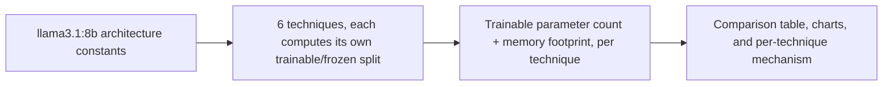

# PEFT, LoRA, and QLoRA: A Theoretical Comparison

This experiment compares six ways to fine-tune a large language model: full fine-tuning, and five parameter-efficient fine-tuning (PEFT) techniques from four different design families. It does not run any training. Instead, it computes real trainable-parameter counts and memory footprints directly from a model's architecture, for the concrete scenario of fine-tuning `llama3.1:8b` to summarize dialogues.

**[Live dashboard](https://swati-peft-comparison.streamlit.app/)**

**In short:** full fine-tuning needs about 120GB of memory to train `llama3.1:8b`. LoRA gets the same model tuned in about 15GB, using only 0.04% of its parameters as trainable, because Adam's optimizer state, not the weights themselves, is what full fine-tuning actually pays for. QLoRA takes that same 15GB down to under 4GB, but not by training fewer parameters than LoRA. It trains the exact same 3.4 million parameters; it just shrinks the frozen 8 billion by storing them in 4-bit instead of 16-bit. And BitFit, a technique that trains only a model's bias terms, has nothing to train at all on `llama3.1:8b`: Llama's architecture has no bias terms to begin with.

## What is PEFT, and why

Fine-tuning means continuing to train an already-pretrained model on new data, so it picks up a specific task, style, or domain instead of relying only on its original general-purpose behavior. The original way to do this was full fine-tuning: keep training the model exactly as it was pretrained, letting every one of its parameters move. That works, but it gets expensive fast. As models grew from millions of parameters to tens of billions, full fine-tuning's memory cost grew right along with them, since every parameter needs a gradient and optimizer state during training, not just storage space (see Terminology below). Full fine-tuning a modern model can need well over 100GB of memory and a full new copy of the model per task, which puts it out of reach for most individual practitioners, and makes maintaining many task-specific versions of a large model impractical even for teams that can afford the compute.

Parameter-efficient fine-tuning, PEFT, is the family of techniques built to fix that. Instead of letting every parameter move, each PEFT technique finds a small slice of the model, sometimes existing weights, sometimes a small number of newly added ones, and trains only that, while leaving the rest of the model frozen. The bet underneath all of them is that adapting a model to a new task doesn't actually require moving every parameter; it requires moving the model in a handful of the right directions, which is a much smaller job. When that bet holds, PEFT gets most of full fine-tuning's benefit for a small fraction of its cost, which is why it has become the default starting point for fine-tuning a large model rather than the exception.

PEFT is not the only alternative to full fine-tuning, though, and it's worth being clear about when it's the right tool at all. For many tasks, a well-written prompt, a few in-context examples, or retrieval-augmented generation gets a frozen, off-the-shelf model close enough, with no training step of any kind; the [intent-classification-prompting](../intent-classification-prompting/README.md) experiment in this repo is a direct example, where a good prompting technique on a completely untouched model beat every other technique tried, prompting included the more elaborate ones. Fine-tuning, PEFT included, earns its cost once a task needs something prompting can't reliably deliver on its own: a consistent output format under pressure, a narrow domain vocabulary the base model doesn't already know well, or behavior that needs to hold up across a volume of queries too large to keep re-explaining in every prompt. Once fine-tuning is worth doing at all, PEFT is almost always worth trying before full fine-tuning, precisely because its cost is so much lower that there is little to lose by starting there.

## Terminology

This experiment leans on a few training concepts throughout. Skip this section if they're already familiar.

**Parameter / weight.** A single number inside the model that it learned during training. A model with "8 billion parameters" has 8 billion of these numbers. Picture a huge mixing board with billions of dials; training is turning each dial until the model gives good answers.

**Trainable parameter.** A parameter this training run is allowed to change. Full fine-tuning changes all of them. PEFT changes only a small slice and leaves the rest untouched. This one number is why PEFT is cheaper: fewer trainable parameters means less memory, faster training, and a smaller file to save at the end.

**Frozen weights.** Parameters that are not being trained. The model still uses them to compute its answer, but nothing about them changes, so they cost far less memory than a trainable parameter does.

**Gradient.** A number that tells a trainable parameter which way to move, and by how much, to make the model's next answer a little better. Every trainable parameter gets its own gradient, recomputed after each attempt.

**Optimizer, and Adam specifically.** The rule that actually moves a parameter, using its gradient. Adam ([Kingma & Ba, 2014](https://arxiv.org/abs/1412.6980)) is the most common choice for training language models today, because it gives each parameter its own step size based on that parameter's recent history, instead of using one fixed step size for everything.

**Optimizer state.** Extra numbers Adam keeps for every trainable parameter, to remember that parameter's recent history. In practice, this means each trainable parameter ends up costing about 4 times its own size in memory once its gradient and Adam's extra numbers are added in. That's the real reason PEFT saves memory: fewer trainable parameters means paying that 4x cost far fewer times, not just skipping a smaller update. (For the curious: this experiment counts it as 16 bytes per trainable parameter under standard mixed-precision Adam, 2 for the weight, 2 for the gradient, 12 for Adam's two running averages kept in fp32; see [EleutherAI's Transformer Math 101](https://blog.eleuther.ai/transformer-math/) for the full derivation.)

**Rank, as in "low-rank."** In LoRA, the update to a weight is built from two small matrices instead of one big one. Rank is how big those small matrices are. A higher rank can express a more detailed update, but adds more trainable parameters too. The bet behind picking a low rank at all is that the update a model actually needs is simpler than its full size suggests ([Aghajanyan et al., 2020](https://arxiv.org/abs/2012.13255)).

**Quantization (4-bit).** Storing a number in less space than usual, at some cost to precision. QLoRA stores the frozen part of the model this way to save memory, while keeping the small trainable part at normal precision, since that's the part that actually needs to be updated accurately.

**Forward pass / backward pass.** The forward pass is the model reading an input and producing an answer. The backward pass works backward from how wrong that answer was, to figure out each trainable parameter's gradient. Frozen parameters skip the backward pass entirely, which is part of why PEFT trains faster, not just lighter, than full fine-tuning.

**Memory footprint (fine-tuning).** How much memory training actually needs: the weights, the gradients, Adam's optimizer state, and the activations kept from the forward pass. This experiment only compares the first three, since those are the ones that change depending on which technique you pick; the activations cost roughly the same no matter which technique is used. See Caveats below.

## Setup

Every other experiment in this repo calls a model. This one doesn't. Comparing *how* PEFT techniques work doesn't require running them, it requires knowing where each one places its trainable parameters and how many there are, both of which follow directly from a model's published architecture.

**Reference model.** `llama3.1:8b`, the same model used in [Intent Classification: Comparing Prompting Techniques](../intent-classification-prompting/README.md): 8,030,261,248 parameters, 32 layers, hidden size 4096, grouped-query attention with 8 key-value heads. These are Meta's published architecture constants ([`model_config.py`](model_config.py)), not values loaded from a downloaded checkpoint.

**Scenario.** "Fine-tuning `llama3.1:8b` to summarize [SAMSum](https://huggingface.co/datasets/Samsung/samsum) dialogues." This scenario is never actually run. It exists so every technique's numbers share one concrete backdrop instead of floating as abstract percentages, and so this experiment's dataset choice doesn't just repeat Banking77 from experiment 1. SAMSum was picked because summarization is a generation task, closer to how PEFT is used in practice than a classification task is.



## Techniques compared

| Technique | Family | Idea |
|---|---|---|
| Full fine-tuning | Baseline | Every weight is trainable |
| LoRA | Reparameterization | Freeze the weights, learn a low-rank update alongside them |
| QLoRA | Reparameterization | Same as LoRA, but the frozen weights are stored in 4-bit |
| Adapters | Bottleneck module | Insert small trainable modules in series inside each layer |
| Prefix-tuning | Soft prompt | Learn virtual key/value vectors prepended at every layer's attention |
| BitFit | Selective | Train only the model's existing bias terms, add nothing new |

Two techniques get a mention without a full row. **DoRA** ([Liu et al., 2024](https://arxiv.org/abs/2402.09353)) is a 2024 refinement of LoRA that splits the learned update into a magnitude component and a direction component, trained separately, adding a small magnitude vector per targeted matrix on top of LoRA's own A/B parameters, worth knowing about but not a different mechanism to diagram. **Prompt tuning** ([Lester et al., 2021](https://arxiv.org/abs/2104.08691)) is prefix-tuning's simpler cousin: it learns virtual tokens only at the input layer, not at every layer's keys and values. That is far fewer trainable parameters (on `llama3.1:8b`, roughly 82,000 for 20 virtual tokens, against prefix-tuning's 5.24 million) but also a much narrower point of influence over the frozen model, which is part of why prefix-tuning is generally the more capable of the two.

### Why each technique exists, and what it actually costs you

**Full fine-tuning** was the only option before PEFT existed: to adapt a pretrained model to a new task, keep training it, letting every parameter move. It gives the model the most freedom to change, at the highest possible cost: roughly 120GB of memory to train `llama3.1:8b`, and a full new copy of the model to store per task, since nothing is shared with the original. Reach for it when a PEFT technique's constrained update genuinely isn't enough, for example teaching the model a large amount of new domain knowledge or a capability far from what it already does, and only when there's both the compute and a large enough dataset to support changing every parameter without overfitting.

**LoRA** was introduced by [Hu et al., 2021](https://arxiv.org/abs/2106.09685), on the bet that the change a model needs for a new task lives in a much smaller space than its full parameter count ([Aghajanyan et al., 2020](https://arxiv.org/abs/2012.13255)). It's very cheap to train, and after training, its A and B matrices can be merged directly into the frozen weight, so a LoRA-tuned model runs at exactly the same speed as the original at inference time. The trade-off is rank: too low, and the update may not have room to capture everything full fine-tuning could. This is the default choice for adapting an existing model cheaply whenever the base weights already fit comfortably in memory, especially when inference speed matters and when it's useful to keep several task-specific variants of the same base model around as small adapter files instead of full copies.

**QLoRA** was built by [Dettmers et al., 2023](https://arxiv.org/abs/2305.14314) to fit LoRA fine-tuning of much bigger models onto a single consumer GPU, by shrinking the frozen weights rather than changing what gets trained. It gets LoRA's exact update at a quarter of LoRA's frozen-weight memory. Some precision is lost by storing weights in 4-bit, though the paper's specific quantization scheme (double quantization plus the NF4 data type) is designed to keep that loss small enough not to show up in quality. Reach for this specifically when the base model doesn't fit in available GPU memory at 16-bit at all, for example fine-tuning a 70B model on a single consumer GPU; if the model already fits comfortably, plain LoRA avoids QLoRA's small quantization-precision cost for no real benefit.

**Adapters** are one of the earliest PEFT techniques ([Houlsby et al., 2019](https://arxiv.org/abs/1902.00751)), predating LoRA, built for the same underlying problem: adapting a large pretrained model to many tasks without storing a full copy per task. At their default settings, they train roughly 10x more parameters than LoRA on this model, and unlike LoRA's update, an adapter module can't be merged back into the frozen weights, so it adds a small permanent cost to every inference call, not just to training. This is part of why LoRA became the more popular default over time, and today Adapters are mostly of historical interest, still reasonable when inference speed genuinely doesn't matter, for example offline batch scoring, or when working in a codebase already built around adapter modules rather than merge-able updates.

**Prefix-tuning** ([Li & Liang, 2021](https://arxiv.org/abs/2101.00190)) was built for generation tasks, on the idea that steering a frozen model's attention with a learned prompt can work almost as well as changing its weights, while touching no weights at all. No weights are ever touched, which makes it easy to swap between many tasks on the same frozen model. The real cost is context window space, not parameters: every virtual token eats a position that a real token could otherwise use, on every single call. It earns its keep when many tasks need to be served off the exact same frozen weights with nothing to merge or swap at all, and prompts are short enough that losing a few tens of context positions doesn't matter; it's less attractive for long-context use cases, where that lost space is worth more.

**BitFit** ([Zaken et al., 2021](https://arxiv.org/abs/2106.10199)) asked how little of a model you could train and still adapt it to a new task, and found that just its existing bias terms, already tiny, already there, were often enough. It's extremely cheap when it applies, since nothing new is added and almost nothing is unfrozen. Whether it applies at all depends entirely on the base model's design: bias-free architectures like Llama give it nothing to work with, which is not a flaw in the technique, just a mismatch with this particular model family. It's worth trying first, before anything heavier, but only on an architecture that actually has bias terms to unfreeze, typically BERT-style encoders rather than modern bias-free decoder models like Llama; check this before reaching for it, since on the wrong architecture it silently trains nothing.

### Where each technique's trainable parameters sit

```mermaid
flowchart TD
    subgraph full["Full fine-tuning"]
        F1["Every weight matrix in every layer"] --> F2["100% trainable"]
    end
    subgraph lora["LoRA / QLoRA"]
        L1["Frozen weight W"] -.->|"output added at inference"| L2["Trainable low-rank branch: A (r x in), B (out x r)"]
    end
    subgraph adapter["Adapters"]
        A1["Frozen attention block"] --> A2["Trainable bottleneck module (in series)"]
        A2 --> A3["Frozen MLP block"] --> A4["Trainable bottleneck module (in series)"]
    end
    subgraph prefix["Prefix-tuning"]
        P1["Trainable virtual key/value vectors"] -->|"prepended, every layer"| P2["Frozen attention computation"]
    end
    subgraph bitfit["BitFit"]
        B1["Every weight, every bias term"] --> B2["Only pre-existing biases trainable; Llama has none"]
    end
```



LoRA and Adapters both freeze the base weights and add something new, but where that new piece sits changes what it costs at inference time. LoRA's A/B branch is added to the frozen weight's output and, once training is done, can be merged directly back into W, so a LoRA-tuned model runs at exactly the same inference speed as the original. Adapters sit in series on the model's main path and can't be merged away, so they add a small amount of inference latency permanently. This was part of LoRA's own motivation, laid out directly in [Hu et al., 2021](https://arxiv.org/abs/2106.09685).

## Results

Reference model: `llama3.1:8b`, 8,030,261,248 parameters.

| Technique | Family | Trainable Params | Trainable % | Memory to Fine-Tune |
|---|---|---|---|---|
| Full fine-tuning | Baseline | 8,030,261,248 | 100.0000% | 119.66 GB |
| LoRA (r=8, q/v proj) | Reparameterization | 3,407,872 | 0.0424% | 15.00 GB |
| QLoRA (r=8, q/v proj) | Reparameterization | 3,407,872 | 0.0424% | 3.79 GB |
| Adapters (bottleneck=64) | Bottleneck module | 33,820,672 | 0.4212% | 15.40 GB |
| Prefix-tuning (20 tokens) | Soft prompt | 5,242,880 | 0.0653% | 15.03 GB |
| BitFit | Selective | 0 | 0.0000% | 14.96 GB |

**Reading the table across, not just down.** All five PEFT techniques land in the same rough memory range, 3.8GB to 15.4GB, next to full fine-tuning's 119.66GB. That's the headline worth sitting with before the individual numbers: which PEFT technique you pick barely matters next to the decision to use PEFT at all. Once that's decided, the differences between the five techniques show up in where their trainable parameters actually sit, not in how many there are.

QLoRA comes out cheapest overall, at 3.79GB, but for a specific reason: it trains the exact same parameters as LoRA and gets to that number by compressing the frozen weights, not by training less. LoRA itself, at 15.00GB and 0.0424% trainable, is the more useful reference point, since it's the number every other technique here is really being measured against. Adapters sit at the other end of the parameter count, training roughly 10x more than LoRA at 33.8 million parameters, and they're the only technique here that adds a permanent inference cost, since their modules can't be merged back into the frozen weights the way LoRA's can. Prefix-tuning looks cheap by parameter count alone, 5.24 million, but that count hides its real cost: it spends context window positions instead of memory, which this table has no column for. And BitFit trains zero parameters here, not because it's the most efficient technique on offer, but because `llama3.1:8b` simply has no bias terms for it to select; on a BERT-style model with biases in every layer, this row would look completely different.

The pattern underneath all of this: LoRA and QLoRA win on raw memory because their update sits alongside the frozen weights and merges away after training, while Adapters and Prefix-tuning both add something that stays around at inference time, a module in Adapters' case, context space in Prefix-tuning's, in ways the parameter and memory numbers alone don't fully capture.

See the full numbers, charts, and a per-technique deep-dive in the [live dashboard](https://swati-peft-comparison.streamlit.app/), or run it locally with `streamlit run app.py`.

### LoRA: trainable parameters scale linearly with rank

| Rank | Trainable Params | Trainable % | Memory |
|---|---|---|---|
| 4 | 1,703,936 | 0.0212% | 14.98 GB |
| 8 | 3,407,872 | 0.0424% | 15.00 GB |
| 16 | 6,815,744 | 0.0849% | 15.05 GB |
| 32 | 13,631,488 | 0.1698% | 15.14 GB |
| 64 | 27,262,976 | 0.3395% | 15.31 GB |
| 128 | 54,525,952 | 0.6790% | 15.67 GB |

## What we learned

**1. Full fine-tuning's memory cost is almost entirely Adam's optimizer state, not the weights.** Just holding `llama3.1:8b`'s weights in fp16 takes about 15GB. Full fine-tuning needs about 120GB, roughly 8x that, to train it. The gap is Adam: every one of the 8.03 billion parameters needs a gradient (2 bytes) and two optimizer moments (4 bytes each in fp32), on top of the weight itself. This isn't a property of the model being large, it's a property of Adam keeping per-parameter state, described directly in [Kingma & Ba, 2014](https://arxiv.org/abs/1412.6980) and quantified for transformer-scale models in [EleutherAI's Transformer Math 101](https://blog.eleuther.ai/transformer-math/). Every PEFT technique in this experiment is, underneath the mechanism differences, an attack on this specific cost: touch fewer parameters, and Adam has less state to keep.

**2. QLoRA's win is memory compression, not fewer trainable parameters.** LoRA and QLoRA train the identical 3,407,872 parameters in this experiment, the identical rank, the identical target matrices. The only difference is that QLoRA stores the *frozen* 8.03 billion parameters at 4-bit instead of 16-bit, which is why its memory footprint (3.79GB) is roughly a quarter of LoRA's (15.00GB): a quarter of the base weight's storage, plus the same tiny trainable overhead in both cases. This is worth stating plainly because it's an easy pair of ideas to conflate: QLoRA does not train a smaller slice of the model than LoRA does. [Dettmers et al., 2023](https://arxiv.org/abs/2305.14314) built QLoRA specifically to decouple "how much can you compress the frozen weights" from "how many parameters do you actually train," and this experiment's numbers show that decoupling directly: the trainable-parameter row is unchanged, only the frozen-weight byte width moved.

**3. Adapters train about 10x more parameters than LoRA's default configuration, for a mechanism LoRA was designed to avoid the cost of.** At their common default settings on `llama3.1:8b`, Adapters (33.8M trainable) cost roughly 10x LoRA's 3.4M, mostly because Adapters add two full bottleneck modules per layer (64 down, 64 up, at every layer) where LoRA only touches two projection matrices. The bigger practical difference isn't the parameter count, though; it's where the new parameters sit. LoRA's update lives alongside the frozen weight and merges back into it after training, so a LoRA-tuned model has zero added inference cost. Adapters sit in series on the model's main computation path and can't be merged away the same way, so they carry a small permanent inference latency cost. [Hu et al., 2021](https://arxiv.org/abs/2106.09685) name this directly as a motivation for LoRA over the (at the time, already established) Adapters technique from [Houlsby et al., 2019](https://arxiv.org/abs/1902.00751).

**4. BitFit trains zero parameters on `llama3.1:8b`, because Llama has no bias terms to select.** BitFit's idea is to unfreeze only a model's existing bias terms and train nothing else. That idea depends on the model having bias terms in the first place. Llama-family architectures don't: their linear projections are bias-free, and their RMSNorm layers ([Zhang & Sennrich, 2019](https://arxiv.org/abs/1910.07467)) have only a weight (a per-channel scale), not a bias, unlike the LayerNorm used in the BERT-style models BitFit ([Zaken et al., 2021](https://arxiv.org/abs/2106.10199)) was originally tested against. This is a known, published property of the LLaMA architecture ([Touvron et al., 2023](https://arxiv.org/abs/2302.13971)), not a new finding here, so it's presented as confirmation, not a discovery: a clean illustration of why a technique's assumptions need checking against the specific architecture in front of you, not just its parameter count.

**5. LoRA's trainable count scales linearly with rank, and stays far below full fine-tuning even at high rank.** Going from rank 4 to rank 128, a 32x increase in rank, moves trainable parameters from about 1.7 million to about 54.5 million, exactly the linear relationship the mechanism predicts (each targeted matrix's trainable size is proportional to r). Even at rank 128, that's still 0.68% of `llama3.1:8b`'s parameters, two orders of magnitude below full fine-tuning. This is the practical headroom LoRA has to spend: raising rank buys more expressive updates, per the "low intrinsic dimensionality" argument in [Aghajanyan et al., 2020](https://arxiv.org/abs/2012.13255), well before its cost approaches full fine-tuning's.

**6. Prefix-tuning's parameter count doesn't show its real cost.** By trainable-parameter count and memory, prefix-tuning (5.24M trainable, 15.03GB) looks similar to LoRA. But prefix-tuning's virtual tokens are prepended to every layer's attention computation, which means they consume real positions in the model's context window on every forward pass, a cost a parameter count alone doesn't capture. LoRA and Adapters don't have this cost: neither one grows the effective sequence length. This is a direct consequence of how prefix-tuning was designed in [Li & Liang, 2021](https://arxiv.org/abs/2101.00190), not a flaw in the measurement, but it's a reminder that "trainable parameters" and "memory footprint" are not the whole cost picture for every technique.

## Caveats

These are computed numbers, not measured ones. No training run actually happened, so real-world memory usage will differ from these figures by whatever a specific framework's overhead adds, and this experiment doesn't count activation memory (which depends on batch size and sequence length, and applies similarly across every technique, so it shouldn't change the relative comparison much, but does change the absolute numbers).

LoRA and QLoRA's numbers assume the original paper's minimal configuration, rank 8 applied only to query and value projections. Real-world LoRA configurations often extend to all four attention projections and the MLP matrices for a quality improvement, which would raise the trainable count for both, proportionally, without changing the relationship between them.

This is one reference model. `llama3.1:8b`'s specific architecture (bias-free layers, grouped-query attention) directly shapes two of the results above (BitFit's zero, and QLoRA's exact compression ratio). A model with biases, or standard multi-head attention instead of GQA, would shift some of these numbers, though not the underlying mechanisms.

## Grounding research

* [Hu et al., 2021, LoRA: Low-Rank Adaptation of Large Language Models](https://arxiv.org/abs/2106.09685)
* [Dettmers et al., 2023, QLoRA: Efficient Finetuning of Quantized LLMs](https://arxiv.org/abs/2305.14314)
* [Liu et al., 2024, DoRA: Weight-Decomposed Low-Rank Adaptation](https://arxiv.org/abs/2402.09353)
* [Houlsby et al., 2019, Parameter-Efficient Transfer Learning for NLP](https://arxiv.org/abs/1902.00751)
* [Li & Liang, 2021, Prefix-Tuning: Optimizing Continuous Prompts for Generation](https://arxiv.org/abs/2101.00190)
* [Lester et al., 2021, The Power of Scale for Parameter-Efficient Prompt Tuning](https://arxiv.org/abs/2104.08691)
* [Zaken et al., 2021, BitFit: Simple Parameter-efficient Fine-tuning](https://arxiv.org/abs/2106.10199)
* [Aghajanyan et al., 2020, Intrinsic Dimensionality Explains the Effectiveness of Language Model Fine-Tuning](https://arxiv.org/abs/2012.13255)
* [Kingma & Ba, 2014, Adam: A Method for Stochastic Optimization](https://arxiv.org/abs/1412.6980)
* [Zhang & Sennrich, 2019, Root Mean Square Layer Normalization](https://arxiv.org/abs/1910.07467)
* [Touvron et al., 2023, LLaMA: Open and Efficient Foundation Language Models](https://arxiv.org/abs/2302.13971)
* [EleutherAI, Transformer Math 101](https://blog.eleuther.ai/transformer-math/)

## Reproducing this

Unlike the other experiments in this repo, there's no model to download and no dataset to load. `requirements.txt` and `requirements-experiment.txt` are identical: everything here is arithmetic over `model_config.py`'s architecture constants.

To just view the dashboard:

```bash
pip install -r requirements.txt
streamlit run app.py
```

To recompute the results from scratch:

```bash
pip install -r requirements-experiment.txt
python run_experiment.py       # a few seconds, no GPU needed
streamlit run app.py
```
