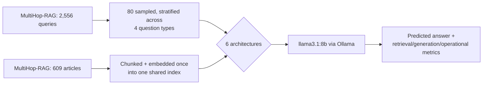

# RAG Architectures Compared

This experiment compares 6 ways to build retrieval-augmented generation (RAG): Naive RAG, Hybrid (dense + BM25) RAG, Reranked RAG, HyDE, Query Decomposition RAG, and Corrective RAG (CRAG). It asks which one wins, and specifically at which kind of question, not just which one wins on average. A second, smaller experiment inside this one holds the architecture fixed and varies only how the corpus was chunked before indexing, to separate "what the architecture does with retrieved evidence" from "how good that evidence was to begin with."

*Dashboard not yet deployed to Streamlit Community Cloud — run `streamlit run app.py` locally, or see "Reproducing this" below.*

**In short:** Query Decomposition RAG won on overall answer quality (0.675 F1, versus 0.497-0.619 for the rest), but not because it retrieved better evidence: its Recall@k (0.517) and MRR (0.268) were both mediocre-to-worst among the 6. Hybrid RAG had the best retrieval by every retrieval metric (0.650 Recall@k, 0.468 MRR) and still only placed second on F1. And Corrective RAG, the one architecture built specifically to avoid hallucinating, had the *worst* incorrect-abstention rate (40%, refusing to answer questions it could have answered) while its correct-abstention rate on truly unanswerable questions (100%) was no better than Naive RAG's, at roughly double the cost per query.

## What is RAG, and why compare architectures at all

A language model only knows what it learned during training. Retrieval-augmented generation fixes that by giving the model a search step first: look something up in an external corpus, then answer using what was found, instead of relying only on memorized knowledge. That one idea, retrieve then generate, covers everything from "grep a few paragraphs into the prompt" to considerably more elaborate designs, and in practice most write-ups on RAG show exactly one of those designs, usually the simplest one, with no comparison to the alternatives. This experiment builds 6 of them side by side, against the same corpus and the same questions, so the comparison is real rather than anecdotal.

## Setup

**Dataset.** [MultiHop-RAG](https://huggingface.co/datasets/yixuantt/MultiHopRAG) ([Tang & Yang, 2024](https://arxiv.org/abs/2401.15391)) ships two things: a corpus of 609 real news articles, and 2,556 queries, each labeled with one of 4 question types:

- **Inference** queries need a fact that isn't stated directly, it has to be inferred by combining two stated facts.
- **Comparison** queries ask which of two things is bigger, earlier, more, etc., requiring an independent lookup for each side.
- **Temporal** queries depend on dates and ordering events correctly in time.
- **Null** queries are deliberately unanswerable from the corpus. Every article the question sounds like it's about is real, but the specific fact asked for was never reported. A system that answers anyway is hallucinating.

That labeling is exactly what "which architecture wins at which scenario" needs: instead of one blended accuracy number, results can be broken out by what kind of retrieval and reasoning challenge a query actually poses. 80 queries were sampled, stratified evenly across the 4 types (20 each), so no architecture is judged on an easier mix than another.

**Corpus indexing.** All 609 articles are chunked once, using recursive chunking (paragraph breaks first, falling back to sentences and then words for anything still too big; see the chunking sub-experiment below for what this strategy is and why it's the default), and embedded into one shared index every architecture searches against. That's a deliberate difference from a per-query fixed corpus: MultiHop-RAG's articles run long enough (up to ~70,000 characters) that how they get cut into retrievable pieces is itself a real design decision, not a detail to skip past. Recursive chunking is used here as the default because it's the most commonly reached-for strategy in practice, not because it was pre-validated as the best one for this corpus; the chunking sub-experiment tests that assumption directly, on Naive RAG, after the fact.

**Model.** Every architecture runs on the same local model, `llama3.1:8b` (Q4_K_M), through Ollama, using the same shared [`llm_client.py`](llm_client.py). Any accuracy or cost difference between architectures comes from architecture, not from different models answering. Dense embeddings use `sentence-transformers/all-MiniLM-L6-v2`; reranking uses `cross-encoder/ms-marco-MiniLM-L-6-v2`. Both run locally, no API cost.



## The 6 architectures

| Architecture | What it does differently |
|---|---|
| **Naive RAG** | Embed the query, take the top-5 chunks by cosine similarity, generate. The baseline. |
| **Hybrid RAG** | Dense search + BM25 keyword search, merged by reciprocal rank fusion. |
| **Reranked RAG** | Dense search retrieves a wide top-20, a cross-encoder reranks it down to 5. |
| **HyDE** | Generates a hypothetical answer first, embeds *that* instead of the raw query. |
| **Query Decomposition RAG** | Splits the query into 2-3 sub-questions, retrieves per sub-question, merges. |
| **Corrective RAG (CRAG)** | Grades retrieved chunks' relevance before generating; re-retrieves or abstains if nothing passes. |

Every architecture shares the exact same final-answer prompt (see each architecture's Deep Dive tab in the dashboard for the verbatim text), told to answer only from the passages it's given and to say "Insufficient information." when they don't support an answer. That's what makes null-query abstention a fair comparison across architectures: any difference in how often one abstains correctly comes from what it retrieved and how, not from one architecture being told to be more careful than another.

## Evaluation metrics

**Retrieval quality**, computed only over the 3 answerable question types (a null query has no gold chunk by construction, so these are undefined, not 0, for it):
- **Recall@k** — did at least one gold chunk make it into the retrieved set at all. The most basic "did retrieval even have a chance" check.
- **Precision@k** — what fraction of the retrieved set was actually gold. Distinguishes an architecture that retrieves a little noise from one that retrieves mostly noise.
- **MRR (Mean Reciprocal Rank)** — how high the first gold chunk ranked. A gold chunk buried at position 5 still counts for Recall@k but should score worse than one at position 1, since a longer context is more expensive and gives the generator more irrelevant text to wade through.

**Generation quality:**
- **Exact Match / F1** — standard extractive-QA scoring of the predicted answer against the gold answer, computed only on answerable queries.
- **Incorrect abstention rate** — how often an architecture said "Insufficient information." on a question the corpus actually could answer. The generation-side failure mode that Recall@k alone can't see: retrieval can succeed and generation can still refuse to use it.
- **Correct abstention rate** — how often an architecture correctly abstained on a null query, i.e. didn't hallucinate. This is the metric CRAG exists to win.
- **Faithfulness (lexical-overlap proxy)** — what fraction of an answer's own content words also appear in the retrieved context. See "What this task does, and doesn't, test" below for what this approximation misses relative to an LLM-judged faithfulness score.

**Operational metrics**, for every LLM call: tokens used, time to first token, latency, error rate, context payload size, empty retrieval rate. Mean LLM calls and mean retrieval rounds are tracked as their own metrics here, since architectures in this experiment differ specifically in *how many* calls and retrieval attempts they make per query, which is exactly the cost side of the quality/cost tradeoff this experiment is about. Semantic cache hit rate isn't tracked: no architecture here caches anything, so the metric would read 0% everywhere and say nothing about architecture.

## Results

| Architecture | F1 | Exact Match | Recall@k | MRR | Correct Abstention | Incorrect Abstention | Mean LLM Calls | Mean Wall-Clock |
|---|---|---|---|---|---|---|---|---|
| Naive RAG | 0.575 | 56.7% | 0.533 | 0.365 | 100% | 28.3% | 1.0 | 10.6s |
| Hybrid RAG | 0.619 | 60.0% | **0.650** | **0.468** | 100% | 23.3% | 1.0 | 13.2s |
| Reranked RAG | 0.522 | 50.0% | 0.583 | 0.371 | 100% | 31.7% | 1.0 | 9.2s |
| HyDE | 0.528 | 51.7% | 0.450 | 0.285 | 90% | 31.7% | 2.0 | 20.7s |
| **Query Decomposition RAG** | **0.675** | **66.7%** | 0.517 | 0.268 | 95% | **20.0%** | 2.0 | 21.8s |
| Corrective RAG (CRAG) | 0.497 | 48.3% | 0.450 | 0.367 | 100% | **40.0%** | 2.0 | 20.6s |

F1, Exact Match, Recall@k, and MRR are computed over the 60 answerable queries (Inference + Comparison + Temporal); Correct/Incorrect Abstention over the 20 null and 60 answerable queries respectively. Every architecture had a 0% model-call error rate, so none of the gap above comes from outright failures.

By question type (F1 for the 3 answerable types, correct-abstention rate for null):

| Architecture | Inference F1 | Comparison F1 | Temporal F1 | Null Abstention |
|---|---|---|---|---|
| Naive RAG | 0.925 | 0.550 | 0.250 | 100% |
| Hybrid RAG | 0.925 | 0.633 | 0.300 | 100% |
| Reranked RAG | 0.915 | 0.400 | 0.250 | 100% |
| HyDE | 0.700 | 0.533 | 0.350 | 90% |
| Query Decomposition RAG | 0.925 | **0.650** | **0.450** | 95% |
| Corrective RAG (CRAG) | 0.790 | 0.450 | 0.250 | 100% |

See the full results, every prompt, and a step-by-step trace of any query through any architecture by running the dashboard locally with `streamlit run app.py`.

## Why these metrics, and which ones actually mattered

**Retrieval metrics and generation quality told two different stories, and neither alone would have been enough.** Hybrid RAG has the best Recall@k (0.650) and the best MRR (0.468) of any architecture, by a clear margin, and yet Query Decomposition RAG beats it on F1 (0.675 vs 0.619) despite having *worse* Recall@k (0.517) and the *worst* MRR (0.268) in the whole comparison. Reading retrieval metrics alone says Hybrid should win; reading generation metrics alone says Decomposition should win; only having both together shows that good retrieval (by the strict, gold-fact-sentence definition this experiment uses) and good final answers aren't the same thing here. This kind of gap between retrieval-metric quality and end-to-end task accuracy isn't a new discovery, it's a known caveat in IR-for-QA research generally (see [Gao et al.'s RAG survey](https://arxiv.org/abs/2312.10997)), and this experiment's own numbers are a clean, concrete instance of it.

**Question-type breakdowns were the single most decisive choice in this experiment, because the overall F1 numbers alone actively mislead.** Every architecture except HyDE scores within 0.925-0.925 (an exact tie) on Inference F1. If that were the whole story, "architecture doesn't matter for inference questions" would be the conclusion. But Comparison F1 spans 0.400 (Reranked) to 0.650 (Decomposition), a 25-point gap, and Temporal F1 sits stuck at 0.250-0.450 for every architecture, uniformly weak. Averaging across question types the way the overall F1 column does hides both of those facts entirely.

**Correct-abstention rate is what actually tested Corrective RAG's reason for existing, and it came back negative.** CRAG's whole design is "grade retrieved evidence before trusting it, so you don't hallucinate an answer the corpus can't support." On this experiment's null queries, that design bought nothing: Naive RAG, Hybrid RAG, Reranked RAG, and CRAG all hit 100% correct abstention, because the shared answer prompt's plain instruction to say "Insufficient information." already covers it. What CRAG's extra grading step *did* buy is the worst incorrect-abstention rate in the experiment (40%, refusing questions it could have answered), at roughly double Naive RAG's LLM calls and wall-clock time. Without this metric, "CRAG grades relevance before answering" reads as a strict improvement; with it, the real story is a real cost for no measured safety benefit, on this task.

**Mean LLM calls and mean wall-clock time explained *why* the pricier architectures cost more, not just *that* they did.** HyDE, Query Decomposition, and CRAG all make 2 LLM calls per query (CRAG averages 2.025, since 2 of 80 queries triggered its corrective re-retrieval branch) and take roughly double Naive RAG's wall-clock time (20.6-21.8s vs 9.2-13.2s for the single-call architectures). That's the direct, mechanical cost of the extra round trip, not a mysterious slowdown.

**Faithfulness (the lexical-overlap proxy) mostly didn't differentiate architectures on Inference questions, and that's informative in its own right.** Every architecture scores 0.90-1.00 faithfulness on Inference queries regardless of how well it actually retrieved (Naive: 50% recall, 0.975 faithfulness; Query Decomposition: 30% recall, 0.950 faithfulness). The likely reason: MultiHop-RAG's inference answers are often a named entity central to a heavily-covered news story (11 of this sample's 80 queries are about the FTX collapse and Sam Bankman-Fried alone, a story covered across dozens of this corpus's articles), so *any* topically-adjacent retrieved chunk tends to mention that name somewhere, satisfying a lexical-overlap check even without the one designated "gold" evidence sentence. That's a property of a redundant news corpus, not evidence that faithfulness is a bad metric in general; see "What this task does, and doesn't, test" below.

**Empty retrieval rate and model-call error rate did no differentiating work in this run.** Both sat at 0% for every architecture: with a shared corpus of thousands of chunks, top-k search never returns fewer than k results, and llama3.1:8b never failed a call outright. That's still useful to know, since it means every quality gap above is a genuine behavioral difference, not one architecture just breaking more often than another.

**Mean context payload bytes needs a specific caveat for the 2-call architectures.** It's computed as an average *per LLM call*, not a total. HyDE's first call (write a hypothetical passage) sends only the question, a small payload; its second call (generate the answer) sends the full passages, a large one. Averaging the two makes HyDE's reported context payload (3,822 bytes) look smaller than Naive RAG's single large call (7,069 bytes), which could misread as "HyDE sends less data," when its total data sent across both calls is actually comparable to Naive RAG's one call plus a small extra. Time to first token (see below) has the same "which call is 'first'" caveat for these architectures.

**A serving artifact in this experiment's own run: Ollama's time-to-first-token measurement can be corrupted by local memory pressure, badly enough to break a mean outright.** During this run, the host machine came under heavy memory pressure partway through Naive RAG and for most of Hybrid RAG's queries. Ollama's self-reported `prompt_eval_duration` (used as TTFT) spiked into the hundreds or even thousands of seconds for a number of calls made during that window, in a few cases reporting a TTFT *larger than that same call's own total latency*, which is logically impossible and is clearly a server-side measurement artifact under system load, not a property of the query. A single such spike is enough to wreck a mean built from 80 samples (Hybrid's raw mean TTFT computes to 195.7s; its median is 8.0s). `operational_summary()` reports the **median** TTFT for exactly this reason. This is the same family of caution this repo's other experiments already give Ollama's local timing numbers (KV-cache warmth distorting TTFT, buffered stdout hiding progress); this run is a concrete instance of a related failure mode, worth naming rather than quietly working around.

## What we learned

**1. Query decomposition won on comparison questions specifically because it retrieved specifically better evidence there, a clean confirmation of the original hypothesis.** Decomposition's Recall@k on comparison queries is 0.85, tied for the best result in the entire experiment (with Hybrid), well above Naive RAG's 0.70 on the same question type. That's the direct mechanism: splitting "which of X and Y is bigger" into "how big is X" and "how big is Y" gives each half its own targeted search, instead of one blended query embedding that has to compromise between two topics. The F1 result downstream (0.650, the best of any architecture on comparison questions) tracks that retrieval win closely. This matches the reasoning behind decomposition-style prompting generally (see [Prasad et al., ADaPT](https://arxiv.org/abs/2311.05772), used for a related purpose in this repo's [agentic-architectures](../agentic-architectures/README.md) experiment); it's a confirmation of an expected mechanism, not a surprise.

**2. Query decomposition also won overall despite having the worst retrieval metrics of any architecture, and the likely reason is this corpus's redundancy, not better reasoning.** On inference questions, decomposition's Recall@k is 0.30, the worst score in the entire experiment (even behind HyDE's 0.25), yet its Inference F1 (0.925) ties for the best. The faithfulness metric explains why this isn't a contradiction: every architecture scores 0.90-1.00 faithfulness on inference questions regardless of its actual recall, which only makes sense if the correct answer (typically a named person or company central to an ongoing news story) shows up incidentally in many topically-related chunks, not only in the one chunk holding the literal designated evidence sentence. Decomposition retrieves more distinct chunks per query (7.1 on average, against 5.0 for the single-pass architectures), so it has more chances to stumble onto the answer's name somewhere in that wider net, even when its narrower, stricter Recall@k metric says it missed. This is a property of a redundant news corpus specifically; see "What this task does, and doesn't, test" below for where this stops generalizing.

**3. Corrective RAG's grading step didn't improve the one thing it exists to improve, and made a different thing worse.** CRAG's correct-abstention rate on null queries (100%) is identical to Naive RAG's, Hybrid RAG's, and Reranked RAG's, all of which reach the same number with no grading step at all, just the shared prompt's plain instruction not to guess. What CRAG's grading step did change is its incorrect-abstention rate on answerable questions: 40%, the worst in the experiment, meaningfully above Naive RAG's 28.3% using the exact same retrieval mechanism underneath (plain dense search). The grading step appears to be *too* conservative: a chunk that would have let the shared generation prompt answer correctly on its own is sometimes rejected by the separate grading call before generation ever sees it. This tracks a limitation the CRAG paper itself names: the retrieval evaluator (grader) is its own imperfect model call, and the whole system's reliability is bounded by how well *that* call judges relevance, not by the underlying retrieval ([Yan et al., 2024](https://arxiv.org/abs/2401.15884)). This experiment's numbers are a concrete instance of that already-known limitation, not a new one.

**4. CRAG's actual corrective step, the part that gives it its name, almost never fired.** Its broader hybrid re-retrieval triggered on only 2 of 80 queries (2.5%): the initial grading pass found at least one relevant chunk the other 78 times. Nearly all of CRAG's behavior in this experiment, for better and for worse, comes from its first-pass grading and knowledge refinement, not from the corrective re-retrieval branch its name refers to. A harder corpus, one where a single retrieval pass more often comes back empty-handed, would be a fairer test of whether the corrective step itself earns its cost; see "Future work" below.

**5. HyDE's exact failure mode showed up directly on a null query, in a way worth reading verbatim.** Asked "which country, accused of aggression... [is responsible for the Donbas situation]," a question this corpus cannot actually answer, HyDE's hypothesis-writing step confidently generated a passage naming Russia, drawing on the model's general world knowledge rather than anything in the corpus. That hypothesis's embedding then retrieved real articles that were topically about Russia and Ukraine, and the final generation step, seeing passages that were genuinely about the right general topic, answered "Russia" instead of recognizing that none of those passages actually supported this specific claim. This is exactly the risk HyDE's own design accepts: a hypothesis doesn't need to be factually correct to be useful for retrieval, but when the model's world knowledge is specific and plausible enough, it can drag in real, topically-adjacent evidence that then looks like confirmation. HyDE's overall correct-abstention rate (90%, the worst in the experiment) and its weakest-of-all-architectures Inference F1 (0.700) are consistent with this same mechanism working against it more broadly, not just in this one example.

**6. Temporal reasoning was hard for every architecture, uniformly, which points at the model, not the retrieval mechanism.** Every architecture's Temporal F1 falls between 0.250 and 0.450, a narrow band compared to the 0.400-0.925 spread seen on comparison and inference questions. No retrieval strategy tried here meaningfully moved this number. That pattern, a hard ceiling that doesn't budge no matter how retrieval changes, is what you'd expect if the bottleneck is the generator's ability to reason about dates and ordering once it has the right passages, not whether it received the right passages in the first place. Worth reading Query Decomposition's apparent lead here (0.450, nominally the best) cautiously: this is a 20-query subgroup per architecture, and its own faithfulness score on temporal questions (0.100, the lowest of any architecture on any question type in this experiment) suggests it was often producing an answer only loosely connected to what it retrieved, which is more consistent with more frequent guessing than with better temporal reasoning.

**7. Hybrid retrieval's Recall@k and MRR wins were real and mechanistically clear, even though they didn't translate into the top F1 score.** Dense search alone (Naive RAG) and BM25 alone each miss different queries; fusing the two rankings recovered evidence neither found alone reliably enough on its own, landing the best Recall@k (0.650) and MRR (0.468) of any architecture, and the best Comparison F1 (0.633) among the single-retrieval-call architectures. That it still finished second overall to Query Decomposition (which wins by a different mechanism, see finding 2) doesn't undercut the retrieval-quality win; it's a reminder that "best retrieval" and "best final answer" are different questions this experiment deliberately measures separately.

## The chunking sub-experiment: how much does chunking actually matter

Architecture held fixed at Naive RAG (no reranker or fusion step able to compensate for a weak first-pass chunk), varying only how the corpus was cut before indexing:

| Strategy | What it does |
|---|---|
| **Fixed 128 / 256 / 512** | Cuts on raw word-count boundaries, ignoring sentence structure. Can split a sentence, or a fact, in half. |
| **Sentence** | Packs whole sentences into a chunk up to a target size. Never splits a sentence. |
| **Recursive** | Splits on paragraph breaks first, falling back to sentences, then words, for anything still too big. The most commonly reached-for default in practice. |
| **Semantic** | Embeds every sentence, cuts wherever consecutive sentences' embeddings stop being similar, the idea being that a topic shift shows up as a similarity dip ([Chroma's chunking research](https://research.trychroma.com/evaluating-chunking)). |

| Strategy | Chunk Count | Mean Tokens/Chunk | Recall@k | F1 | Faithfulness | Correct Abstention |
|---|---|---|---|---|---|---|
| Fixed 128 | 9,721 | 124 | 0.542 | 0.596 | 0.686 | 100% |
| Fixed 256 | 4,976 | 242 | 0.542 | 0.492 | 0.745 | 100% |
| Fixed 512 | 2,586 | 460 | **0.750** | 0.562 | **0.824** | 100% |
| Sentence | 6,858 | 155 | 0.708 | **0.604** | 0.694 | 87.5% |
| Recursive | 6,787 | 184 | 0.625 | 0.479 | 0.781 | 100% |
| Semantic | 13,241 | 80 | 0.625 | **0.604** | 0.632 | 87.5% |

(32 queries, 8 per question type; Naive RAG only. Small subgroups here, especially the 8 null queries behind the Correct Abstention column, so read exact rankings as directional, not precise.)

**Bigger fixed-size chunks retrieved the right evidence more often, but that didn't translate into the best answers.** Fixed 512 has the best Recall@k (0.750) by a clear margin over every other strategy, which makes sense: a bigger chunk is less likely to miss a fact simply because there's more text in it. But its F1 (0.562) lands in the middle of the pack, behind Sentence and Semantic chunking despite their lower or equal recall. A bigger chunk also means more surrounding, possibly irrelevant text riding along with the fact that matters, and this experiment's own Faithfulness metric hints at why that's not free: Fixed 512 has the highest faithfulness (0.824), meaning when it does answer, its answer is well-grounded in retrieved text, but by then, the model has more text to sift through per chunk, and this is the same recall/F1 gap noted in the main comparison's finding 1, at the chunking level instead of the architecture level.

**Sentence-aware chunking (never cutting mid-sentence) beat both smaller and larger fixed-size cuts on the metric it should most directly affect.** Sentence chunking's Recall@k (0.708) is second only to Fixed 512's, while using much smaller chunks (155 tokens average, versus 460). That's a direct, mechanistic result of never splitting a fact-bearing sentence across a chunk boundary: the same fact that a fixed-size cut might slice in half stays whole in one chunk here, so it counts (this experiment's gold-chunk check requires a fact to appear complete, as a substring, in a single chunk).

**Semantic chunking tied for the best F1 despite average chunk size varying wildly, including some very short chunks.** Its chunks ranged from 1 token to 608, with the smallest chunks likely being isolated short sentences (a dateline, a one-line quote) that got cut off because the sentence before or after it crossed the similarity threshold. That variance is probably also why semantic chunking has the lowest faithfulness (0.632) and the lowest correct-abstention rate (87.5%, tied with Sentence) in this sub-experiment: a degenerate, too-short chunk can still register as "topically close enough" to retrieve, without carrying enough surrounding context to ground an answer well.

**None of these differences are large relative to this sub-experiment's sample size.** 32 queries (8 per type) is small enough that a single query flipping from correct to incorrect can move a subgroup's F1 by 0.125. The direction of the recall/F1 disconnect (bigger or better-matched chunks retrieving more often, without that reliably producing the best final answer) is the more trustworthy takeaway here than any single strategy's exact rank.

### Good chunking practices, in general

Beyond what this sub-experiment measured directly:

- **Don't split mid-sentence or mid-fact if you can avoid it.** A fixed-size cut is the fastest strategy to implement and the easiest one to get wrong this way: a single sentence that happens to straddle a chunk boundary means neither resulting chunk contains the complete fact, which no amount of `k` can recover from.
- **Overlap between adjacent chunks is cheap insurance.** A few dozen tokens of overlap means a fact sitting near a boundary is still whole in at least one chunk, at the cost of a small amount of duplicate content in the index.
- **Bigger isn't automatically safer.** A larger chunk is less likely to cut a fact in half, but it also packs more unrelated content into one embedding vector, diluting how strongly that vector matches any single query (see Embedding Quality below). There's a real tradeoff here, not a dominant strategy.
- **Match chunk size to how the corpus is actually written.** A corpus of short, dense FAQ answers wants small chunks close to one answer each; a corpus of long-form articles, like this one, has more room for a chunk to span a few related sentences without losing coherence.
- **Re-chunking means re-embedding, in full.** Changing the chunking strategy changes every chunk's boundaries, which means every embedding in the index is now stale. There's no way to patch just the changed chunks; the whole index has to be rebuilt.

## Ensuring embedding quality

Every architecture in this experiment sits on top of one embedding model, and every one of them fails the same way if that embedding is weak: the wrong chunks get retrieved, and no amount of reranking, fusion, or clever prompting downstream can recover information that was never retrieved in the first place.

- **Pick a model benchmarked on retrieval specifically**, not just general similarity. The [MTEB leaderboard](https://huggingface.co/spaces/mteb/leaderboard) reports a dedicated Retrieval score, separate from Classification or STS; a model strong at general sentence similarity isn't necessarily strong at ranking a passage against a query, a distinct, asymmetric task.
- **Match query/passage asymmetry if the model supports it.** A query ("who criticized the merger") and its answer ("Jane Doe called the merger reckless") are different kinds of text. Model families like `e5` and `bge` are trained with separate `query:`/`passage:` prefixes for exactly this reason; using a symmetric model, or forgetting the prefix on an asymmetric one, throws that signal away.
- **Validate retrieval quality directly, on your own corpus.** A benchmark score measures the model in general, not whether it understands your corpus's specific vocabulary, product names, internal jargon, or in this experiment's case, a news corpus's proper nouns. Recall@k and MRR on a labeled sample, exactly what this experiment computes, are the real test.
- **Chunk size interacts with embedding quality, not just retrieval scope**, per the chunking section above: one fixed-size vector stands in for everything in the chunk, so a chunk that's too long dilutes that vector across multiple topics.
- **Re-embed the whole corpus after any model change.** Swapping embedding model versions changes the vector space; old and new embeddings aren't comparable, and there's no way to incrementally update just the changed part.
- **Normalize consistently.** This experiment L2-normalizes every embedding so a plain dot product equals cosine similarity. Mixing normalized and unnormalized vectors in the same index silently corrupts every similarity score, with no error thrown.

## What impacts a RAG application, beyond architecture choice

The architecture comparison above holds several things constant that, in a real deployment, are just as often the actual bottleneck:

- **Corpus coverage.** No architecture here can answer a null query correctly by retrieving harder; the fact genuinely isn't in the corpus. The single biggest lever on RAG quality in practice is usually whether the corpus actually contains the answer, not which retrieval mechanism searches it.
- **Chunking**, covered in its own section above.
- **Embedding quality**, covered in its own section above.
- **Corpus freshness.** A static index answers questions about the world as of whenever it was last embedded. This experiment's corpus is a fixed snapshot of news articles; a production system needs an explicit re-indexing strategy or it will confidently retrieve stale information.
- **Context window pressure.** More retrieved chunks isn't free: every chunk added to the prompt is tokens the generator has to read (cost and latency, measured directly here as prompt tokens and time to first token) and content that can crowd out or distract from the genuinely relevant passage, sometimes called "lost in the middle" behavior in long contexts ([Liu et al., 2023](https://arxiv.org/abs/2307.03172)).
- **The generation prompt itself.** This experiment holds the final-answer prompt fixed across all 6 architectures on purpose, to isolate retrieval as the variable. In production, prompt wording (how strictly it's told to stick to the passages, how it's told to handle partial evidence) is its own lever, separate from which architecture retrieved the passages.

## Caveats

- 80 queries (20 per question type) is enough to see clear directional differences between architectures, not enough for tight statistical confidence on exact percentage-point gaps, especially once broken down further by question type (20 answerable queries per type per architecture is a small subgroup).
- A local 8B model at temperature 0 with strict output-format instructions is a noisier narrator than a larger hosted model would be; some of the gap between architectures may partly reflect how reliably `llama3.1:8b` follows a given prompt's exact format, not purely architectural difference.
- This experiment's own run hit a real local-serving reliability issue: the host machine came under heavy memory pressure during Naive RAG's and (worse) Hybrid RAG's runs, at one point slowing Hybrid RAG's 80 queries to over 4 real hours of wall-clock time, and corrupting Ollama's self-reported time-to-first-token for a number of calls made during that window (see "Why these metrics" above for how the summary tables handle this). The other four architectures ran after the pressure resolved and show no such corruption. This is a genuine property of running a multi-hour local benchmark on a shared 16GB machine, not a bug in any architecture being measured, but it means wall-clock and TTFT numbers for Naive and Hybrid RAG in the raw `results/records.json` carry more noise than the other four architectures' do.
- Faithfulness is a lexical-overlap proxy, not an LLM-judged score. It can't distinguish "the answer's words appear in context because the claim is genuinely supported" from "the answer's words appear in context because a related but different sentence happens to share vocabulary." Findings 2 and 6 above lean on this metric to explain a pattern, not to prove a claim with certainty.
- The chunking sub-experiment runs a smaller sample (32 queries) than the main comparison, on Naive RAG only; its findings describe how chunking affects retrieval and generation quality for that one architecture, not a claim that every architecture would respond to chunking strategy identically.

## What this task does, and doesn't, test

MultiHop-RAG is a good fit for some of these architectures, and a poor or only partial fit for others, worth being explicit about rather than leaving implied by the results alone.

**Good fits.** Query Decomposition RAG gets a fair, direct test on comparison questions, which are genuinely two independent lookups wearing one sentence, exactly the shape decomposition is built for, and it wins there by the clearest, most mechanistic margin in the experiment (finding 1). Corrective RAG gets a fair test of its grading step, since MultiHop-RAG's null queries are specifically designed to look topically plausible while being genuinely unanswerable, exactly the situation a relevance grader should catch, and the experiment shows plainly that grading's benefit here didn't clear the bar the simpler architectures already met for free (finding 3). Hybrid RAG gets a fair test of dense-plus-lexical fusion, since a news corpus mixes exact-name and exact-date lookups with paraphrased description, and it duly won on every retrieval metric.

**Partial or poor fits.** This corpus's high redundancy, the same real-world event covered by many separate articles, means a "wrong" retrieval can still surface the right named entity by accident (finding 2), which makes Recall@k and MRR less reliable predictors of final answer quality here than they'd be on a corpus where each fact is stated exactly once. A corpus of internal technical documentation or single-source legal filings, where a fact genuinely appears in only one place, would be a fairer, harder test of whether precise retrieval actually matters for the final answer. Temporal reasoning is tested only shallowly here: MultiHop-RAG's temporal questions ask for ordering and comparison of dates already present in the retrieved text, not the harder problem of resolving relative time expressions ("last quarter," "since the merger") against a specific document's publish date, so this experiment's uniformly weak temporal scores (finding 6) may understate how much retrieval architecture could matter for temporal questions that are actually retrieval-bound rather than reasoning-bound. And CRAG's corrective re-retrieval branch, the part of its design distinct from plain relevance grading, triggered on only 2 of 80 queries (finding 4); a corpus where a single retrieval pass fails more often would be needed to actually test whether that branch pays for itself.

## Future work

A natural follow-up experiment, scoped as its own experiment rather than added onto this one (see "Starting a new experiment" in this repo's `CLAUDE.md`), could test:

- **An LLM-judged faithfulness score (RAGAS-style)**, replacing this experiment's lexical-overlap proxy with an actual judge call, to check whether the cheaper heuristic used here agreed with a more expensive, more accurate signal or was systematically off in some direction.
- **A larger, hosted or batched backend**, to run a much larger query sample than 80 and get tighter statistical confidence on the exact percentage-point gaps between architectures, especially on the smaller per-question-type subgroups.
- **Combining architectures**, for example Hybrid retrieval feeding into CRAG's grading step instead of plain dense retrieval, to see whether the wins found here compose or trade off against each other.
- **A corpus with real staleness**, articles that were true when written but contradicted by later ones, to test whether any of these architectures notice a conflict in retrieved evidence rather than just averaging over it.
- **A low-redundancy corpus**, where each fact is stated exactly once (internal technical docs or single-source legal filings, rather than a news topic covered by dozens of articles), to test whether the retrieval-metric/generation-quality gap this experiment found (finding 2) holds up once the corpus can no longer let a wide, imprecise retrieval stumble onto the right answer by accident.
- **Graph RAG**, which builds an explicit knowledge graph over the corpus and retrieves via graph traversal rather than similarity search, a meaningfully different retrieval mechanism this experiment didn't include because it needs infrastructure (a graph store) beyond what a local embedding index and BM25 provide.

## Terminology

**Chunk.** A piece of a longer document, split up so it's small enough to embed meaningfully and retrieve individually. A whole 70,000-character news article can't be usefully compared against a short query as one embedding; chunking is what makes retrieval granular enough to work at all.

**Embedding.** A list of numbers (a vector) that a model produces to represent the meaning of a piece of text, such that text with similar meaning ends up with similar-looking vectors, even if it shares no exact words. "Who leads the company" and "chief executive officer" can end up close together in embedding space despite sharing no words at all.

**Dense retrieval (semantic search).** Retrieval by comparing embeddings: embed the query, embed every candidate chunk, rank candidates by how close their vectors are to the query's (cosine similarity). Called "dense" because every dimension of the vector typically carries some signal, as opposed to a sparse, mostly-zero representation like a keyword count.

**BM25.** A classic, decades-old keyword-ranking function ([Robertson & Zaragoza](https://www.staff.city.ac.uk/~sb317/papers/foundations_bm25_review.pdf)) that scores a document against a query based on term frequency, with no notion of meaning at all. It's the "sparse" counterpart to dense retrieval: it can't find a paraphrase, but it never misses an exact name or number the way an embedding sometimes can.

**Reciprocal rank fusion (RRF).** A way to merge two separately-ranked lists (e.g. one from dense search, one from BM25) into a single ranking, using each item's *position* in each list rather than its raw score. This avoids the problem that a cosine similarity and a BM25 score live on completely different, incomparable numeric scales.

**Cross-encoder.** A model that scores a (query, passage) pair by reading both together in one forward pass, as opposed to a bi-encoder (what dense retrieval uses), which embeds the query and the passage independently and compares the two vectors afterward. A cross-encoder is more accurate because it can attend across the two texts directly, but far too slow to run over an entire corpus, which is why it's only ever used to rerank a shortlist a cheaper method narrowed first.

**HyDE (Hypothetical Document Embeddings).** Retrieving using the embedding of a model-generated hypothetical answer instead of the embedding of the raw query, on the idea that a hypothetical answer is phrased more like the real supporting text than a question is ([Gao et al., 2022](https://arxiv.org/abs/2212.10496)).

**Query decomposition.** Splitting one question into several simpler, self-contained sub-questions, retrieving separately for each, and combining the results. Aimed at questions that are really more than one lookup wearing one sentence, like a comparison between two things.

**Corrective RAG (CRAG).** Explicitly grading whether retrieved evidence is actually relevant before generating an answer from it, and taking a corrective action (retrieve again differently, or abstain) rather than trusting whatever the first retrieval pass returned ([Yan et al., 2024](https://arxiv.org/abs/2401.15884)).

**Recall@k / Precision@k / MRR.** Standard information-retrieval metrics. Recall@k: did a relevant (gold) item appear anywhere in the top k retrieved. Precision@k: what fraction of the top k retrieved were actually relevant. MRR: the reciprocal of the rank of the first relevant item (1/1 if it's first, 1/2 if second, etc.), averaged across queries, rewarding a relevant item appearing earlier over appearing later.

**Faithfulness / groundedness.** Whether an answer's claims are actually supported by the retrieved context, as opposed to being correct by coincidence (or memorized from training) while citing context that doesn't actually back it up. The gold-standard way to check this is an LLM judge comparing each claim in the answer against the context; this experiment uses a cheaper lexical-overlap proxy instead (see "What this task does and doesn't test").

## Grounding research

* [Lewis et al., 2020, Retrieval-Augmented Generation for Knowledge-Intensive NLP Tasks](https://arxiv.org/abs/2005.11401)
* [Gao et al., 2023, Retrieval-Augmented Generation for Large Language Models: A Survey](https://arxiv.org/abs/2312.10997)
* [Gao et al., 2022, Precise Zero-Shot Dense Retrieval without Relevance Labels (HyDE)](https://arxiv.org/abs/2212.10496)
* [Yan et al., 2024, Corrective Retrieval Augmented Generation](https://arxiv.org/abs/2401.15884)
* [Asai et al., 2023, Self-RAG: Learning to Retrieve, Generate, and Critique through Self-Reflection](https://arxiv.org/abs/2310.11511)
* [Es et al., 2023, RAGAS: Automated Evaluation of Retrieval Augmented Generation](https://arxiv.org/abs/2309.15217)
* [Robertson & Zaragoza, The Probabilistic Relevance Framework: BM25 and Beyond](https://www.staff.city.ac.uk/~sb317/papers/foundations_bm25_review.pdf)
* [Cormack et al., 2009, Reciprocal Rank Fusion Outperforms Condorcet and Individual Rank Learning Methods](https://plg.uwaterloo.ca/~gvcormac/cormacksigir09-rrf.pdf)
* [Tang & Yang, 2024, MultiHop-RAG: Benchmarking Retrieval-Augmented Generation for Multi-Hop Queries](https://arxiv.org/abs/2401.15391)
* [Liu et al., 2023, Lost in the Middle: How Language Models Use Long Contexts](https://arxiv.org/abs/2307.03172)
* [Chroma, 2024, Evaluating Chunking Strategies for Retrieval](https://research.trychroma.com/evaluating-chunking)

## Reproducing this

`requirements.txt` only covers the dashboard (`app.py`), which just reads the results already saved in `results/`. Running the experiment itself needs a few heavier packages, listed separately in `requirements-experiment.txt`, so the dashboard stays light to deploy.

To just view the dashboard:

```bash
pip install -r requirements.txt
streamlit run app.py
```

To rerun the whole experiment from scratch:

```bash
ollama pull llama3.1:8b        # one time setup
pip install -r requirements-experiment.txt
python3 -u run_experiment.py            # main architecture comparison
python3 -u run_chunking_experiment.py   # chunking sub-experiment
streamlit run app.py
```
