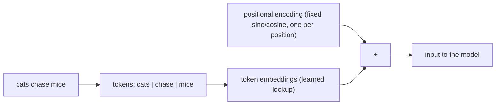
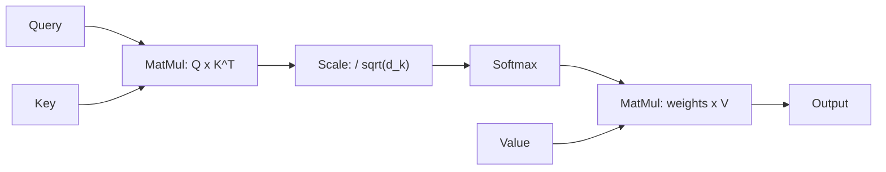
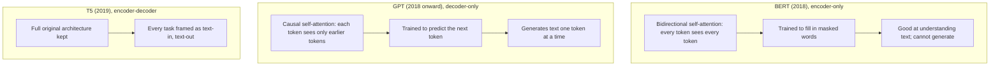
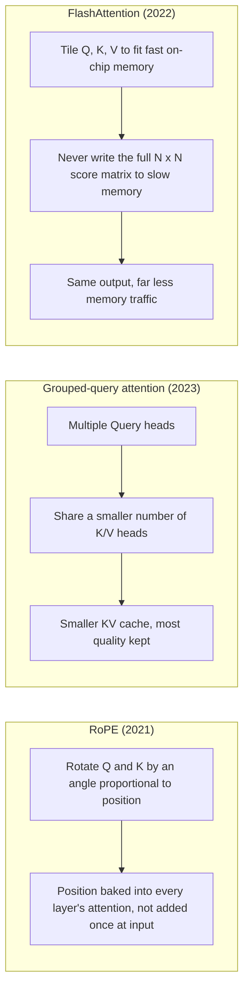
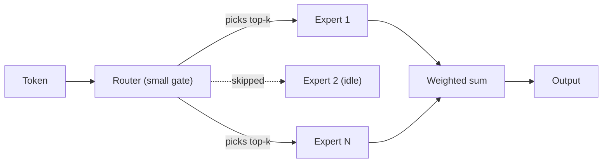

# Attention Is All You Need: A Deep Dive

A from-scratch walkthrough of the transformer architecture introduced in [Vaswani et al., 2017, Attention Is All You Need](https://arxiv.org/abs/1706.03762), aimed at someone seeing it for the first time. It traces the mechanism component by component, computes a real worked example by hand (small enough to read in a table), and then walks through how BERT, GPT, T5, and the efficiency and Mixture-of-Experts designs that followed changed the original architecture, and why each change happened. There is no dataset and no technique comparison here; unlike the other experiments in this repo, this one is a conceptual deep dive, not a side-by-side evaluation.

**[Live dashboard](https://swati-llm-architecture-and-evolution.streamlit.app/)**

## Why this paper exists

Before 2017, the best sequence models (translation, summarization) were built from recurrent neural networks (RNNs), which read a sentence one token at a time, in order, carrying a running summary forward as they went. That design has two costs. First, it's slow to train: token 50 can't be processed until tokens 1 through 49 have been, so there's no way to process a sequence in parallel on a GPU. Second, information from early tokens has to survive being carried through every step to reach a token much later in the sentence, and in practice it tends to fade the farther it travels.

Vaswani et al. proposed removing recurrence entirely and replacing it with attention: every token looks directly at every other token it needs, in one step, regardless of the distance between them. That single change is the paper's title. Attention, it turns out, is all you need, no recurrence, no convolution.

## Tokenization, embeddings, and position

The model never sees raw text. A sentence is first split into tokens, and every token is looked up in a table of embeddings, vectors the model learned during training, where tokens with similar meaning end up with similar-looking embeddings.

Embeddings alone say nothing about order, though: attention compares every token to every other token regardless of where they sit, so "dog bites man" and "man bites dog" would look identical without help. The paper's fix is a positional encoding: a second vector, one per position, built from sine and cosine waves at different frequencies, added directly onto the token embedding before anything else happens. That sum, token meaning plus position, is what actually enters the model.



## Scaled dot-product attention: the core mechanism

This is the one idea the entire paper is built around. For every token, the model builds three vectors from its embedding, using three separate learned projections:

- **Query (Q):** what this token is looking for
- **Key (K):** what each token (including itself) has to offer
- **Value (V):** the actual content passed along if a match is found

To compute one token's output, its Query is compared against *every* token's Key using a dot product, a similarity score. Those scores are scaled down by dividing by the square root of the Key dimension, `sqrt(d_k)` (this keeps scores from growing too large as dimension increases, which would push softmax into a region where its gradient is nearly flat and learning stalls), then passed through softmax so they become a proper set of weights that sum to 1. Finally, those weights build a weighted average of every token's Value. The paper's formula (Section 3.2.1) is exactly this:

```
Attention(Q, K, V) = softmax( QK^T / sqrt(d_k) ) V
```



## Multi-head attention

Running attention once per layer would force every kind of relationship a token might need (grammar, reference, topic) to share one single similarity computation. Instead, the paper splits `d_model` into `h` smaller pieces and runs `h` independent attention computations in parallel, called heads, each with its own learned Q, K, V projections into that smaller space. Their outputs are concatenated back together and passed through one more learned projection, `W_O`. Splitting into more heads doesn't add parameters; each head just works in a smaller slice of the same total dimension, free to specialize on a different kind of pattern.

## Around attention: residuals, normalization, feed-forward

Attention alone isn't the whole layer. Every block adds three more pieces around it, each solving a specific problem:

- **Residual connections.** Each sub-layer's output is added back to its own input, rather than replacing it outright. This gives gradients a direct path backward through a deep stack of layers, which is what makes stacking many layers (the paper uses 6 of each) trainable at all ([He et al., 2015](https://arxiv.org/abs/1512.03385), the residual idea the transformer paper adopted).
- **Layer normalization.** Rescales the numbers flowing between layers so they stay in a stable, consistent range, preventing values from drifting to extremes as they pass through many layers.
- **Feed-forward network (MLP).** After attention has let tokens exchange information, a small two-layer network is applied to each token's vector independently. If attention is tokens talking to each other, this is each token thinking alone about what it just heard.

```mermaid
flowchart TD
    subgraph Encoder block
        E1["Input embeddings + position"] --> E2["Multi-Head Self-Attention (bidirectional)"]
        E2 --> E3["Add & Norm"]
        E3 --> E4["Feed-Forward"]
        E4 --> E5["Add & Norm -> output (repeat N x)"]
    end
    subgraph Decoder block
        D1["Output embeddings, shifted right"] --> D2["Masked Self-Attention (causal)"]
        D2 --> D3["Add & Norm"]
        D3 --> D4["Cross-Attention (Q from decoder, K/V from encoder)"]
        D4 --> D5["Add & Norm"]
        D5 --> D6["Feed-Forward + Add & Norm -> output (repeat N x)"]
    end
```



## The full architecture

Stack six of each block, wire the decoder's cross-attention to read the encoder's final output, and add one last linear layer plus softmax over the vocabulary to turn the decoder's output into next-token probabilities. This is the complete architecture from the paper's Figure 1, originally built for machine translation: the encoder reads the full source sentence at once, and the decoder generates the translation one token at a time, causally, cross-attending back into the encoder at every step.

## Worked example: "cats chase mice" through attention

The numbers below are real, computed arithmetic (see [`run_experiment.py`](run_experiment.py)), not illustrations drawn by hand. To keep every number small enough to read, the embeddings and projection weights are **hand-picked, not learned from data or a trained model**. `d_model = 4` here, against thousands in a real model, for the same reason: readability, not realism. The specific attention pattern below isn't a claim about what a real trained model would do with this sentence; it exists to make the mechanism above concrete with actual numbers.

**Token embeddings** (`cats`, `chase`, `mice`; `d_model = 4`):

| | d0 | d1 | d2 | d3 |
|---|---|---|---|---|
| cats | 1.0 | 0.0 | 1.0 | 0.0 |
| chase | 0.0 | 1.0 | 0.0 | 1.0 |
| mice | 1.0 | 1.0 | 0.0 | 0.0 |

Each embedding is projected through its own learned weight matrix into Query, Key, and Value. Raw scores are `Q @ K^T`, scaled by dividing by `sqrt(d_k) = sqrt(4) = 2.00`, then passed through softmax row by row:

**Attention weights** (row = the token attending, column = how much of that column's Value it uses):

| attends from \ to | cats | chase | mice |
|---|---|---|---|
| cats | 0.211 | 0.442 | 0.347 |
| chase | 0.384 | 0.233 | 0.384 |
| mice | 0.524 | 0.158 | 0.318 |

Every row sums to exactly 1, since softmax makes attention a proper split of 100% focus across every token a query can see. Worth noticing: `chase`, the verb, splits its attention almost evenly between `cats` and `mice`, its subject and object. That's a tidy coincidence of these hand-picked numbers, not a demonstration of learned linguistic behavior, but it's a useful illustration of what "splitting attention across relevant tokens" actually looks like as real numbers.

The full dashboard (`app.py`) also shows this same computation split across 2 attention heads, each working in its own 2-dimensional slice of the 4-dimensional space, then concatenated and projected back through `W_O`. See the Worked Example tab there for every intermediate matrix.

## Evolution since 2017

The 2017 architecture is a full encoder-decoder built for translation. Almost nothing since has abandoned attention itself; instead, each design below kept the mechanism and changed either which half of the architecture it uses, or how attention is computed to make it cheaper to run at scale.

### BERT, GPT, T5: which half of the architecture



**BERT** ([Devlin et al., 2018](https://arxiv.org/abs/1810.04805)) kept only the encoder half, where every token can attend to every other token in both directions, and trained it by hiding random words and asking the model to predict them (masked language modeling), which forces the model to use both left and right context at once. Many real tasks (classification, sentiment, answering a question about a passage) need deep understanding, not generation, and that's exactly what this buys. The trade-off: no decoder, no causal mask, so BERT cannot generate text one token at a time the way GPT can.

**GPT** ([Radford et al., 2018](https://cdn.openai.com/research-covers/language-unsupervised/language_understanding_paper.pdf)) kept only the decoder half, with causal (masked) self-attention and no cross-attention at all, since there's no separate encoder to read from. If the goal is generating fluent text, bidirectional attention is actually a liability: a model that could see the whole sentence at once, including the word it's supposed to predict, would have nothing left to learn. Trained simply to predict the next token, repeated over huge amounts of text, this is the architecture behind essentially every modern chat-style LLM: GPT, Llama, Mistral, and, at the level of publicly known industry trends rather than confirmed internals (see the caveat below), Claude are all decoder-only descendants of this half of the original design.

**T5** ([Raffel et al., 2019](https://arxiv.org/abs/1910.10683)) kept the *full* original architecture, encoder and decoder both, but changed how every task is framed: translation, summarization, classification, even regression are all rewritten as "input text in, output text out," using a task prefix in the input like `"summarize: ..."`. This doesn't change the mechanism at all; it's a framing choice that lets one architecture and one training recipe handle wildly different tasks without task-specific output layers.

### The efficiency line: making attention cheaper to run

This next set of changes isn't about which half of the architecture to keep. It's about a cost that becomes serious once models generate long sequences: at every generation step, a model needs the Key and Value vectors of every token generated so far (the KV cache), and computing full attention over a long sequence gets expensive in both memory and time.



**RoPE, rotary position embeddings** ([Su et al., 2021](https://arxiv.org/abs/2104.09864)). The original sinusoidal positional encoding is added once, at the input, and has to somehow still be readable by attention many layers later. RoPE instead bakes position directly into the attention computation itself: each Query and Key vector is rotated by an angle proportional to its position, at every layer, so the dot product between two tokens' Query and Key naturally depends on their *relative* distance, not just their absolute positions. This also generalizes better to sequence lengths longer than anything seen during training, part of why nearly every modern open LLM (Llama, Mistral, DeepSeek, Qwen) uses it.

**Grouped-query attention (GQA)** ([Ainslie et al., 2023](https://arxiv.org/abs/2305.13245)). In standard multi-head attention, every Query head has its own Key and Value head, so the KV cache grows with the full head count. Multi-query attention ([Shazeer, 2019](https://arxiv.org/abs/1911.02150)) pushed to the opposite extreme first: every Query head shares one single K/V head, shrinking the cache a lot but giving up some quality. GQA is the middle ground: Query heads are split into a handful of groups, and each group shares one K/V head. It's the setting most current open models (Llama 2 and later, Mistral) actually ship with.

**FlashAttention** ([Dao et al., 2022](https://arxiv.org/abs/2205.14135)). This one changes nothing about the math from Section 3.2.1: same Q, K, V, same softmax, same output. What Dao et al. noticed is that standard attention is bottlenecked by *moving* the full N x N score matrix between slow GPU memory (HBM) and fast on-chip memory (SRAM), not by the matrix multiplication itself. FlashAttention processes attention in small tiles that fit in fast memory and never materializes the full matrix at all, giving the exact same output much faster and with far less memory. It's an implementation-level optimization, not a new architecture, but a big part of why long-context models became practical.

### Sparse models: Mixture of Experts



**Mixture of Experts** ([Shazeer et al., 2017](https://arxiv.org/abs/1701.06538)). A dense model's every parameter runs on every token, so making the model bigger always makes every token more expensive to process. MoE replaces the single feed-forward network in each block with many smaller feed-forward "experts," plus a small learned router that picks only a few experts to actually run for each token. The model's *total* parameter count can grow far larger than a dense model's, while the compute spent per token stays close to a much smaller dense model's, since most experts sit idle for any given token. [Fedus et al., 2021](https://arxiv.org/abs/2101.03961)'s Switch Transformer showed this scales well even routing to just a single expert per token.

**DeepSeek: multi-head latent attention + DeepSeekMoE.** DeepSeek's models combine two efficiency ideas from opposite ends of the architecture. Multi-head latent attention ([DeepSeek-AI, 2024, DeepSeek-V2](https://arxiv.org/abs/2405.04434)) compresses what would normally be full per-head Key and Value vectors into one small shared latent vector before caching it, decompressing on the fly when attention runs, cutting KV cache size well beyond what grouped-query attention alone achieves. DeepSeekMoE ([Dai et al., 2024](https://arxiv.org/abs/2401.06066)) reworks the expert side: instead of a few large experts, it uses many more, smaller, finer-grained routed experts for sharper specialization, plus a small number of shared experts that every token always runs through, to capture the common patterns every token needs without making every routed expert re-learn them. Both ideas attack the same underlying pressure as GQA and MoE above, just further along the same two axes: smaller cache per token, more specialization per parameter spent.

### A note on Perplexity and Claude

**Perplexity** isn't a transformer architecture at all; it's a product built on top of an existing LLM, combining it with web retrieval so answers can cite live sources. There's no separate architecture to diagram here, just an existing decoder-only model (from one of several providers, depending on the mode) wired up to a search layer, closer in spirit to retrieval-augmented generation than to a new architectural family.

**Claude's** internal architecture isn't publicly published by Anthropic: no paper laying out layer counts, attention variant, or MoE structure the way there is for GPT-2, T5, or DeepSeek. What can be said honestly, at the level of publicly known industry trends rather than confirmed internals, is that it's a decoder-only transformer descendant like the rest of this section, using some form of efficient attention to support long context. Presenting more detail than that as a real diagram would mean inventing internals that haven't been published, so this deep dive doesn't.

## Terminology

This experiment leans on a lot of vocabulary. Plain-language definitions for every term, in the order they come up, live in the dashboard's Terminology tab (`app.py`'s `TERMINOLOGY` dict) so they stay next to the diagrams that use them: token, embedding, dimension, positional encoding, Query/Key/Value, dot product, softmax, attention weight, attention head, self- vs. cross-attention, causal (masked) attention, residual connection, layer normalization, feed-forward network, encoder/decoder, autoregressive generation, logits, KV cache, and sparse vs. dense models.

## What we learned

**1. Splitting attention into more heads costs nothing in parameters; it only redivides the same dimension.** The worked example's 2-head split uses the exact same `d_model = 4` as the single-head pass, just 2 dimensions per head instead of 4. This is easy to miss from prose alone: multi-head attention sounds like it should be more expensive than single-head attention, but `W_Q`, `W_K`, `W_V`, and `W_O` are each sized to `d_model` regardless of how many heads that gets split into. The benefit isn't more capacity; it's that each head gets its own smaller, independent similarity computation to specialize with, motivated directly in [Vaswani et al., 2017](https://arxiv.org/abs/1706.03762), Section 3.2.2.

**2. Almost every efficiency innovation since 2017 targets the KV cache, not the core attention computation itself.** RoPE changes how position reaches attention; GQA changes how many K/V heads exist; multi-head latent attention compresses K/V into a shared latent vector; FlashAttention changes how the same computation moves through memory. None of them change the `softmax(QK^T / sqrt(d_k))V` formula's actual math. The common thread is that generation is autoregressive, one token at a time, and every one of those tokens' Key and Value vectors has to stay cached for every future step, so cache size, not the attention formula, is where most of the real engineering pressure since 2017 has actually gone.

**3. BERT, GPT, and T5 are architecturally simpler variations on the original paper than their different reputations suggest.** BERT is the encoder half. GPT is the decoder half, with cross-attention removed since there's nothing to cross-attend to. T5 is the *entire* original architecture, just re-framed at the task level. None of the three invented a new attention mechanism; each one is a specific, deliberate subset (or re-framing) of Figure 1 in [Vaswani et al., 2017](https://arxiv.org/abs/1706.03762), chosen to match what the task actually needs: understanding, generation, or both.

## Caveats

The worked example's embeddings and projection weights are hand-picked, chosen only to keep numbers small and readable, not learned from any dataset or trained model. Nothing about the specific attention weights it produces should be read as a claim about what a real trained model does with this sentence; it demonstrates the mechanism's arithmetic, not learned behavior.

The Claude and Perplexity notes in the Evolution section are deliberately limited to what's publicly known. Anthropic has not published Claude's architecture details, and inventing specifics to fill that gap would misrepresent confirmed research as fact.

## Grounding research

* [Vaswani et al., 2017, Attention Is All You Need](https://arxiv.org/abs/1706.03762)
* [He et al., 2015, Deep Residual Learning for Image Recognition](https://arxiv.org/abs/1512.03385)
* [Devlin et al., 2018, BERT: Pre-training of Deep Bidirectional Transformers for Language Understanding](https://arxiv.org/abs/1810.04805)
* [Radford et al., 2018, Improving Language Understanding by Generative Pre-Training (GPT-1)](https://cdn.openai.com/research-covers/language-unsupervised/language_understanding_paper.pdf)
* [Raffel et al., 2019, Exploring the Limits of Transfer Learning with a Unified Text-to-Text Transformer (T5)](https://arxiv.org/abs/1910.10683)
* [Su et al., 2021, RoFormer: Enhanced Transformer with Rotary Position Embedding](https://arxiv.org/abs/2104.09864)
* [Shazeer, 2019, Fast Transformer Decoding: One Write-Head is All You Need](https://arxiv.org/abs/1911.02150)
* [Ainslie et al., 2023, GQA: Training Generalized Multi-Query Transformer Models from Multi-Head Checkpoints](https://arxiv.org/abs/2305.13245)
* [Dao et al., 2022, FlashAttention: Fast and Memory-Efficient Exact Attention with IO-Awareness](https://arxiv.org/abs/2205.14135)
* [Shazeer et al., 2017, Outrageously Large Neural Networks: The Sparsely-Gated Mixture-of-Experts Layer](https://arxiv.org/abs/1701.06538)
* [Fedus et al., 2021, Switch Transformers: Scaling to Trillion Parameter Models](https://arxiv.org/abs/2101.03961)
* [DeepSeek-AI, 2024, DeepSeek-V2: A Strong, Economical, and Efficient Mixture-of-Experts Language Model](https://arxiv.org/abs/2405.04434)
* [Dai et al., 2024, DeepSeekMoE: Towards Ultimate Expert Specialization in Mixture-of-Experts Language Models](https://arxiv.org/abs/2401.06066)

## Reproducing this

Unlike most experiments in this repo, there's no model to download and no dataset to load. `requirements-experiment.txt` adds only `numpy`, needed to compute the worked example's matrices.

To just view the dashboard:

```bash
pip install -r requirements.txt
streamlit run app.py
```

To recompute the worked example from scratch:

```bash
pip install -r requirements-experiment.txt
python run_experiment.py       # instant, no GPU needed
streamlit run app.py
```
